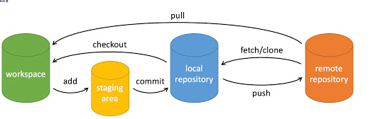

# git常用操作

## git的分区

好用的在线学习git网址https://learngitbranching.js.org/?locale=zh_CN

可以分为4个区域



- workspace : 工作区
- staging area：暂存区/缓存区
- local repository：版本库或本地仓库

- remote repository：远程仓库

## git基础命令

### 本地的操作


**基础操作**

```
git init //初始化仓库
git clone //拷贝一个远程仓库，也就是下载一个仓库
git add // 将文件添加到暂存区
git status // 查看当前仓库的状态，显示有变更的文件
git diff //比较文件的不同，即比较暂存区和工作区的差异
git commit // 提交暂存区到本地仓库 git commit -m "你的提交注释"
git reset // 退回版本
git rm // 删除工作区文件
git mv // 移动或重命名工作区文件
git restore  //使得在工作空间但是不在暂存区的文件撤销更改(内容恢复到没修改之前的状态)
```

**分支**

在介绍两种方法之前，我们需要先了解一下分支的概念： 
分支是用来标记特定代码的提交，每一个分支通过SHA1sum值来标识，所以对分支的操作是轻量级的，你改变的仅仅是SHA1sum值。

如下图所示，当前有2个分支，A,C,E属于master分支，而A,B，D,F属于dev分支。

```css
A----C----E（master）
 \
  B---D---F(dev)
```


它们的head指针分别指向E和F，对上述做如下操作：

```cpp
git checkout master  //选择or切换到master分支
git merge dev        //将dev分支合并到当前分支(master)中
```

合并完成后：

```css
A---C---E---G(master)
 \         /
  B---D---F（dev）
```

现在ABCDEFG属于master，G是一次合并后的结果，是将E和Ｆ的代码合并后的结果，可能会出现冲突。而ABDF依然属于dev分支。可以继续在dev的分支上进行开发:

```css
A---C---E---G---H(master)
 \         /
  B---D---F---I（dev）
```

**操作分支**

```
git branch //查看本地所有分支 

git branch -r //查看远程所有分支

git branch -a //查看本地和远程的所有分支

git branch <branchname> //新建分支

git branch -d <branchname> //删除本地分支

git branch -d -r <branchname> //删除远程分支，删除后还需推送到服务器
git push origin:<branchname>  //删除后推送至服务器

git branch -m <oldbranch> <newbranch> //重命名本地分支

git checkout (branchname) // 切换分支
当你切换分支的时候，Git 会用该分支的最后提交的快照替换你的工作目录的内容， 所以多个分支不需要多个目录。

git merge // 合并分支
/**
*重命名远程分支：
*1、删除远程待修改分支
*2、push本地新分支到远程服务器
*/

//git中一些选项解释:

-d
--delete：删除

-D
--delete --force的快捷键

-f
--force：强制

-m
--move：移动或重命名

-M
--move --force的快捷键

-r
--remote：远程

-a
--all：所有
```


### 远程相关的操作

```
git remote // 远程仓库操作
git fetch <远程主机名> //这个命令将某个远程主机的更新全部取回本地

如果只想取回特定分支的更新，可以指定分支名：
git fetch <远程主机名> <分支名> //注意之间有空格

最常见的命令如取回origin 主机的master 分支：
git fetch origin master
取回更新后，会返回一个FETCH_HEAD ，指的是某个branch在服务器上的最新状态，我们可以在本地通过它查看刚取回的更新信息：
git log -p FETCH_HEAD

可以看到返回的信息包括更新的文件名，更新的作者和时间，以及更新的代码。

我们可以通过这些信息来判断是否产生冲突，以确定是否将更新merge到当前分支。 
```


`git pull` 的过程可以理解为：

```cpp
git fetch origin master //从远程主机的master分支拉取最新内容 
git merge FETCH_HEAD    //将拉取下来的最新内容合并到当前所在的分支中
```

即将远程主机的某个分支的更新取回，并与本地指定的分支合并，完整格式可表示为：

```
git pull <远程主机名> <远程分支名>:<本地分支名>
```

如果远程分支是与当前分支合并，则冒号后面的部分可以省略：

```ruby
git pull origin next
```


```
git push // 上传远程代码并合并
```

