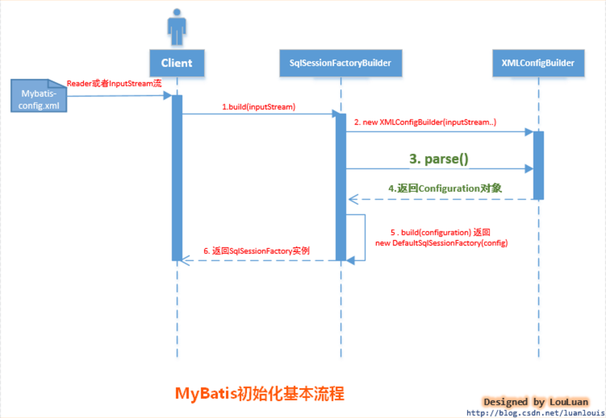

# MyBatis-1

## MyBatis初始化的方式及引入

MyBatis的初始化可以有两种方式：

- **基于XML配置文件**：基于XML配置文件的方式是将MyBatis的所有配置信息放在XML文件中，MyBatis通过加载并XML配置文件，将配置文信息组装成内部的Configuration对象。
- **基于Java API**：这种方式不使用XML配置文件，需要MyBatis使用者在Java代码中，手动创建Configuration对象，然后将配置参数set 进入Configuration对象中。

## 初始化方式 - XML配置

> 接下来我们将通过 基于XML配置文件方式的MyBatis初始化，深入探讨MyBatis是如何通过配置文件构建Configuration对象，并使用它。

现在就从使用MyBatis的简单例子入手，深入分析一下MyBatis是怎样完成初始化的，都初始化了什么。看以下代码：

```java
// mybatis初始化
String resource = "mybatis-config.xml";  
InputStream inputStream = Resources.getResourceAsStream(resource);  
SqlSessionFactory sqlSessionFactory = new SqlSessionFactoryBuilder().build(inputStream);

// 创建SqlSession
SqlSession sqlSession = sqlSessionFactory.openSession();  

// 执行SQL语句
List list = sqlSession.selectList("com.foo.bean.BlogMapper.queryAllBlogInfo");  
```

有过MyBatis使用经验的读者会知道，上述语句的作用是执行`com.foo.bean.BlogMapper.queryAllBlogInfo` 定义的SQL语句，返回一个List结果集。总的来说，上述代码经历了三个阶段(本系列也对应三篇文章分别讲解)：

- `mybatis初始化` 本文
- `创建SqlSession` - 详解后文
- `执行SQL语句` - 详解后文

上述代码的功能是根据配置文件mybatis-config.xml 配置文件，创建SqlSessionFactory对象，然后产生SqlSession，执行SQL语句。而mybatis的初始化就发生在第三句：SqlSessionFactory sqlSessionFactory = new SqlSessionFactoryBuilder().build(inputStream); 现在就让我们看看第三句到底发生了什么。

### MyBatis初始化基本过程：

SqlSessionFactoryBuilder根据传入的数据流生成Configuration对象，然后根据Configuration对象创建默认的SqlSessionFactory实例。

初始化的基本过程如下序列图所示：



由上图所示，mybatis初始化要经过简单的以下几步：

- 调用SqlSessionFactoryBuilder对象的build(inputStream)方法；
- SqlSessionFactoryBuilder会根据输入流inputStream等信息创建XMLConfigBuilder对象;
- SqlSessionFactoryBuilder调用XMLConfigBuilder对象的parse()方法；
- XMLConfigBuilder对象返回Configuration对象；
- SqlSessionFactoryBuilder根据Configuration对象创建一个DefaultSessionFactory对象；
- SqlSessionFactoryBuilder返回 DefaultSessionFactory对象给Client，供Client使用。

SqlSessionFactoryBuilder相关的代码如下所示：

```java
public SqlSessionFactory build(InputStream inputStream)  {  
    return build(inputStream, null, null);  
}  

public SqlSessionFactory build(InputStream inputStream, String environment, Properties properties)  {  
    try  {  
        //2. 创建XMLConfigBuilder对象用来解析XML配置文件，生成Configuration对象  
        XMLConfigBuilder parser = new XMLConfigBuilder(inputStream, environment, properties);  
        //3. 将XML配置文件内的信息解析成Java对象Configuration对象  
        Configuration config = parser.parse();  
        //4. 根据Configuration对象创建出SqlSessionFactory对象  
        return build(config);  
    } catch (Exception e) {  
        throw ExceptionFactory.wrapException("Error building SqlSession.", e);  
    } finally {  
        ErrorContext.instance().reset();  
        try {  
            inputStream.close();  
        } catch (IOException e) {  
            // Intentionally ignore. Prefer previous error.  
        }  
    }
}

// 从此处可以看出，MyBatis内部通过Configuration对象来创建SqlSessionFactory,用户也可以自己通过API构造好Configuration对象，调用此方法创SqlSessionFactory  
public SqlSessionFactory build(Configuration config) {  
    return new DefaultSqlSessionFactory(config);  
}  

```

上述的初始化过程中，涉及到了以下几个对象：

- SqlSessionFactoryBuilder ： SqlSessionFactory的构造器，用于创建SqlSessionFactory，采用了Builder设计模式
- Configuration ：该对象是mybatis-config.xml文件中所有mybatis配置信息
- SqlSessionFactory：SqlSession工厂类，以工厂形式创建SqlSession对象，采用了Factory工厂设计模式
- XmlConfigParser ：负责将mybatis-config.xml配置文件解析成Configuration对象，共SqlSessonFactoryBuilder使用，创建SqlSessionFactory

# Mapper映射文件配置

## insert, update, delete 的配置及使用

```xml
<?xml version="1.0" encoding="UTF-8" ?>   
<!DOCTYPE mapper   
PUBLIC "-//ibatis.apache.org//DTD Mapper 3.0//EN"  
"http://ibatis.apache.org/dtd/ibatis-3-mapper.dtd"> 

<!-- mapper 为根元素节点， 一个namespace对应一个dao -->
<!-- 
Mapper元素只有一个属性namespace，它有两个作用：`一是用于区分不同的mapper`（在不同的mapper文件里，子元素的id可以相同，mybatis通过namespace和子元素的id联合区分），`二是与接口关联`（应用程序通过接口访问mybatis时，mybatis通过接口的完整名称查找对应的mapper配置，因此namespace的命名务必小心一定要某接口同名）。
-->
<mapper namespace="com.dy.dao.UserDao">
    
    <!-- 
    cache- 配置本定命名空间的缓存。
        type- cache实现类，默认为PERPETUAL，可以使用自定义的cache实现类（别名或完整类名皆可）
        eviction- 回收算法，默认为LRU，可选的算法有：
            LRU– 最近最少使用的：移除最长时间不被使用的对象。
            FIFO– 先进先出：按对象进入缓存的顺序来移除它们。
            SOFT– 软引用：移除基于垃圾回收器状态和软引用规则的对象。
            WEAK– 弱引用：更积极地移除基于垃圾收集器状态和弱引用规则的对象。
        flushInterval- 刷新间隔，默认为1个小时，单位毫秒
        size- 缓存大小，默认大小1024，单位为引用数
        readOnly- 只读
    -->
    <cache type="PERPETUAL" eviction="LRU" flushInterval="60000"  
        size="512" readOnly="true" />
    
    <!-- 
    cache-ref–从其他命名空间引用缓存配置。
        如果你不想定义自己的cache，可以使用cache-ref引用别的cache。因为每个cache都以namespace为id，所以cache-ref只需要配置一个namespace属性就可以了。需要注意的是，如果cache-ref和cache都配置了，以cache为准。
    -->
    <cache-ref namespace="com.someone.application.data.SomeMapper"/>
    
    <insert
      <!-- 1. id （必须配置）
        id是命名空间中的唯一标识符，可被用来代表这条语句。 
        一个命名空间（namespace） 对应一个dao接口, 
        这个id也应该对应dao里面的某个方法（相当于方法的实现），因此id 应该与方法名一致 -->
      
      id="insertUser"
      
      <!-- 2. parameterType （可选配置, 默认为mybatis自动选择处理）
        将要传入语句的参数的完全限定类名或别名， 如果不配置，mybatis会通过ParameterHandler 根据参数类型默认选择合适的typeHandler进行处理
        parameterType 主要指定参数类型，可以是int, short, long, string等类型，也可以是复杂类型（如对象） -->
      
      parameterType="com.demo.User"
      
      <!-- 3. flushCache （可选配置，默认配置为true）
        将其设置为 true，任何时候只要语句被调用，都会导致本地缓存和二级缓存都会被清空，默认值：true（对应插入、更新和删除语句） -->
      
      flushCache="true"
      
      <!-- 4. statementType （可选配置，默认配置为PREPARED）
        STATEMENT，PREPARED 或 CALLABLE 的一个。这会让 MyBatis 分别使用 Statement，PreparedStatement 或 CallableStatement，默认值：PREPARED。 -->
      
      statementType="PREPARED"
      
      <!-- 5. keyProperty (可选配置， 默认为unset)
        （仅对 insert 和 update 有用）唯一标记一个属性，MyBatis 会通过 getGeneratedKeys 的返回值或者通过 insert 语句的 selectKey 子元素设置它的键值，默认：unset。如果希望得到多个生成的列，也可以是逗号分隔的属性名称列表。 -->
      
      keyProperty=""
      
      <!-- 6. keyColumn     (可选配置)
        （仅对 insert 和 update 有用）通过生成的键值设置表中的列名，这个设置仅在某些数据库（像 PostgreSQL）是必须的，当主键列不是表中的第一列的时候需要设置。如果希望得到多个生成的列，也可以是逗号分隔的属性名称列表。 -->
      
      keyColumn=""
      
      <!-- 7. useGeneratedKeys (可选配置， 默认为false)
        （仅对 insert 和 update 有用）这会令 MyBatis 使用 JDBC 的 getGeneratedKeys 方法来取出由数据库内部生成的主键（比如：像 MySQL 和 SQL Server 这样的关系数据库管理系统的自动递增字段），默认值：false。  -->
      
      useGeneratedKeys="false"
      
      <!-- 8. timeout  (可选配置， 默认为unset, 依赖驱动)
        这个设置是在抛出异常之前，驱动程序等待数据库返回请求结果的秒数。默认值为 unset（依赖驱动）。 -->
      timeout="20">

    <update
      id="updateUser"
      parameterType="com.demo.User"
      flushCache="true"
      statementType="PREPARED"
      timeout="20">

    <delete
      id="deleteUser"
      parameterType="com.demo.User"
      flushCache="true"
      statementType="PREPARED"
      timeout="20">
</mapper>

```

以上就是一个模板配置， 哪些是必要配置，哪些是根据自己实际需求，看一眼就知道了。看一个真实的UserDao-Mapper.xml配置：

```xml
<?xml version="1.0" encoding="UTF-8" ?>   
<!DOCTYPE mapper   
PUBLIC "-//ibatis.apache.org//DTD Mapper 3.0//EN"  
"http://ibatis.apache.org/dtd/ibatis-3-mapper.dtd"> 

<mapper namespace="com.dy.dao.UserDao">
   
   <!-- 对应userDao中的insertUser方法，  -->
   <insert id="insertUser" parameterType="com.dy.entity.User">
           insert into user(id, name, password, age, deleteFlag) 
               values(#{id}, #{name}, #{password}, #{age}, #{deleteFlag})
   </insert>
   
   <!-- 对应userDao中的updateUser方法 -->
   <update id="updateUser" parameterType="com.dy.entity.User">
           update user set name = #{name}, password = #{password}, age = #{age}, deleteFlag = #{deleteFlag}
               where id = #{id};
   </update>
    
   <!-- 对应userDao中的deleteUser 方法 --> 
   <delete id="deleteUser" parameterType="com.dy.entity.User">
           delete from user where id = #{id};
   </delete>
</mapper>

```

这样，一个简单的映射关系就建立了。仔细观察上面parameterType, "com.dy.entity.User"，包名要是再长点呢，每次都这样写，写得蛋疼了。别忘了之前讲的 typeAliases（别名）， 那么这个地方，用上别名，岂不是技能跟蛋疼的长长的包名说拜拜了。好啦，咱们配上别名，在哪儿配？ 当然是在mybatis 的全局配置文件（我这儿名字是mybatis-conf.xml）， 不要认为是在mapper的配置文件里面配置哈。

```xml
<typeAliases>
     <!--
        通过package, 可以直接指定package的名字， mybatis会自动扫描你指定包下面的javabean,
        并且默认设置一个别名，默认的名字为： javabean 的首字母小写的非限定类名来作为它的别名。
        也可在javabean 加上注解@Alias 来自定义别名， 例如： @Alias(user) 
        <package name="com.dy.entity"/>
     -->
     <typeAlias alias="user" type="com.dy.entity.User"/>
</typeAliases> 
```

这样，一个别名就取好了，咱们可以把上面的 com.dy.entity.User 都直接改为user 了。 这多方便呀！

## select、resultMap的配置及使用

select无疑是我们最常用，也是最复杂的，mybatis通过resultMap能帮助我们很好地进行高级映射。下面就开始看看select 以及 resultMap的用法：

先看select的配置吧：

```xml
<select
     <!--  1. id （必须配置）
        id是命名空间中的唯一标识符，可被用来代表这条语句。 
        一个命名空间（namespace） 对应一个dao接口, 
        这个id也应该对应dao里面的某个方法（相当于方法的实现），因此id 应该与方法名一致
     -->
     
     id="selectPerson"
     
     <!-- 2. parameterType （可选配置, 默认为mybatis自动选择处理）
        将要传入语句的参数的完全限定类名或别名， 如果不配置，mybatis会通过ParameterHandler 根据参数类型默认选择合适的typeHandler进行处理
        parameterType 主要指定参数类型，可以是int, short, long, string等类型，也可以是复杂类型（如对象） -->
     parameterType="int"
     
     <!-- 3. resultType (resultType 与 resultMap 二选一配置)
         resultType用以指定返回类型，指定的类型可以是基本类型，可以是java容器，也可以是javabean -->
     resultType="hashmap"
     
     <!-- 4. resultMap (resultType 与 resultMap 二选一配置)
         resultMap用于引用我们通过 resultMap标签定义的映射类型，这也是mybatis组件高级复杂映射的关键 -->
     resultMap="personResultMap"
     
     <!-- 5. flushCache (可选配置)
         将其设置为 true，任何时候只要语句被调用，都会导致本地缓存和二级缓存都会被清空，默认值：false -->
     flushCache="false"
     
     <!-- 6. useCache (可选配置)
         将其设置为 true，将会导致本条语句的结果被二级缓存，默认值：对 select 元素为 true -->
     useCache="true"
     
     <!-- 7. timeout (可选配置) 
         这个设置是在抛出异常之前，驱动程序等待数据库返回请求结果的秒数。默认值为 unset（依赖驱动）-->
     timeout="10000"
     
     <!-- 8. fetchSize (可选配置) 
         这是尝试影响驱动程序每次批量返回的结果行数和这个设置值相等。默认值为 unset（依赖驱动)-->
     fetchSize="256"
     
     <!-- 9. statementType (可选配置) 
         STATEMENT，PREPARED 或 CALLABLE 的一个。这会让 MyBatis 分别使用 Statement，PreparedStatement 或 CallableStatement，默认值：PREPARED-->
     statementType="PREPARED"
     
     <!-- 10. resultSetType (可选配置) 
         FORWARD_ONLY，SCROLL_SENSITIVE 或 SCROLL_INSENSITIVE 中的一个，默认值为 unset （依赖驱动）-->
     resultSetType="FORWARD_ONLY">

```

配置看起来总是这么多，不过实际常用的配置也就那么几个， 根据自己的需要吧，上面都已注明是否必须配置。看一个CourseDao-Mapper.xml配置：

```xml
<mapper namespace="com.dy.dao.CourseDao">
    
    <!-- 
         1.此处直接将resultType 设置为course, 一看就知道我设置了别名吧，如果没有设置别名，那么resultType = com.dy.entity.Course。
         2.可能细心的你会发现：Course.java中的属性名与数据库字段名不一致，下面，我就在sql语句中用了as, 使之匹配，当然方法不止一种，在学习了resultMap之后，你能看到一种更直观优雅的方式去将javabean中的属性与数据库字段名保持一致
         3.findCourseById 与CourseDao中findCourseById方法对应， 那么传入的参数名称以及类型也应该保持对应关系。
         4.可以看到，在sql语句中，通过#{}表达式可以获取参数。
         5.下面这条sql语句，实际上的形式是怎么样的？还记得之前说过，mybatis默认为preparedStatement吧，那么，用我们jdbc代码来看，它其实就是：
             select course_id as id, course_name as name, course_delete_flg as deleteFlag from t_course where course_id=?
     -->
    <select id="findCourseById"  resultType="course" >
        select course_id as id, course_name as name, course_delete_flg as deleteFlag from t_course where course_id=#{courseId}
    </select>
</mapper>
```

上面的示例，我们针对course, 简单演示了 select的用法， 不过有个问题值得思考： 一个student可以对应多个course, 那么，在mybatis中如何处理这种一对多， 甚至于多对多，一对一的关系呢？

这儿，就不得不提到 resultMap 这个东西， mybatis的resultMap功能可谓十分强大，能够处理复杂的关系映射， 那么resultMap 该怎么配置呢？ 别急，这就来了：

```xml
    <!-- 
        resultMap –结果映射，用来描述如何从数据库结果集映射到你想要的对象。

        1.type 对应类型，可以是javabean, 也可以是其它
        2.id 必须唯一， 用于标示这个resultMap的唯一性，在使用resultMap的时候，就是通过id指定
     -->
    <resultMap type="" id="">
    
        <!-- id, 唯一性，注意啦，这个id用于标示这个javabean对象的唯一性， 不一定会是数据库的主键（不要把它理解为数据库对应表的主键） 
            property属性对应javabean的属性名，column对应数据库表的列名
            （这样，当javabean的属性与数据库对应表的列名不一致的时候，就能通过指定这个保持正常映射了）
        -->
        <id property="" column=""/>
        
        <!-- result与id相比， 对应普通属性 -->    
        <result property="" column=""/>
        
        <!-- 
            constructor对应javabean中的构造方法
         -->
        <constructor>
            <!-- idArg 对应构造方法中的id参数；-->
            <idArg column=""/>
            <!-- arg 对应构造方法中的普通参数；-->
            <arg column=""/>
        </constructor>
        
        <!-- 
            聚集元素用来处理“一对多”的关系。需要指定映射的Java实体类的属性，属性的javaType（一般为ArrayList）；列表中对象的类型ofType（Java实体类）；对应的数据库表的列名称；

            collection，对应javabean中容器类型, 是实现一对多的关键 
            property 为javabean中容器对应字段名
            column 为体现在数据库中列名
            ofType 就是指定javabean中容器指定的类型

            不同情况需要告诉MyBatis 如何加载一个聚集。MyBatis 可以用两种方式加载：
                1. select: 执行一个其它映射的SQL 语句返回一个Java实体类型。较灵活；
                2. resultMap: 使用一个嵌套的结果映射来处理通过join查询结果集，映射成Java实体类型。
        -->
        <collection property="" column="" ofType=""></collection>
        
        <!-- 
            联合元素用来处理“一对一”的关系。需要指定映射的Java实体类的属性，属性的javaType（通常MyBatis 自己会识别）。对应的数据库表的列名称。如果想覆写的话返回结果的值，需要指定typeHandler。

            association 为关联关系，是实现N对一的关键。
            property 为javabean中容器对应字段名
            column 为体现在数据库中列名
            javaType 指定关联的类型

            不同情况需要告诉MyBatis 如何加载一个联合。MyBatis可以用两种方式加载：
                1. select: 执行一个其它映射的SQL 语句返回一个Java实体类型。较灵活；
                2. resultMap: 使用一个嵌套的结果映射来处理，通过join查询结果集，映射成Java实体类型。
         -->
        <association property="" column="" javaType=""></association>

        <!-- 
            有时一个单独的数据库查询也许返回很多不同（但是希望有些关联）数据类型的结果集。鉴别器元素就是被设计来处理这个情况的，还有包括类的继承层次结构。鉴别器非常容易理解，因为它的表现很像Java语言中的switch语句。

            定义鉴别器指定了column和javaType属性。列是MyBatis查找比较值的地方。JavaType是需要被用来保证等价测试的合适类型（尽管字符串在很多情形下都会有用）。

            下面这个例子为，当classId为20000001时，才映射classId属性。
        -->
        <discriminator column="CLASS_ID" javaType="String" jdbcType="VARCHAR">  
            <case value="20000001" resultType="liming.student.manager.data.model.StudentEntity" >  
                <result property="classId" column="CLASS_ID" javaType="String" jdbcType="VARCHAR"/>  
            </case> 
        </discriminator>
    </resultMap>
```

好啦，知道resutMap怎么配置后，咱们立即接着上面的demo来练习一下吧，一个student对应多个course， 典型的一对多，咱们就来看看mybatis怎么配置这种映射吧：StudentDao-Mapper.xml

```java
<mapper namespace="com.dy.dao.StudentDao">

    <!-- 这儿定义一个resultMap -->
    <resultMap type="student" id="studentMap">
    
        <!-- 
            数据库中主键是id, 但是我这儿却是指定idCard为主键，为什么？ 
            刚刚讲了，id用来表示唯一性， 我们可以认为只要idCard一样，那么他就是同一个学生。
            如果此处用数据库中id， 那么mybatis将会认为数据库中每条记录都是一个student, 这显然不符合逻辑
        -->
        <id property="idCard" column="stu_id_card"/>
        <result property="id" column="stu_id"/>
        <result property="name" column="stu_name"/>
        <result property="deleteFlag" column="stu_delete_flg"/>
  
        <constructor>  
            <idArg javaType="String" column="STUDENT_ID"/>  
            <arg javaType="String" column="STUDENT_NAME"/>  
            <arg javaType="String" column="STUDENT_SEX"/>  
            <arg javaType="Date" column="STUDENT_BIRTHDAY"/>  
        </constructor>
        
        <!-- 
            这儿就是实现一对多的关键。 
            在Student中，courseList为List<Course>, 因此，ofType也应该与之对应（当然，我用了别名，不然要蛋疼的写全名了）。
            collection的子标签是在指定Course的映射关系（由于Course的javabean的属性名与数据库的列名不一致）
        -->
        <collection property="courseList" column="stu_course_id" ofType="Course">
            <id property="id" column="course_id"/>
            <result property="name" column="course_name"/>
            <result property="deleteFlag" column="course_delete_flg"/>
        </collection>
    </resultMap>
    
    <!-- 这儿将返回类型设置成了上面指定的studentMap -->
    <select id="findStudentById" resultMap="studentMap">
        SELECT s.*, c.* FROM t_student s LEFT JOIN t_course c ON s.stu_course_id=c.course_id WHERE s.stu_id_card=#{idCard}
    </select>

    <!-- 
        sql –可以重用的SQL块，可以被其他数据库操作语句引用。
    -->
    <sql id="userColumns"> userid,username,password</sql>
    
    <select id="queryUsers" parameterType="UserDto" resultType="UserDto" useCache="false">
	select <include refid="userColumns"/> from t_user t where t.username = #{username}
    </select>
    
</mapper>
```

当然，我们需要定义StudentEntity实体类的构造方法：

```xml
public StudentEntity(String studentID, String studentName, String studentSex, Date studentBirthday){  
    this.studentID = studentID;  
    this.studentName = studentName;  
    this.studentSex = studentSex;  
    this.studentBirthday = studentBirthday;  
}   
```

相信通过以上示例， 大家也能够使用mybatis的select 和 resultMap的用法了。上面只演示了一对多的映射，其实多对一、多对多也与它类似，所以我就没演示了，有兴趣的可以自己动手再做做。

## 字符串代入法

默认的情况下，使用#{}语法会促使MyBatis 生成PreparedStatement 属性并且使用PreparedStatement 的参数（=？）来安全的设置值。尽量这些是快捷安全，也是经常使用的。但有时候你可能想直接未更改的字符串代入到SQL 语句中。比如说，对于ORDER BY，你可能会这样使用：ORDER BY ${columnName}但MyBatis 不会修改和规避掉这个字符串。

> 注意：这样地接收和应用一个用户输入到未更改的语句中，是非常不安全的。这会让用户能植入破坏代码，所以，要么要求字段不要允许客户输入，要么你直接来检测他的合法性 。

## 例子可以看

https://how2j.cn/k/mybatis/mybatis-one-to-many/1089.html
