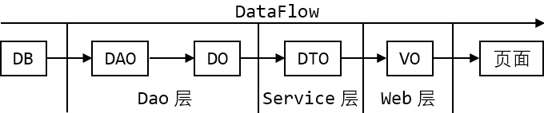

# POJO、DO、DTO、VO

| 对象                             | 含义         | 作用                                            | 作用范围                        |
| :------------------------------- | ------------ | ----------------------------------------------- | ------------------------------- |
| DO(Data Object)                  | 数据对象     | 与数据库表结构对应，通过DAO层向上传输数据源对象 | 数据库与Dao层，Dao层与Service层 |
| DTO(Data Transfer Object)        | 数据传输对象 | 主要用于远程调用等需大量传输对象的地方          | Sevice层和Web层                 |
| VO(View Object)                  | 视图对象     | 对应页面所显示的数据，将这些数据进行封装并返回  | Web层与页面                     |
| POJO(Plain Ordinary Java Object) | 普通Java对象 |                                                 |                                 |
| BO（Business Object）            | 业务对象     | 由 Service 层输出的封装业务逻辑的对象           | Service 层                      |

(1) 在分布式系统中，系统之间可通过DTO进行数据传输
(2) DTO只是简单的数据传输，没有业务逻辑的处理
(3) 使用DTO的好处：1、避免传递过多无用数据，提高数据传输速度；2、隐藏后端表结构
(4) POJO是DO/DTO/BO/VO的统称

## 需要VO的原因

(1) 如Service层有getUser方法返回用户，User有属性gender
(2) Service层对gender的定义：1-Male，2-Female，0-Undefine
(3) Web层对gender的定义：1-HandsomeBoy，2-PrettyGirl，0-Secret

为何不在Service层直接定义为Web层的内容？
(1) 对于客户端风格制定要求不高、后端服务的客户端就1、2个，可通过Service层直接定义
(2) 若该后端服务面向多个客户端，且它们要求自定义的风格迥异，即不同的客户端对于表现层的要求有所不同
(3) 且从设计层面上分析，Service层只负责业务，与具体的表现形式无关，因此它返回的DTO，不应与表现形式耦合，需通过VO解决

## DTO与VO的区别

(1) DTO表示Service层需接收、返回的数据，VO表示Web层需显示的数据
(2) 假设DTO中有某时间属性格式为Date/yyyy-MM-dd-HH-mm-ss，由于VO需向前端返回页面所需的数据格式，因此可能需转成"yyyy年MM月dd月"

## DTO与DO的区别

(1) 假设某表有10个字段，则其对应的DO就有10个属性，但页面只需显示4个属性，因此没有必要将整个DO对象传递给Web层，只需把页面所需的4个属性封装为DTO，将其传递给Web层即可；若该POJO作为界面显示对象，则它就为VO
(2) DTO可只取有含义的业务字段，DO是和数据库记录的一一映射，但DTO只需要按照业务需求定义所需字段

