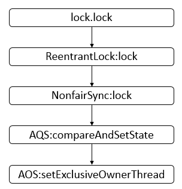
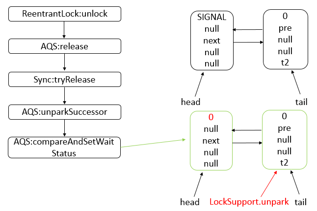
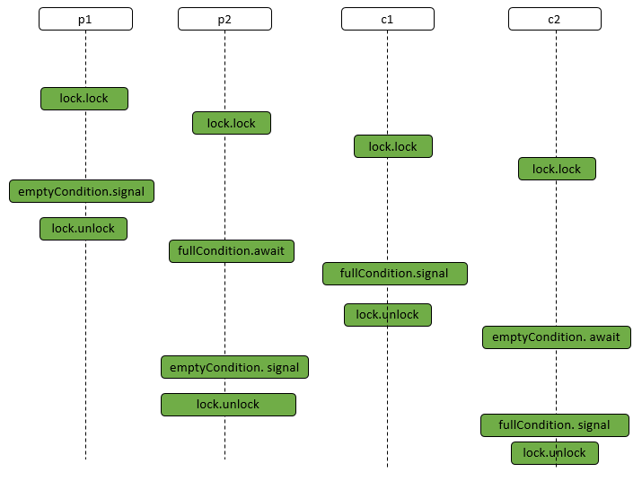

# AQS

- 什么是AQS? 为什么它是核心?？
- AQS的核心思想是什么? 它是怎么实现的? 底层数据结构等
- AQS有哪些核心的方法?
- AQS定义什么样的资源获取方式? AQS定义了两种资源获取方式：`独占`(只有一个线程能访问执行，又根据是否按队列的顺序分为`公平锁`和`非公平锁`，如`ReentrantLock`) 和`共享`(多个线程可同时访问执行，如`Semaphore`、`CountDownLatch`、 `CyclicBarrier` )。`ReentrantReadWriteLock`可以看成是组合式，允许多个线程同时对某一资源进行读。
- AQS底层使用了什么样的设计模式? 模板
- AQS的应用示例?

## AbstractQueuedSynchronizer简介

AQS是一个用来构建锁和同步器的框架，使用AQS能简单且高效地构造出应用广泛的大量的同步器，比如我们提到的ReentrantLock，Semaphore，其他的诸如ReentrantReadWriteLock，SynchronousQueue，FutureTask等等皆是基于AQS的。当然，我们自己也能利用AQS非常轻松容易地构造出符合我们自己需求的同步器。

### AQS 核心思想

AQS核心思想是，如果被请求的共享资源空闲，则将当前请求资源的线程设置为有效的工作线程，并且将共享资源设置为锁定状态。如果被请求的共享资源被占用，那么就需要一套线程阻塞等待以及被唤醒时锁分配的机制，这个机制AQS是用CLH队列锁实现的，即将暂时获取不到锁的线程加入到队列中。

> CLH(Craig,Landin,and Hagersten)队列是一个虚拟的双向队列(虚拟的双向队列即不存在队列实例，仅存在结点之间的关联关系)。AQS是将每条请求共享资源的线程封装成一个CLH锁队列的一个结点(Node)来实现锁的分配。

AQS使用一个int成员变量来表示同步状态，通过内置的FIFO队列来完成获取资源线程的排队工作。AQS使用CAS对该同步状态进行原子操作实现对其值的修改。

```java
private volatile int state;//共享变量，使用volatile修饰保证线程可见性
```

状态信息通过procted类型的getState，setState，compareAndSetState进行操作

```java
//返回同步状态的当前值
protected final int getState() {  
        return state;
}
 // 设置同步状态的值
protected final void setState(int newState) { 
        state = newState;
}
//原子地(CAS操作)将同步状态值设置为给定值update如果当前同步状态的值等于expect(期望值)
protected final boolean compareAndSetState(int expect, int update) {
        return unsafe.compareAndSwapInt(this, stateOffset, expect, update);
}
```

### AQS 对资源的共享方式

AQS定义两种资源共享方式

- Exclusive(独占)：只有一个线程能执行，如ReentrantLock。又可分为公平锁和非公平锁：
  - 公平锁：按照线程在队列中的排队顺序，先到者先拿到锁
  - 非公平锁：当线程要获取锁时，无视队列顺序直接去抢锁，谁抢到就是谁的
- Share(共享)：多个线程可同时执行，如Semaphore/CountDownLatch。Semaphore、CountDownLatCh、 CyclicBarrier、ReadWriteLock 我们都会在后面讲到。

ReentrantReadWriteLock 可以看成是组合式，因为ReentrantReadWriteLock也就是读写锁允许多个线程同时对某一资源进行读。

不同的自定义同步器争用共享资源的方式也不同。自定义同步器在实现时只需要实现共享资源 state 的获取与释放方式即可，至于具体线程等待队列的维护(如获取资源失败入队/唤醒出队等)，AQS已经在上层已经帮我们实现好了。

### AQS底层使用了模板方法模式

> 同步器的设计是基于模板方法模式的，如果需要自定义同步器一般的方式是这样(模板方法模式很经典的一个应用)：

使用者继承AbstractQueuedSynchronizer并重写指定的方法。(这些重写方法很简单，无非是对于共享资源state的获取和释放) 将AQS组合在自定义同步组件的实现中，并调用其模板方法，而这些模板方法会调用使用者重写的方法。

这和我们以往通过实现接口的方式有很大区别，模板方法模式请参看：[设计模式行为型 - 模板方法(Template Method)详解]()

AQS使用了模板方法模式，自定义同步器时需要重写下面几个AQS提供的模板方法：

```java
isHeldExclusively()//该线程是否正在独占资源。只有用到condition才需要去实现它。
tryAcquire(int)//独占方式。尝试获取资源，成功则返回true，失败则返回false。
tryRelease(int)//独占方式。尝试释放资源，成功则返回true，失败则返回false。
tryAcquireShared(int)//共享方式。尝试获取资源。负数表示失败；0表示成功，但没有剩余可用资源；正数表示成功，且有剩余资源。
tryReleaseShared(int)//共享方式。尝试释放资源，成功则返回true，失败则返回false。
```

默认情况下，每个方法都抛出 UnsupportedOperationException。 这些方法的实现必须是内部线程安全的，并且通常应该简短而不是阻塞。AQS类中的其他方法都是final ，所以无法被其他类使用，只有这几个方法可以被其他类使用。

以ReentrantLock为例，state初始化为0，表示未锁定状态。A线程lock()时，会调用tryAcquire()独占该锁并将state+1。此后，其他线程再tryAcquire()时就会失败，直到A线程unlock()到state=0(即释放锁)为止，其它线程才有机会获取该锁。当然，释放锁之前，A线程自己是可以重复获取此锁的(state会累加)，这就是可重入的概念。但要注意，获取多少次就要释放多么次，这样才能保证state是能回到零态的。

## AbstractQueuedSynchronizer数据结构

AbstractQueuedSynchronizer类底层的数据结构是使用`CLH(Craig,Landin,and Hagersten)队列`是一个虚拟的双向队列(虚拟的双向队列即不存在队列实例，仅存在结点之间的关联关系)。AQS是将每条请求共享资源的线程封装成一个CLH锁队列的一个结点(Node)来实现锁的分配。其中Sync queue，即同步队列，是双向链表，包括head结点和tail结点，head结点主要用作后续的调度。而Condition queue不是必须的，其是一个单向链表，只有当使用Condition时，才会存在此单向链表。并且可能会有多个Condition queue。


## AbstractQueuedSynchronizer源码分析

### 类的继承关系

AbstractQueuedSynchronizer继承自AbstractOwnableSynchronizer抽象类，并且实现了Serializable接口，可以进行序列化。

```java
public abstract class AbstractQueuedSynchronizer extends AbstractOwnableSynchronizer implements java.io.Serializable 
```

其中AbstractOwnableSynchronizer抽象类的源码如下:

```java
public abstract class AbstractOwnableSynchronizer implements java.io.Serializable {
    
    // 版本序列号
    private static final long serialVersionUID = 3737899427754241961L;
    // 构造方法
    protected AbstractOwnableSynchronizer() { }
    // 独占模式下的线程
    private transient Thread exclusiveOwnerThread;
    
    // 设置独占线程 
    protected final void setExclusiveOwnerThread(Thread thread) {
        exclusiveOwnerThread = thread;
    }
    
    // 获取独占线程 
    protected final Thread getExclusiveOwnerThread() {
        return exclusiveOwnerThread;
    }
}    
```

AbstractOwnableSynchronizer抽象类中，可以设置独占资源线程和获取独占资源线程。分别为setExclusiveOwnerThread与getExclusiveOwnerThread方法，这两个方法会被子类调用。

> AbstractQueuedSynchronizer类有两个内部类，分别为Node类与ConditionObject类。下面分别做介绍。

### 类的内部类 - Node类

```java
static final class Node {
    // 模式，分为共享与独占
    // 共享模式
    static final Node SHARED = new Node();
    // 独占模式
    static final Node EXCLUSIVE = null;        
    // 结点状态
    // CANCELLED，值为1，表示当前的线程被取消
    // SIGNAL，值为-1，表示当前节点的后继节点包含的线程需要运行，也就是unpark
    // CONDITION，值为-2，表示当前节点在等待condition，也就是在condition队列中
    // PROPAGATE，值为-3，表示当前场景下后续的acquireShared能够得以执行
    // 值为0，表示当前节点在sync队列中，等待着获取锁
    static final int CANCELLED =  1;
    static final int SIGNAL    = -1;
    static final int CONDITION = -2;
    static final int PROPAGATE = -3;        

    // 结点状态
    volatile int waitStatus;        
    // 前驱结点
    volatile Node prev;    
    // 后继结点
    volatile Node next;        
    // 结点所对应的线程
    volatile Thread thread;        
    // 下一个等待者
    Node nextWaiter;
    
    // 结点是否在共享模式下等待
    final boolean isShared() {
        return nextWaiter == SHARED;
    }
    
    // 获取前驱结点，若前驱结点为空，抛出异常
    final Node predecessor() throws NullPointerException {
        // 保存前驱结点
        Node p = prev; 
        if (p == null) // 前驱结点为空，抛出异常
            throw new NullPointerException();
        else // 前驱结点不为空，返回
            return p;
    }
    
    // 无参构造方法
    Node() {    // Used to establish initial head or SHARED marker
    }
    
    // 构造方法
        Node(Thread thread, Node mode) {    // Used by addWaiter
        this.nextWaiter = mode;
        this.thread = thread;
    }
    
    // 构造方法
    Node(Thread thread, int waitStatus) { // Used by Condition
        this.waitStatus = waitStatus;
        this.thread = thread;
    }
}   
```

每个线程被阻塞的线程都会被封装成一个Node结点，放入队列。每个节点包含了一个Thread类型的引用，并且每个节点都存在一个状态，具体状态如下。

- `CANCELLED`，值为1，表示当前的线程被取消。
- `SIGNAL`，值为-1，表示当前节点的后继节点包含的线程需要运行，需要进行unpark操作。
- `CONDITION`，值为-2，表示当前节点在等待condition，也就是在condition queue中。
- `PROPAGATE`，值为-3，表示当前场景下后续的acquireShared能够得以执行。
- 值为0，表示当前节点在sync queue中，等待着获取锁。

## AbstractQueuedSynchronizer示例详解一

借助下面示例来分析AbstractQueuedSyncrhonizer内部的工作机制。示例源码如下


```java
import java.util.concurrent.locks.Lock;
import java.util.concurrent.locks.ReentrantLock;

class MyThread extends Thread {
    private Lock lock;
    public MyThread(String name, Lock lock) {
        super(name);
        this.lock = lock;
    }
    
    public void run () {
        lock.lock();
        try {
            System.out.println(Thread.currentThread() + " running");
        } finally {
            lock.unlock();
        }
    }
}
public class AbstractQueuedSynchonizerDemo {
    public static void main(String[] args) {
        Lock lock = new ReentrantLock();
        
        MyThread t1 = new MyThread("t1", lock);
        MyThread t2 = new MyThread("t2", lock);
        t1.start();
        t2.start();    
    }
}
```

运行结果(可能的一种):

```html
Thread[t1,5,main] running
Thread[t2,5,main] running   
```

结果分析: 从示例可知，线程t1与t2共用了一把锁，即同一个lock。可能会存在如下一种时序。


说明: 首先线程t1先执行lock.lock操作，然后t2执行lock.lock操作，然后t1执行lock.unlock操作，最后t2执行lock.unlock操作。基于这样的时序，分析AbstractQueuedSynchronizer内部的工作机制。

- t1线程调用lock.lock方法，其方法调用顺序如下，只给出了主要的方法调用。



说明: 其中，前面的部分表示哪个类，后面是具体的类中的哪个方法，AQS表示AbstractQueuedSynchronizer类，AOS表示AbstractOwnableSynchronizer类。

- t2线程调用lock.lock方法，其方法调用顺序如下，只给出了主要的方法调用。


说明: 经过一系列的方法调用，最后达到的状态是禁用t2线程，因为调用了LockSupport.park。

- t1线程调用lock.unlock，其方法调用顺序如下，只给出了主要的方法调用。



说明: 在上一步调用了LockSupport.unpark后，t2线程恢复运行，则运行parkAndCheckInterrupt，之后，继续运行acquireQueued方法，最后达到的状态是头节点head与尾结点tail均指向了t2线程所在的结点，并且之前的头节点已经从sync队列中断开了。

- t2线程调用lock.unlock，其方法调用顺序如下，只给出了主要的方法调用。


说明: t2线程执行lock.unlock后，最终达到的状态还是与之前的状态一样。

## AbstractQueuedSynchronizer示例详解二

下面我们结合Condition实现生产者与消费者，来进一步分析AbstractQueuedSynchronizer的内部工作机制。

- Depot(仓库)类

```java
import java.util.concurrent.locks.Condition;
import java.util.concurrent.locks.Lock;
import java.util.concurrent.locks.ReentrantLock;

public class Depot {
    private int size;
    private int capacity;
    private Lock lock;
    private Condition fullCondition;
    private Condition emptyCondition;
    
    public Depot(int capacity) {
        this.capacity = capacity;    
        lock = new ReentrantLock();
        fullCondition = lock.newCondition();
        emptyCondition = lock.newCondition();
    }
    
    public void produce(int no) {
        lock.lock();
        int left = no;
        try {
            while (left > 0) {
                while (size >= capacity)  {
                    System.out.println(Thread.currentThread() + " before await");
                    fullCondition.await();
                    System.out.println(Thread.currentThread() + " after await");
                }
                int inc = (left + size) > capacity ? (capacity - size) : left;
                left -= inc;
                size += inc;
                System.out.println("produce = " + inc + ", size = " + size);
                emptyCondition.signal();
            }
        } catch (InterruptedException e) {
            e.printStackTrace();
        } finally {
            lock.unlock();
        }
    }
    
    public void consume(int no) {
        lock.lock();
        int left = no;
        try {            
            while (left > 0) {
                while (size <= 0) {
                    System.out.println(Thread.currentThread() + " before await");
                    emptyCondition.await();
                    System.out.println(Thread.currentThread() + " after await");
                }
                int dec = (size - left) > 0 ? left : size;
                left -= dec;
                size -= dec;
                System.out.println("consume = " + dec + ", size = " + size);
                fullCondition.signal();
            }
        } catch (InterruptedException e) {
            e.printStackTrace();
        } finally {
            lock.unlock();
        }
    }
}
```

- 测试类

```java
class Consumer {
    private Depot depot;
    public Consumer(Depot depot) {
        this.depot = depot;
    }
    
    public void consume(int no) {
        new Thread(new Runnable() {
            @Override
            public void run() {
                depot.consume(no);
            }
        }, no + " consume thread").start();
    }
}

class Producer {
    private Depot depot;
    public Producer(Depot depot) {
        this.depot = depot;
    }
    
    public void produce(int no) {
        new Thread(new Runnable() {
            
            @Override
            public void run() {
                depot.produce(no);
            }
        }, no + " produce thread").start();
    }
}

public class ReentrantLockDemo {
    public static void main(String[] args) throws InterruptedException {
        Depot depot = new Depot(500);
        new Producer(depot).produce(500);
        new Producer(depot).produce(200);
        new Consumer(depot).consume(500);
        new Consumer(depot).consume(200);
    }
}   
```

- 运行结果(可能的一种):

```java
produce = 500, size = 500
Thread[200 produce thread,5,main] before await
consume = 500, size = 0
Thread[200 consume thread,5,main] before await
Thread[200 produce thread,5,main] after await
produce = 200, size = 200
Thread[200 consume thread,5,main] after await
consume = 200, size = 0
```

说明: 根据结果，我们猜测一种可能的时序如下



https://pdai.tech/md/java/thread/java-thread-x-lock-AbstractQueuedSynchronizer.html


