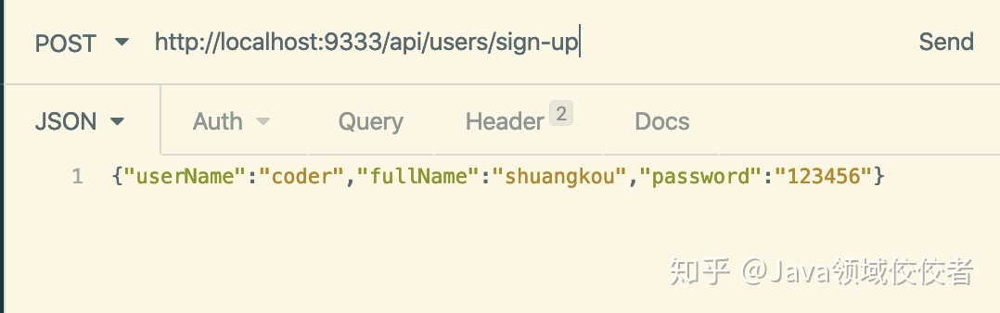

# springboot注解

### **`@Autowired`**

自动导入对象到类中，被注入进的类同样要被 Spring 容器管理比如：Service 类注入到 Controller 类中。

```text
@Service
public class UserService {
  ......
}

@RestController
@RequestMapping("/users")
public class UserController {
   @Autowired
   private UserService userService;
   ......
}
```

### **`@Component`,`@Repository`,`@Service`,** **`@Controller`**

我们一般使用 `@Autowired` 注解让 Spring 容器帮我们自动装配 bean。要想把类标识成可用于 `@Autowired` 注解自动装配的 bean 的类,可以采用以下注解实现：

- `@Component` ：通用的注解，可标注任意类为 `Spring` 组件。如果一个 Bean 不知道属于哪个层，可以使用`@Component` 注解标注。
- `@Repository` : 对应持久层即 Dao 层，主要用于数据库相关操作。
- `@Service` : 对应服务层，主要涉及一些复杂的逻辑，需要用到 Dao 层。
- `@Controller` : 对应 Spring MVC 控制层，主要用户接受用户请求并调用 Service 层返回数据给前端页面

### **`@RestController`**

`@RestController`注解是`@Controller和`@`ResponseBody`的合集,表示这是个控制器 bean,并且是将函数的返回值直 接填入 HTTP 响应体中,是 REST 风格的控制器。

单独使用 `@Controller` 不加 `@ResponseBody`的话一般使用在要返回一个视图的情况，这种情况属于比较传统的 Spring MVC 的应用，对应于前后端不分离的情况。`@Controller` +`@ResponseBody` 返回 JSON 或 XML 形式数据

### **`@ Configuration`**

一般用来声明配置类，可以使用 `@Component`注解替代，不过使用`Configuration`注解声明配置类更加语义化。

```text
@Configuration
public class AppConfig {
    @Bean
    public TransferService transferService() {
        return new TransferServiceImpl();
    }

}
```

### **@RequestMapping**

@RequestMapping注解的主要用途是将Web请求与请求处理类中的方法进行映射。Spring MVC和Spring WebFlux都通过`RquestMappingHandlerMapping`和`RequestMappingHndlerAdapter`两个类来提供对@RequestMapping注解的支持。

`@RequestMapping`注解对请求处理类中的请求处理方法进行标注；`@RequestMapping`注解拥有以下的六个配置属性：

- `value`:映射的请求URL或者其别名
- `method`:兼容HTTP的方法名
- `params`:根据HTTP参数的存在、缺省或值对请求进行过滤
- `header`:根据HTTP Header的存在、缺省或值对请求进行过滤
- `consume`:设定在HTTP请求正文中允许使用的媒体类型
- `product`:在HTTP响应体中允许使用的媒体类型

提示：在使用@RequestMapping之前，请求处理类还需要使用@Controller或@RestController进行标记

下面是使用@RequestMapping的两个示例：

```java
@Controller
public class DemoController{
    
    @RequestMapping(value="/dome/home",method=RequestMethod.GET)
    public String home(){
        return "/home";
    }
}
```

@RequestMapping还可以对类进行标记，这样类中的处理方法在映射请求路径时，会自动将类上@RequestMapping设置的value拼接到方法中映射路径之前，如下：

```java
@Controller
@RequestMapping(value="/dome")
public class DemoController{
    
    @RequestMapping(value="/dome/home",method=RequestMethod.GET)
    public String home(){
        return "/home";
    }
}
```

#### **GET 请求**

```
@GetMapping("users")` 等价于`@RequestMapping(value="/users",method=RequestMethod.GET)
```

#### **POST 请求**

```
@PostMapping("users")` 等价于`@RequestMapping(value="/users",method=RequestMethod.POST)
```

#### **PUT 请求**

```
@PutMapping("/users/{userId}")` 等价于`@RequestMapping(value="/users/{userId}",method=RequestMethod.PUT)
```

#### **DELETE 请求**

```
@DeleteMapping("/users/{userId}")`等价于`@RequestMapping(value="/users/{userId}",method=RequestMethod.DELETE)
```

## **前后端传值**

### **`@PathVariable`** **和** **`@RequestParam`**

`@PathVariable`用于获取路径参数，`@RequestParam`用于获取查询参数。

举个简单的例子：

```text
@GetMapping("/klasses/{klassId}/teachers")
public List<Teacher> getKlassRelatedTeachers(
         @PathVariable("klassId") Long klassId,
         @RequestParam(value = "type", required = false) String type ) {
...
}
```

如果我们请求的 url 是：`/klasses/{123456}/teachers?type=web`

那么我们服务获取到的数据就是：`klassId=123456,type=web`

### **`@RequestBody`**

用于读取 Request 请求（可能是 POST,PUT,DELETE,GET 请求）的 body 部分并且**Content-Type 为 application/json** 格式的数据，接收到数据之后会自动将数据绑定到 Java 对象上去。系统会使用`HttpMessageConverter`或者自定义的`HttpMessageConverter`将请求的 body 中的 json 字符串转换为 java 对象。

我用一个简单的例子来给演示一下基本使用！

我们有一个注册的接口：

```text
@PostMapping("/sign-up")
public ResponseEntity signUp(@RequestBody @Valid UserRegisterRequest userRegisterRequest) {
  userService.save(userRegisterRequest);
  return ResponseEntity.ok().build();
}
```

`UserRegisterRequest`对象：

```text
@Data
@AllArgsConstructor
@NoArgsConstructor
public class UserRegisterRequest {
    @NotBlank
    private String userName;
    @NotBlank
    private String password;
    @FullName
    @NotBlank
    private String fullName;
}
```

我们发送 post 请求到这个接口，并且 body 携带 JSON 数据：

```text
{"userName":"coder","fullName":"shuangkou","password":"123456"}
```

这样我们的后端就可以直接把 json 格式的数据映射到我们的 `UserRegisterRequest` 类上。



需要注意的是：**一个请求方法只可以有一个`@RequestBody`，但是可以有多个`@RequestParam`和`@PathVariable`**。 如果你的方法必须要用两个 `@RequestBody`来接受数据的话，大概率是你的数据库设计或者系统设计出问题了！