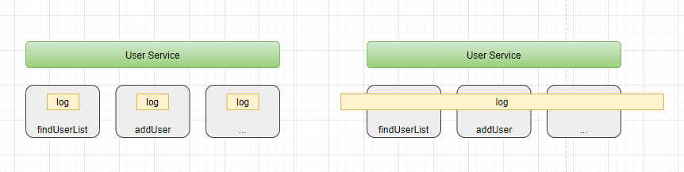
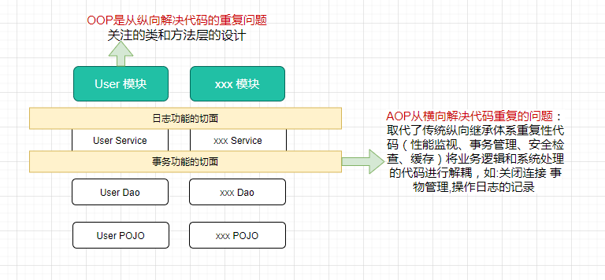
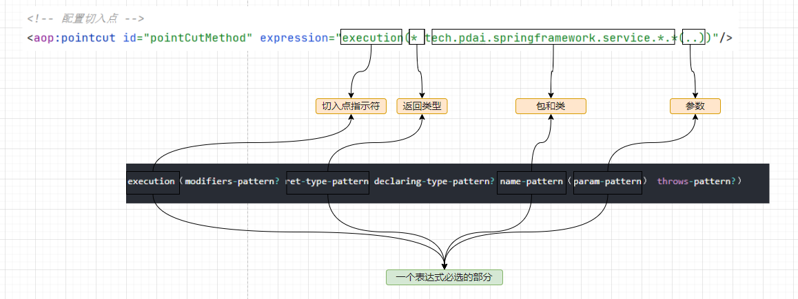

# spring-aop

## AOP是什么

> AOP为Aspect Oriented Programming的缩写，意为：面向切面编程

- 先来看一个例子， 如何给如下UserServiceImpl中所有方法添加进入方法的日志，

```java
/**
 * @author pdai
 */
public class UserServiceImpl implements IUserService {

    /**
     * find user list.
     *
     * @return user list
     */
    @Override
    public List<User> findUserList() {
        System.out.println("execute method： findUserList");
        return Collections.singletonList(new User("pdai", 18));
    }

    /**
     * add user
     */
    @Override
    public void addUser() {
        System.out.println("execute method： addUser");
        // do something
    }

}
```

我们将记录日志功能解耦为日志切面，它的目标是解耦。进而引出AOP的理念：就是将分散在各个业务逻辑代码中相同的代码通过**横向切割**的方式抽取到一个独立的模块中！



OOP面向对象编程，针对业务处理过程的实体及其属性和行为进行抽象封装，以获得更加清晰高效的逻辑单元划分。而AOP则是针对业务处理过程中的切面进行提取，它所面对的是处理过程的某个步骤或阶段，以获得逻辑过程的中各部分之间低耦合的隔离效果。这两种设计思想在目标上有着本质的差异。



## AOP术语

:::

首先让我们从一些重要的AOP概念和术语开始。**这些术语不是Spring特有的**。

:::

- **连接点（Jointpoint）**：表示需要在程序中插入横切关注点的扩展点，**连接点可能是类初始化、方法执行、方法调用、字段调用或处理异常等等**，Spring只支持方法执行连接点，在AOP中表示为**在哪里干**；

- **切入点（Pointcut）**： 选择一组相关连接点的模式，即可以认为连接点的集合，Spring支持perl5正则表达式和AspectJ切入点模式，Spring默认使用AspectJ语法，在AOP中表示为**在哪里干的集合**；

- **通知（Advice）**：在连接点上执行的行为，通知提供了在AOP中需要在切入点所选择的连接点处进行扩展现有行为的手段；包括前置通知（before advice）、后置通知(after advice)、环绕通知（around advice），在Spring中通过代理模式实现AOP，并通过拦截器模式以环绕连接点的拦截器链织入通知；在AOP中表示为**干什么**；

- **方面/切面（Aspect）**：横切关注点的模块化，比如上边提到的日志组件。可以认为是通知、引入和切入点的组合；在Spring中可以使用Schema和@AspectJ方式进行组织实现；在AOP中表示为**在哪干和干什么集合**；
- **引入（inter-type declaration）**：也称为内部类型声明，为已有的类添加额外新的字段或方法，Spring允许引入新的接口（必须对应一个实现）到所有被代理对象（目标对象）, 在AOP中表示为**干什么（引入什么）**；
- **目标对象（Target Object）**：需要被织入横切关注点的对象，即该对象是切入点选择的对象，需要被通知的对象，从而也可称为被通知对象；由于Spring AOP 通过代理模式实现，从而这个对象永远是被代理对象，在AOP中表示为**对谁干**；
- **织入（Weaving）**：把切面连接到其它的应用程序类型或者对象上，并创建一个被通知的对象。这些可以在编译时（例如使用AspectJ编译器），类加载时和运行时完成。Spring和其他纯Java AOP框架一样，在运行时完成织入。在AOP中表示为**怎么实现的**；
- **AOP代理（AOP Proxy）**：AOP框架使用代理模式创建的对象，从而实现在连接点处插入通知（即应用切面），就是通过代理来对目标对象应用切面。在Spring中，AOP代理可以用JDK动态代理或CGLIB代理实现，而通过拦截器模型应用切面。在AOP中表示为**怎么实现的一种典型方式**；

## AOP的配置方式

### XML Schema配置方式

- 目标类

```java
package tech.pdai.springframework.service;

/**
 * @author pdai
 */
public class AopDemoServiceImpl {

    public void doMethod1() {
        System.out.println("AopDemoServiceImpl.doMethod1()");
    }

    public String doMethod2() {
        System.out.println("AopDemoServiceImpl.doMethod2()");
        return "hello world";
    }

    public String doMethod3() throws Exception {
        System.out.println("AopDemoServiceImpl.doMethod3()");
        throw new Exception("some exception");
    }
}
```

- **定义切面类**

```java
package tech.pdai.springframework.aspect;

import org.aspectj.lang.ProceedingJoinPoint;

/**
 * @author pdai
 */
public class LogAspect {

    /**
     * 环绕通知.
     *
     * @param pjp pjp
     * @return obj
     * @throws Throwable exception
     */
    public Object doAround(ProceedingJoinPoint pjp) throws Throwable {
        System.out.println("-----------------------");
        System.out.println("环绕通知: 进入方法");
        Object o = pjp.proceed();
        System.out.println("环绕通知: 退出方法");
        return o;
    }

    /**
     * 前置通知.
     */
    public void doBefore() {
        System.out.println("前置通知");
    }

    /**
     * 后置通知.
     *
     * @param result return val
     */
    public void doAfterReturning(String result) {
        System.out.println("后置通知, 返回值: " + result);
    }

    /**
     * 异常通知.
     *
     * @param e exception
     */
    public void doAfterThrowing(Exception e) {
        System.out.println("异常通知, 异常: " + e.getMessage());
    }

    /**
     * 最终通知.
     */
    public void doAfter() {
        System.out.println("最终通知");
    }

}    
```


- **XML配置AOP**

```xml
<?xml version="1.0" encoding="UTF-8"?>
<beans xmlns="http://www.springframework.org/schema/beans"
       xmlns:xsi="http://www.w3.org/2001/XMLSchema-instance"
       xmlns:aop="http://www.springframework.org/schema/aop"
       xmlns:context="http://www.springframework.org/schema/context"
       xsi:schemaLocation="http://www.springframework.org/schema/beans
 http://www.springframework.org/schema/beans/spring-beans.xsd
 http://www.springframework.org/schema/aop
 http://www.springframework.org/schema/aop/spring-aop.xsd
 http://www.springframework.org/schema/context
 http://www.springframework.org/schema/context/spring-context.xsd
">

    <context:component-scan base-package="tech.pdai.springframework" />

    <aop:aspectj-autoproxy/>

    <!-- 目标类 -->
    <bean id="demoService" class="tech.pdai.springframework.service.AopDemoServiceImpl">
        <!-- configure properties of bean here as normal -->
    </bean>

    <!-- 切面 -->
    <bean id="logAspect" class="tech.pdai.springframework.aspect.LogAspect">
        <!-- configure properties of aspect here as normal -->
    </bean>

    <aop:config>
        <!-- 配置切面 -->
        <aop:aspect ref="logAspect">
            <!-- 配置切入点 -->
            <aop:pointcut id="pointCutMethod" expression="execution(* tech.pdai.springframework.service.*.*(..))"/>
            <!-- 环绕通知 -->
            <aop:around method="doAround" pointcut-ref="pointCutMethod"/>
            <!-- 前置通知 -->
            <aop:before method="doBefore" pointcut-ref="pointCutMethod"/>
            <!-- 后置通知；returning属性：用于设置后置通知的第二个参数的名称，类型是Object -->
            <aop:after-returning method="doAfterReturning" pointcut-ref="pointCutMethod" returning="result"/>
            <!-- 异常通知：如果没有异常，将不会执行增强；throwing属性：用于设置通知第二个参数的的名称、类型-->
            <aop:after-throwing method="doAfterThrowing" pointcut-ref="pointCutMethod" throwing="e"/>
            <!-- 最终通知 -->
            <aop:after method="doAfter" pointcut-ref="pointCutMethod"/>
        </aop:aspect>
    </aop:config>

    <!-- more bean definitions for data access objects go here -->
</beans>
```


- **测试类**

```java
/**
  * main interfaces.
  *
  * @param args args
  */
public static void main(String[] args) {
    // create and configure beans
    ApplicationContext context = new ClassPathXmlApplicationContext("aspects.xml");

    // retrieve configured instance
    AopDemoServiceImpl service = context.getBean("demoService", AopDemoServiceImpl.class);

    // use configured instance
    service.doMethod1();
    service.doMethod2();
    try {
        service.doMethod3();
    } catch (Exception e) {
        // e.printStackTrace();
    }
}
  
```

- **输出结果**

```java
-----------------------
环绕通知: 进入方法
前置通知
AopDemoServiceImpl.doMethod1()
环绕通知: 退出方法
最终通知
-----------------------
环绕通知: 进入方法
前置通知
AopDemoServiceImpl.doMethod2()
环绕通知: 退出方法
最终通知
后置通知, 返回值: hello world
-----------------------
环绕通知: 进入方法
前置通知
AopDemoServiceImpl.doMethod3()
最终通知
异常通知, 异常: some exception
  
```

### AspectJ注解方式

基于XML的声明式AspectJ存在一些不足，需要在Spring配置文件配置大量的代码信息，为了解决这个问题，Spring 使用了@AspectJ框架为AOP的实现提供了一套注解。

| 注解名称        | 解释                                                         |
| --------------- | ------------------------------------------------------------ |
| @Aspect         | 用来定义一个切面。                                           |
| @pointcut       | 用于定义切入点表达式。在使用时还需要定义一个包含名字和任意参数的方法签名来表示切入点名称，这个方法签名就是一个返回值为void，且方法体为空的普通方法。 |
| @Before         | 用于定义前置通知，相当于BeforeAdvice。在使用时，通常需要指定一个value属性值，该属性值用于指定一个切入点表达式(可以是已有的切入点，也可以直接定义切入点表达式)。 |
| @AfterReturning | 用于定义后置通知，相当于AfterReturningAdvice。在使用时可以指定pointcut / value和returning属性，其中pointcut / value这两个属性的作用一样，都用于指定切入点表达式。 |
| @Around         | 用于定义环绕通知，相当于MethodInterceptor。在使用时需要指定一个value属性，该属性用于指定该通知被植入的切入点。 |
| @After-Throwing | 用于定义异常通知来处理程序中未处理的异常，相当于ThrowAdvice。在使用时可指定pointcut / value和throwing属性。其中pointcut/value用于指定切入点表达式，而throwing属性值用于指定-一个形参名来表示Advice方法中可定义与此同名的形参，该形参可用于访问目标方法抛出的异常。 |
| @After          | 用于定义最终final 通知，不管是否异常，该通知都会执行。使用时需要指定一个value属性，该属性用于指定该通知被植入的切入点。 |
| @DeclareParents | 用于定义引介通知，相当于IntroductionInterceptor (不要求掌握)。 |

:::

Spring AOP的实现方式是动态织入，动态织入的方式是在运行时动态将要增强的代码织入到目标类中，这样往往是通过动态代理技术完成的；**如Java JDK的动态代理(Proxy，底层通过反射实现)或者CGLIB的动态代理(底层通过继承实现)**，Spring AOP采用的就是基于运行时增强的代理技术。所以我们看下如下的两个例子([例子代码  (opens new window)](https://github.com/realpdai/tech-pdai-spring-demos) 中05模块）：

- 基于JDK代理例子
- 基于Cglib代理例子

:::

#### 接口使用JDK代理

- 定义接口

```java
/**
 * Jdk Proxy Service.
 *
 * @author pdai
 */
public interface IJdkProxyService {

    void doMethod1();

    String doMethod2();

    String doMethod3() throws Exception;
}
  
```

- 实现类

```java
/**
 * @author pdai
 */
@Service
public class JdkProxyDemoServiceImpl implements IJdkProxyService {

    @Override
    public void doMethod1() {
        System.out.println("JdkProxyServiceImpl.doMethod1()");
    }

    @Override
    public String doMethod2() {
        System.out.println("JdkProxyServiceImpl.doMethod2()");
        return "hello world";
    }

    @Override
    public String doMethod3() throws Exception {
        System.out.println("JdkProxyServiceImpl.doMethod3()");
        throw new Exception("some exception");
    }
}
```

- **定义切面**

```java
package tech.pdai.springframework.aspect;

import org.aspectj.lang.ProceedingJoinPoint;
import org.aspectj.lang.annotation.After;
import org.aspectj.lang.annotation.AfterReturning;
import org.aspectj.lang.annotation.AfterThrowing;
import org.aspectj.lang.annotation.Around;
import org.aspectj.lang.annotation.Aspect;
import org.aspectj.lang.annotation.Before;
import org.aspectj.lang.annotation.Pointcut;
import org.springframework.context.annotation.EnableAspectJAutoProxy;
import org.springframework.stereotype.Component;

/**
 * @author pdai
 */
@EnableAspectJAutoProxy
@Component
@Aspect
public class LogAspect {

    /**
     * define point cut.
     */
    @Pointcut("execution(* tech.pdai.springframework.service.*.*(..))")
    private void pointCutMethod() {
    }


    /**
     * 环绕通知.
     *
     * @param pjp pjp
     * @return obj
     * @throws Throwable exception
     */
    @Around("pointCutMethod()")
    public Object doAround(ProceedingJoinPoint pjp) throws Throwable {
        System.out.println("-----------------------");
        System.out.println("环绕通知: 进入方法");
        Object o = pjp.proceed();
        System.out.println("环绕通知: 退出方法");
        return o;
    }

    /**
     * 前置通知.
     */
    @Before("pointCutMethod()")
    public void doBefore() {
        System.out.println("前置通知");
    }


    /**
     * 后置通知.
     *
     * @param result return val
     */
    @AfterReturning(pointcut = "pointCutMethod()", returning = "result")
    public void doAfterReturning(String result) {
        System.out.println("后置通知, 返回值: " + result);
    }

    /**
     * 异常通知.
     *
     * @param e exception
     */
    @AfterThrowing(pointcut = "pointCutMethod()", throwing = "e")
    public void doAfterThrowing(Exception e) {
        System.out.println("异常通知, 异常: " + e.getMessage());
    }

    /**
     * 最终通知.
     */
    @After("pointCutMethod()")
    public void doAfter() {
        System.out.println("最终通知");
    }

} 
```

- **输出**

```java
-----------------------
环绕通知: 进入方法
前置通知
JdkProxyServiceImpl.doMethod1()
最终通知
环绕通知: 退出方法
-----------------------
环绕通知: 进入方法
前置通知
JdkProxyServiceImpl.doMethod2()
后置通知, 返回值: hello world
最终通知
环绕通知: 退出方法
-----------------------
环绕通知: 进入方法
前置通知
JdkProxyServiceImpl.doMethod3()
异常通知, 异常: some exception
最终通知
  
```

### 切入点（pointcut）的申明规则?

Spring AOP 用户可能会经常使用 execution切入点指示符。执行表达式的格式如下：

```java
execution（modifiers-pattern? ret-type-pattern declaring-type-pattern? name-pattern（param-pattern） throws-pattern?）
```

- ret-type-pattern 返回类型模式, name-pattern名字模式和param-pattern参数模式是必选的， 其它部分都是可选的。返回类型模式决定了方法的返回类型必须依次匹配一个连接点。 你会使用的最频繁的返回类型模式是`*`，**它代表了匹配任意的返回类型**。
- declaring-type-pattern, 一个全限定的类型名将只会匹配返回给定类型的方法。
- name-pattern 名字模式匹配的是方法名。 你可以使用`*`通配符作为所有或者部分命名模式。
- param-pattern 参数模式稍微有点复杂：()匹配了一个不接受任何参数的方法， 而(..)匹配了一个接受任意数量参数的方法（零或者更多）。 模式(*)匹配了一个接受一个任何类型的参数的方法。 模式(*,String)匹配了一个接受两个参数的方法，第一个可以是任意类型， 第二个则必须是String类型。

对应到我们上面的例子：



下面给出一些通用切入点表达式的例子。

```java
// 任意公共方法的执行：
execution（public * *（..））

// 任何一个名字以“set”开始的方法的执行：
execution（* set*（..））

// AccountService接口定义的任意方法的执行：
execution（* com.xyz.service.AccountService.*（..））

// 在service包中定义的任意方法的执行：
execution（* com.xyz.service.*.*（..））

// 在service包或其子包中定义的任意方法的执行：
execution（* com.xyz.service..*.*（..））

// 在service包中的任意连接点（在Spring AOP中只是方法执行）：
within（com.xyz.service.*）

// 在service包或其子包中的任意连接点（在Spring AOP中只是方法执行）：
within（com.xyz.service..*）

// 实现了AccountService接口的代理对象的任意连接点 （在Spring AOP中只是方法执行）：
this（com.xyz.service.AccountService）// 'this'在绑定表单中更加常用

// 实现AccountService接口的目标对象的任意连接点 （在Spring AOP中只是方法执行）：
target（com.xyz.service.AccountService） // 'target'在绑定表单中更加常用

// 任何一个只接受一个参数，并且运行时所传入的参数是Serializable 接口的连接点（在Spring AOP中只是方法执行）
args（java.io.Serializable） // 'args'在绑定表单中更加常用; 请注意在例子中给出的切入点不同于 execution(* *(java.io.Serializable))： args版本只有在动态运行时候传入参数是Serializable时才匹配，而execution版本在方法签名中声明只有一个 Serializable类型的参数时候匹配。

// 目标对象中有一个 @Transactional 注解的任意连接点 （在Spring AOP中只是方法执行）
@target（org.springframework.transaction.annotation.Transactional）// '@target'在绑定表单中更加常用

// 任何一个目标对象声明的类型有一个 @Transactional 注解的连接点 （在Spring AOP中只是方法执行）：
@within（org.springframework.transaction.annotation.Transactional） // '@within'在绑定表单中更加常用

// 任何一个执行的方法有一个 @Transactional 注解的连接点 （在Spring AOP中只是方法执行）
@annotation（org.springframework.transaction.annotation.Transactional） // '@annotation'在绑定表单中更加常用

// 任何一个只接受一个参数，并且运行时所传入的参数类型具有@Classified 注解的连接点（在Spring AOP中只是方法执行）
@args（com.xyz.security.Classified） // '@args'在绑定表单中更加常用

// 任何一个在名为'tradeService'的Spring bean之上的连接点 （在Spring AOP中只是方法执行）
bean（tradeService）

// 任何一个在名字匹配通配符表达式'*Service'的Spring bean之上的连接点 （在Spring AOP中只是方法执行）
bean（*Service）

```

https://juejin.cn/post/6844903856778772494

Cglib 的例子

https://www.cnblogs.com/muscleape/p/9018308.html

https://juejin.cn/post/6844903860666908685
