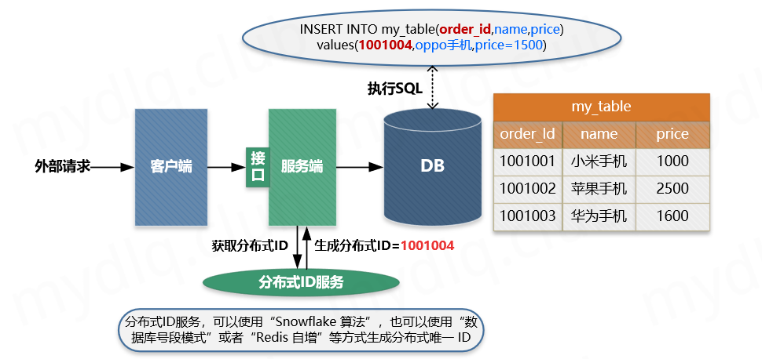
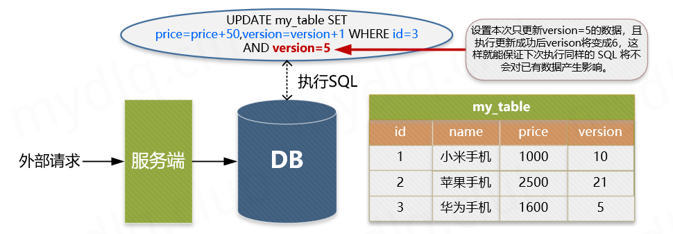
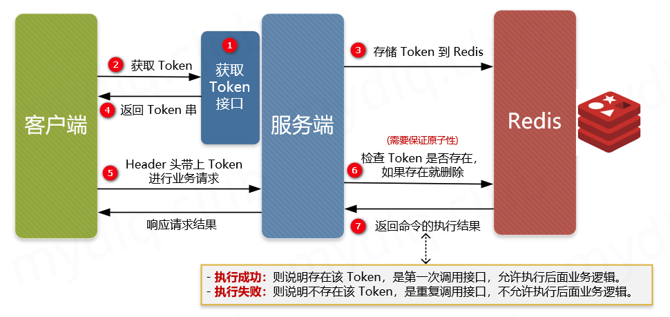
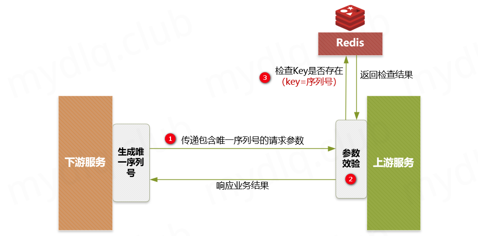

# 幂等

:::

幂等原先是数学中的一个概念，表示进行1次变换和进行N次变换产生的效果相同。

:::

当我们讨论接口的幂等性时一般是在说：以相同的请求调用这个接口一次和调用这个接口多次，对系统产生的影响是相同的。如果一个接口满足这个特性，那么我们就说这个 接口是一个幂等接口。

- **接口幂等和防止重复提交是一回事吗**？

严格来说，并不是。

1. **幂等**: 更多的是在重复请求已经发生，或是无法避免的情况下，采取一定的技术手段让这些重复请求不给系统带来副作用。
2. **防止重复**: 提交更多的是不让用户发起多次一样的请求。比如说用户在线购物下单时点了提交订单按钮，但是由于网络原因响应很慢，此时用户比较心急多次点击了订单提交按钮。 这种情况下就可能会造成多次下单。一般防止重复提交的方案有：将订单按钮置灰，跳转到结果页等。主要还是从客户端的角度来解决这个问题。

- **哪些情况下客户端是防止不了重复提交的**？

虽然我们可在客户端做一些防止接口重复提交的事（比如将订单按钮置灰，跳转到结果页等）， 但是如下情况依然客户端是很难控制接口重复提交到后台的，这也进一步表明了**接口幂等和防止重复提交不是一回事**以及**后端接口保证接口幂等的必要性**所在。

1. **接口超时重试**：接口可能会因为某些原因而调用失败，出于容错性考虑会加上失败重试的机制。如果接口调用一半，再次调用就会因为脏数据的存在而出现异常。
2. **消息重复消费**：在使用消息中间件来处理消息队列，且手动ack确认消息被正常消费时。如果消费者突然断开连接，那么已经执行了一半的消息会重新放回队列。被其他消费者重新消费时就会导致结果异常，如数据库重复数据，数据库数据冲突，资源重复等。
3. **请求重发**：网络抖动引发的nginx重发请求，造成重复调用；

## 什么是接口幂等？

在HTTP/1.1中，对幂等性进行了定义。它描述了一次和多次请求某一个资源对于资源本身应该具有同样的结果（网络超时等问题除外），即第一次请求的时候对资源产生了副作用，但是以后的多次请求都不会再对资源产生副作用。

这里的副作用是不会对结果产生破坏或者产生不可预料的结果。也就是说，其任意多次执行对资源本身所产生的影响均与一次执行的影响相同。

- **对哪些类型的接口需要保证接口幂等**？

我们看下标准的restful请求，幂等情况是怎么样的：

1. SELECT查询操作
   1. GET：只是获取资源，对资源本身没有任何副作用，天然的幂等性。
   2. HEAD：本质上和GET一样，获取头信息，主要是探活的作用，具有幂等性。
   3. OPTIONS：获取当前URL所支持的方法，因此也是具有幂等性的。
2. DELETE删除操作
   1. 删除的操作，如果从删除的一次和删除多次的角度看，数据并不会变化，这个角度看它是幂等的
   2. 但是如果，从另外一个角度，删除数据一般是返回受影响的行数，删除一次和多次删除返回的受影响行数是不一样的，所以从这个角度它需要保证幂等。（折中而言DELETE操作通常也会被纳入保证接口幂等的要求）
3. ADD/EDIT操作
   1. PUT：用于更新资源，有副作用，但是它应该满足幂等性，比如根据id更新数据，调用多次和N次的作用是相同的（根据业务需求而变）。
   2. POST：用于添加资源，多次提交很可能产生副作用，比如订单提交，多次提交很可能产生多笔订单。

## 常见的保证幂等的方式？

### 方案一：数据库唯一主键

**方案描述**

数据库唯一主键的实现主要是利用数据库中主键唯一约束的特性，一般来说唯一主键比较适用于“插入”时的幂等性，其能保证一张表中只能存在一条带该唯一主键的记录。

使用数据库唯一主键完成幂等性时需要注意的是，该主键一般来说并不是使用数据库中自增主键，而是使用分布式 ID 充当主键（可以参考 [Java 中分布式 ID 的设计方案](http://www.mydlq.club/article/92/) 这篇文章），这样才能能保证在分布式环境下 ID 的全局唯一性。

**适用操作：**

- 插入操作
- 删除操作

**使用限制：**

- 需要生成全局唯一主键 ID；

**主要流程：**




主要流程：

- ① 客户端执行创建请求，调用服务端接口。
- ② 服务端执行业务逻辑，生成一个分布式 ID，将该 ID 充当待插入数据的主键，然后执数据插入操作，运行对应的 SQL 语句。
- ③ 服务端将该条数据插入数据库中，如果插入成功则表示没有重复调用接口。如果抛出主键重复异常，则表示数据库中已经存在该条记录，返回错误信息到客户端。

### 方案二：数据库乐观锁

**方案描述：**

数据库乐观锁方案一般只能适用于执行“更新操作”的过程，我们可以提前在对应的数据表中多添加一个字段，充当当前数据的版本标识。这样每次对该数据库该表的这条数据执行更新时，都会将该版本标识作为一个条件，值为上次待更新数据中的版本标识的值。

**适用操作：**

- 更新操作

**使用限制：**

- 需要数据库对应业务表中添加额外字段；

**描述示例：**



例如，存在如下的数据表中：

|  id  |   name   | price |
| :--: | :------: | :---: |
|  1   | 小米手机 | 1000  |
|  2   | 苹果手机 | 2500  |
|  3   | 华为手机 | 1600  |

为了每次执行更新时防止重复更新，确定更新的一定是要更新的内容，我们通常都会添加一个 version 字段记录当前的记录版本，这样在更新时候将该值带上，那么只要执行更新操作就能确定一定更新的是某个对应版本下的信息。

|  id  |   name   | price | version |
| :--: | :------: | :---: | :-----: |
|  1   | 小米手机 | 1000  |   10    |
|  2   | 苹果手机 | 2500  |   21    |
|  3   | 华为手机 | 1600  |    5    |

这样每次执行更新时候，都要指定要更新的版本号，如下操作就能准确更新 version=5 的信息：

```sql
UPDATE my_table SET price=price+50,version=version+1 WHERE id=1 AND version=5
```

上面 WHERE 后面跟着条件 id=1 AND version=5 被执行后，id=1 的 version 被更新为 6，所以如果重复执行该条 SQL 语句将不生效，因为 id=1 AND version=5 的数据已经不存在，这样就能保住更新的幂等，多次更新对结果不会产生影响。

### 方案三：防重 Token 令牌

**方案描述：**

针对客户端连续点击或者调用方的超时重试等情况，例如提交订单，此种操作就可以用 Token 的机制实现防止重复提交。简单的说就是调用方在调用接口的时候先向后端请求一个全局 ID（Token），请求的时候携带这个全局 ID 一起请求（Token 最好将其放到 Headers 中），后端需要对这个 Token 作为 Key，用户信息作为 Value 到 Redis 中进行键值内容校验，如果 Key 存在且 Value 匹配就执行删除命令，然后正常执行后面的业务逻辑。如果不存在对应的 Key 或 Value 不匹配就返回重复执行的错误信息，这样来保证幂等操作。

**适用操作：**

- 插入操作
- 更新操作
- 删除操作

**使用限制：**

- 需要生成全局唯一 Token 串；
- 需要使用第三方组件 Redis 进行数据效验；

**主要流程：**



- ① 服务端提供获取 Token 的接口，该 Token 可以是一个序列号，也可以是一个分布式 ID 或者 UUID 串。
- ② 客户端调用接口获取 Token，这时候服务端会生成一个 Token 串。
- ③ 然后将该串存入 Redis 数据库中，以该 Token 作为 Redis 的键（注意设置过期时间）。
- ④ 将 Token 返回到客户端，客户端拿到后应存到表单隐藏域中。
- ⑤ 客户端在执行提交表单时，把 Token 存入到 Headers 中，执行业务请求带上该 Headers。
- ⑥ 服务端接收到请求后从 Headers 中拿到 Token，然后根据 Token 到 Redis 中查找该 key 是否存在。
- ⑦ 服务端根据 Redis 中是否存该 key 进行判断，如果存在就将该 key 删除，然后正常执行业务逻辑。如果不存在就抛异常，返回重复提交的错误信息。

> 注意，在并发情况下，执行 Redis 查找数据与删除需要保证原子性，否则很可能在并发下无法保证幂等性。其实现方法可以使用分布式锁或者使用 Lua 表达式来注销查询与删除操作。

### 方案四、下游传递唯一序列号

**方案描述：**

所谓请求序列号，其实就是每次向服务端请求时候附带一个短时间内唯一不重复的序列号，该序列号可以是一个有序 ID，也可以是一个订单号，一般由下游生成，在调用上游服务端接口时附加该序列号和用于认证的 ID。

当上游服务器收到请求信息后拿取该 序列号 和下游 认证ID 进行组合，形成用于操作 Redis 的 Key，然后到 Redis 中查询是否存在对应的 Key 的键值对，根据其结果：

- 如果存在，就说明已经对该下游的该序列号的请求进行了业务处理，这时可以直接响应重复请求的错误信息。
- 如果不存在，就以该 Key 作为 Redis 的键，以下游关键信息作为存储的值（例如下游商传递的一些业务逻辑信息），将该键值对存储到 Redis 中 ，然后再正常执行对应的业务逻辑即可。

**适用操作：**

- 插入操作
- 更新操作
- 删除操作

**使用限制：**

- 要求第三方传递唯一序列号；
- 需要使用第三方组件 Redis 进行数据效验；

**主要流程：**



主要步骤：

- ① 下游服务生成分布式 ID 作为序列号，然后执行请求调用上游接口，并附带“唯一序列号”与请求的“认证凭据ID”。
- ② 上游服务进行安全效验，检测下游传递的参数中是否存在“序列号”和“凭据ID”。
- ③ 上游服务到 Redis 中检测是否存在对应的“序列号”与“认证ID”组成的 Key，如果存在就抛出重复执行的异常信息，然后响应下游对应的错误信息。如果不存在就以该“序列号”和“认证ID”组合作为 Key，以下游关键信息作为 Value，进而存储到 Redis 中，然后正常执行接来来的业务逻辑。

> 上面步骤中插入数据到 Redis 一定要设置过期时间。这样能保证在这个时间范围内，如果重复调用接口，则能够进行判断识别。如果不设置过期时间，很可能导致数据无限量的存入 Redis，致使 Redis 不能正常工作。

## 实现接口幂等示例

这里使用防重 Token 令牌方案，该方案能保证在不同请求动作下的幂等性，实现逻辑可以看上面写的"防重 Token 令牌"方案，接下来写下实现这个逻辑的代码。

### 1、Maven 引入相关依赖

这里使用 Maven 工具管理依赖，这里在 pom.xml 中引入 SpringBoot、Redis、lombok 相关依赖。

```xml
<?xml version="1.0" encoding="UTF-8"?>
<project xmlns="http://maven.apache.org/POM/4.0.0" xmlns:xsi="http://www.w3.org/2001/XMLSchema-instance"
         xsi:schemaLocation="http://maven.apache.org/POM/4.0.0 https://maven.apache.org/xsd/maven-4.0.0.xsd">
    <modelVersion>4.0.0</modelVersion>

    <parent>
        <groupId>org.springframework.boot</groupId>
        <artifactId>spring-boot-starter-parent</artifactId>
        <version>2.3.4.RELEASE</version>
    </parent>

    <groupId>mydlq.club</groupId>
    <artifactId>springboot-idempotent-token</artifactId>
    <version>0.0.1</version>
    <name>springboot-idempotent-token</name>
    <description>Idempotent Demo</description>

    <properties>
        <java.version>1.8</java.version>
    </properties>

    <dependencies>
        <!--springboot web-->
        <dependency>
            <groupId>org.springframework.boot</groupId>
            <artifactId>spring-boot-starter-web</artifactId>
        </dependency>
        <!--springboot data redis-->
        <dependency>
            <groupId>org.springframework.boot</groupId>
            <artifactId>spring-boot-starter-data-redis</artifactId>
        </dependency>
        <dependency>
            <groupId>org.apache.commons</groupId>
            <artifactId>commons-pool2</artifactId>
        </dependency>
        <!--lombok-->
        <dependency>
            <groupId>org.projectlombok</groupId>
            <artifactId>lombok</artifactId>
        </dependency>
    </dependencies>

    <build>
        <plugins>
            <plugin>
                <groupId>org.springframework.boot</groupId>
                <artifactId>spring-boot-maven-plugin</artifactId>
            </plugin>
        </plugins>
    </build>

</project>
```

### 2、配置连接 Redis 的参数

在 application 配置文件中配置连接 Redis 的参数，如下：

```yaml
spring:
  redis:
    ssl: false
    host: 127.0.0.1
    port: 6379
    database: 0
    timeout: 1000
    password:
    lettuce:
      pool:
        max-active: 100
        max-wait: -1
        min-idle: 0
        max-idle: 20
```

### 3、创建与验证 Token 工具类

创建用于操作 Token 相关的 Service 类，里面存在 Token 创建与验证方法，其中：

- **Token 创建方法：** 使用 UUID 工具创建 Token 串，设置以 "idempotent_token:"+"Token串" 作为 Key，以用户信息当成 Value，将信息存入 Redis 中。
- **Token 验证方法：** 接收 Token 串参数，加上 Key 前缀形成 Key，再传入 value 值，执行 Lua 表达式（Lua 表达式能保证命令执行的原子性）进行查找对应 Key 与删除操作。执行完成后验证命令的返回结果，如果结果不为空且非0，则验证成功，否则失败。

```java
import java.util.Arrays;
import java.util.UUID;
import java.util.concurrent.TimeUnit;
import lombok.extern.slf4j.Slf4j;
import org.springframework.beans.factory.annotation.Autowired;
import org.springframework.data.redis.core.StringRedisTemplate;
import org.springframework.data.redis.core.script.DefaultRedisScript;
import org.springframework.data.redis.core.script.RedisScript;
import org.springframework.stereotype.Service;

@Slf4j
@Service
public class TokenUtilService {

    @Autowired
    private StringRedisTemplate redisTemplate;

    /**
     * 存入 Redis 的 Token 键的前缀
     */
    private static final String IDEMPOTENT_TOKEN_PREFIX = "idempotent_token:";

    /**
     * 创建 Token 存入 Redis，并返回该 Token
     *
     * @param value 用于辅助验证的 value 值
     * @return 生成的 Token 串
     */
    public String generateToken(String value) {
        // 实例化生成 ID 工具对象
        String token = UUID.randomUUID().toString();
        // 设置存入 Redis 的 Key
        String key = IDEMPOTENT_TOKEN_PREFIX + token;
        // 存储 Token 到 Redis，且设置过期时间为5分钟
        redisTemplate.opsForValue().set(key, value, 5, TimeUnit.MINUTES);
        // 返回 Token
        return token;
    }

    /**
     * 验证 Token 正确性
     *
     * @param token token 字符串
     * @param value value 存储在Redis中的辅助验证信息
     * @return 验证结果
     */
    public boolean validToken(String token, String value) {
        // 设置 Lua 脚本，其中 KEYS[1] 是 key，KEYS[2] 是 value
        String script = "if redis.call('get', KEYS[1]) == KEYS[2] then return redis.call('del', KEYS[1]) else return 0 end";
        RedisScript<Long> redisScript = new DefaultRedisScript<>(script, Long.class);
        // 根据 Key 前缀拼接 Key
        String key = IDEMPOTENT_TOKEN_PREFIX + token;
        // 执行 Lua 脚本
        Long result = redisTemplate.execute(redisScript, Arrays.asList(key, value));
        // 根据返回结果判断是否成功成功匹配并删除 Redis 键值对，若果结果不为空和0，则验证通过
        if (result != null && result != 0L) {
            log.info("验证 token={},key={},value={} 成功", token, key, value);
            return true;
        }
        log.info("验证 token={},key={},value={} 失败", token, key, value);
        return false;
    }

}
```

### 4、创建测试的 Controller 类

创建用于测试的 Controller 类，里面有获取 Token 与测试接口幂等性的接口，内容如下：

```java
import lombok.extern.slf4j.Slf4j;
import mydlq.club.example.service.TokenUtilService;
import org.springframework.beans.factory.annotation.Autowired;
import org.springframework.web.bind.annotation.*;

@Slf4j
@RestController
public class TokenController {

    @Autowired
    private TokenUtilService tokenService;

    /**
     * 获取 Token 接口
     *
     * @return Token 串
     */
    @GetMapping("/token")
    public String getToken() {
        // 获取用户信息（这里使用模拟数据）
        // 注：这里存储该内容只是举例，其作用为辅助验证，使其验证逻辑更安全，如这里存储用户信息，其目的为:
        // - 1)、使用"token"验证 Redis 中是否存在对应的 Key
        // - 2)、使用"用户信息"验证 Redis 的 Value 是否匹配。
        String userInfo = "mydlq";
        // 获取 Token 字符串，并返回
        return tokenService.generateToken(userInfo);
    }

    /**
     * 接口幂等性测试接口
     *
     * @param token 幂等 Token 串
     * @return 执行结果
     */
    @PostMapping("/test")
    public String test(@RequestHeader(value = "token") String token) {
        // 获取用户信息（这里使用模拟数据）
        String userInfo = "mydlq";
        // 根据 Token 和与用户相关的信息到 Redis 验证是否存在对应的信息
        boolean result = tokenService.validToken(token, userInfo);
        // 根据验证结果响应不同信息
        return result ? "正常调用" : "重复调用";
    }

}
```

### 5、创建 SpringBoot 启动类

创建启动类，用于启动 SpringBoot 应用。

```java
import org.springframework.boot.SpringApplication;
import org.springframework.boot.autoconfigure.SpringBootApplication;

@SpringBootApplication
public class Application {

    public static void main(String[] args) {
        SpringApplication.run(Application.class, args);
    }

}
```

### 6、写测试类进行测试

写个测试类进行测试，多次访问同一个接口，测试是否只有第一次能否执行成功。

```java
import org.junit.Assert;
import org.junit.Test;
import org.junit.runner.RunWith;
import lombok.extern.slf4j.Slf4j;
import org.springframework.beans.factory.annotation.Autowired;
import org.springframework.boot.test.context.SpringBootTest;
import org.springframework.http.MediaType;
import org.springframework.test.context.junit4.SpringRunner;
import org.springframework.test.web.servlet.MockMvc;
import org.springframework.test.web.servlet.request.MockMvcRequestBuilders;
import org.springframework.test.web.servlet.setup.MockMvcBuilders;
import org.springframework.web.context.WebApplicationContext;

@Slf4j
@SpringBootTest
@RunWith(SpringRunner.class)
public class IdempotenceTest {

    @Autowired
    private WebApplicationContext webApplicationContext;

    @Test
    public void interfaceIdempotenceTest() throws Exception {
        // 初始化 MockMvc
        MockMvc mockMvc = MockMvcBuilders.webAppContextSetup(webApplicationContext).build();
        // 调用获取 Token 接口
        String token = mockMvc.perform(MockMvcRequestBuilders.get("/token")
                .accept(MediaType.TEXT_HTML))
                .andReturn()
                .getResponse().getContentAsString();
        log.info("获取的 Token 串：{}", token);
        // 循环调用 5 次进行测试
        for (int i = 1; i <= 5; i++) {
            log.info("第{}次调用测试接口", i);
            // 调用验证接口并打印结果
            String result = mockMvc.perform(MockMvcRequestBuilders.post("/test")
                    .header("token", token)
                    .accept(MediaType.TEXT_HTML))
                    .andReturn().getResponse().getContentAsString();
            log.info(result);
            // 结果断言
            if (i == 0) {
                Assert.assertEquals(result, "正常调用");
            } else {
                Assert.assertEquals(result, "重复调用");
            }
        }
    }

}
```

显示如下：

```java
[main] IdempotenceTest:  获取的 Token 串：980ea707-ce2e-456e-a059-0a03332110b4
[main] IdempotenceTest:  第1次调用测试接口
[main] IdempotenceTest:  正常调用
[main] IdempotenceTest:  第2次调用测试接口
[main] IdempotenceTest:  重复调用
[main] IdempotenceTest:  第3次调用测试接口
[main] IdempotenceTest:  重复调用
[main] IdempotenceTest:  第4次调用测试接口
[main] IdempotenceTest:  重复调用
[main] IdempotenceTest:  第5次调用测试接口
[main] IdempotenceTest:  重复调用
```

## 八、最后总结

幂等性是开发当中很常见也很重要的一个需求，尤其是支付、订单等与金钱挂钩的服务，保证接口幂等性尤其重要。在实际开发中，我们需要针对不同的业务场景我们需要灵活的选择幂等性的实现方式：

- 对于下单等存在唯一主键的，可以使用“唯一主键方案”的方式实现。
- 对于更新订单状态等相关的更新场景操作，使用“乐观锁方案”实现更为简单。
- 对于上下游这种，下游请求上游，上游服务可以使用“下游传递唯一序列号方案”更为合理。
- 类似于前端重复提交、重复下单、没有唯一ID号的场景，可以通过 Token 与 Redis 配合的“防重 Token 方案”实现更为快捷。

上面只是给与一些建议，再次强调一下，实现幂等性需要先理解自身业务需求，根据业务逻辑来实现这样才合理，处理好其中的每一个结点细节，完善整体的业务流程设计，才能更好的保证系统的正常运行。最后做一个简单总结，然后本博文到此结束，如下：

| 方案名称        | 适用方法                   | 实现复杂度 | 方案缺点                                                     |
| --------------- | -------------------------- | ---------- | ------------------------------------------------------------ |
| 数据库唯一主键  | 插入操作 删除操作          | 简单       | - 只能用于插入操作； - 只能用于存在唯一主键场景；            |
| 数据库乐观锁    | 更新操作                   | 简单       | - 只能用于更新操作； - 表中需要额外添加字段；                |
| 请求序列号      | 插入操作 更新操作 删除操作 | 简单       | - 需要保证下游生成唯一序列号； - 需要 Redis 第三方存储已经请求的序列号； |
| 防重 Token 令牌 | 插入操作 更新操作 删除操作 | 适中       | - 需要 Redis 第三方存储生成的 Token 串；                     |

http://www.mydlq.club/article/94/
