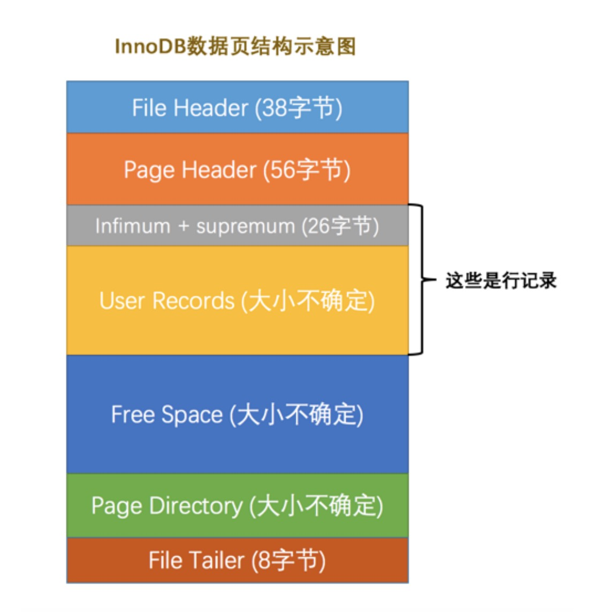
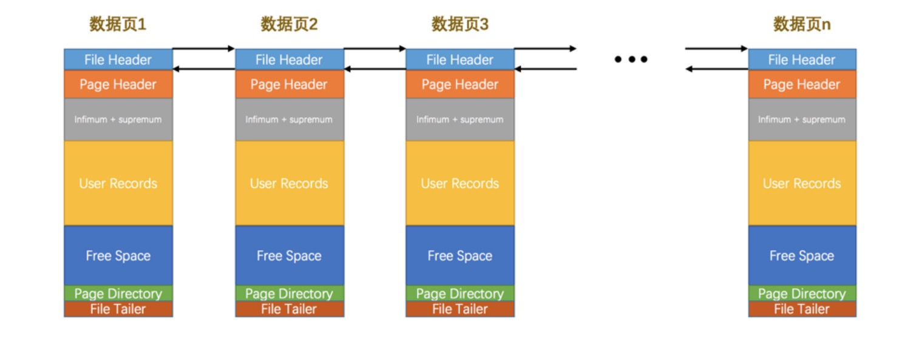
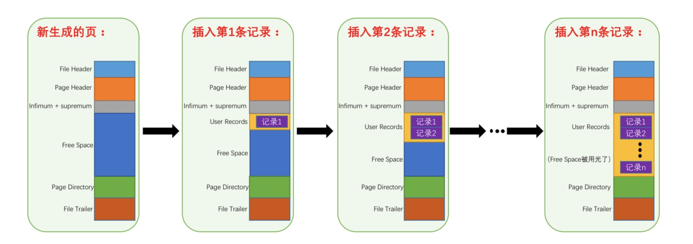
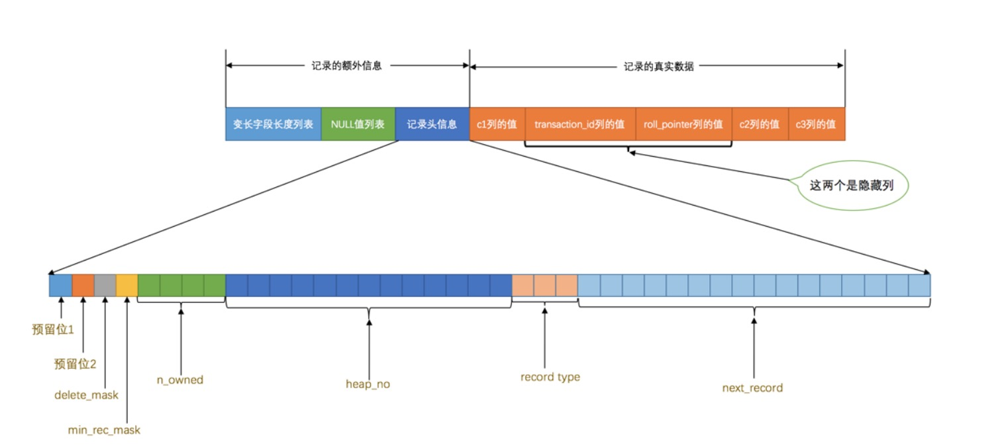
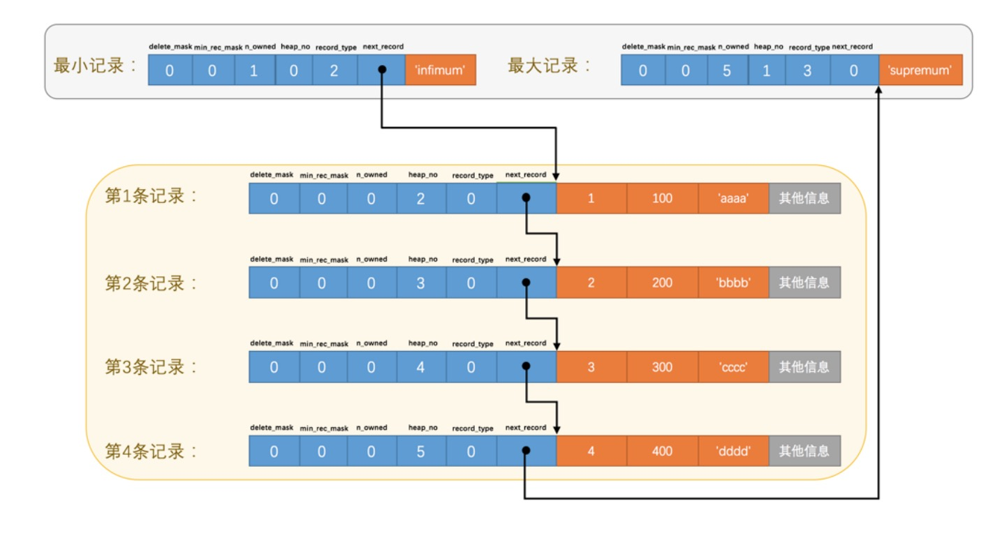
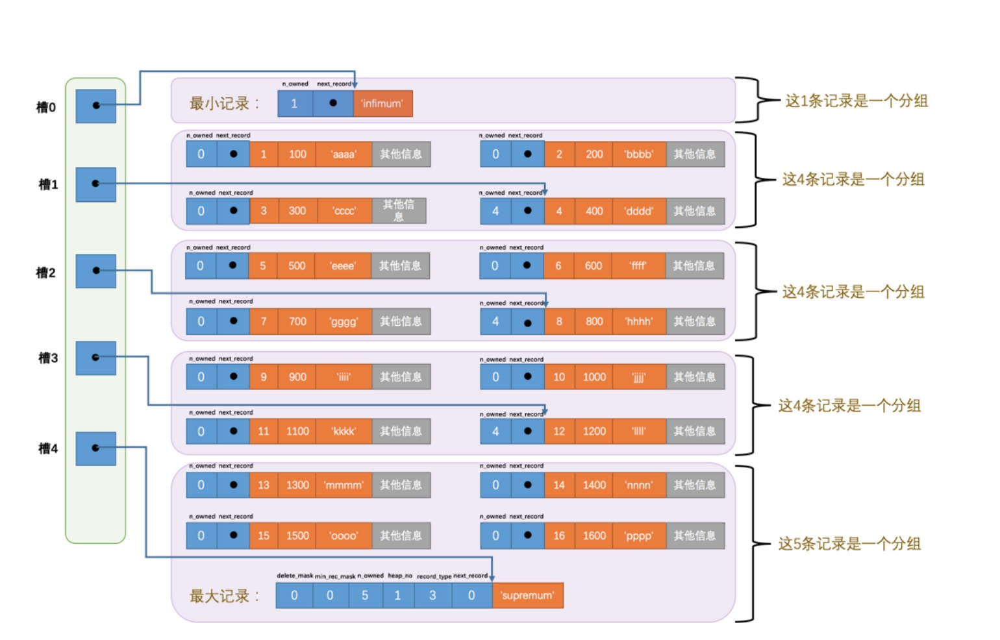
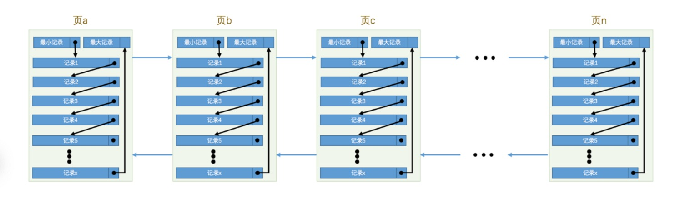

# innoDB存储结构

## innoDB内存结构

- buffer pool：缓冲池是主内存中的一个区域用于innoDB访问时缓存表
- change buffer：当二级缓存不在缓存池中时，它会缓存对二级缓存的更改。在其他读取操作的时候将页面加载到缓冲池合并。

## InnoDB页

### InnoDB页结构

File Header：中记录了本页编号、上一页地址、下一页地址等信息。

page Header：记录了本页页数、最小主键地址、页内槽位个数等信息。

### InnoDB页之间的联系

不同页之间通过双链表联系起来。

### InnoDB页结构内记录的存储

记录都在user records的区域。

### InnoDB页结构内记录的结构

### InnoDB页结构内记录的关联

记录以及主键大小按着next_record进行关联，最大记录的next_record为0，代表最后一个节点。

### InnoDB页结构内划分槽位

### InnoDB页的页内记录、页外的整体关联

# QA

1、为什么页面之间需要使用双链表关联。

因为倒排等时候，可以基于记录的有序性，倒序读取，避免再排序。

2、为什么需要划分槽位。

加快查找，顺序查找是十分慢的，使用二分查找。
