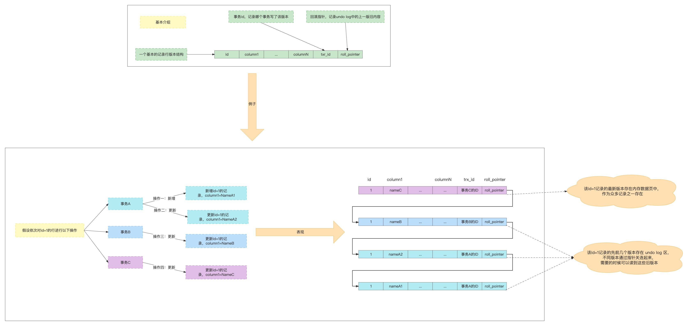

# mvcc、锁

## 隔离级别

innodb支持四个隔离界别：READ UNCOMMITTED、READCOMMITTED、REPEATABLE READ、SERIALIZABLE

读未提交：当前事务可以读到其他事务为提交的记录版本。

读已提交：当前事务只能读到其他事务已经提交的版本（借助MVCC）

可重复读：当前事务只能读到其他事务已经提交版本、而且多次相同读操作不受其他事务提交影响，每次读都是和第一次读一致。（MVCC快照读）

序列化：所有SQL语句加锁，任意的SELECT语句后都隐士加上了SHARE IN LOCK MODE。

## MVCC

### 先看一个写操作

### MVCC目的

MVCC目的就是为了支持多个版本的并发控制

- 读已提交
- 可重复读

### READ VIEW

- creator_trx_id:当前事务的id
- m_ids:当期系统中活跃的事务id列表
- min_trx_id:活跃列表中最小的事务id
- max_trx_id:系统应该分配给下一个事务的id值
- 

查找数据的是后顺着roll_pointer直到找到可见的版本。

### 读已提交的隔离级别

### 可重复读的隔离级别

可重复读使用了readView的缓存保证可重复读。

在同一个事务中，同一查询语句用的是第一次查询时生成的额readview这样就保证了查询结果是一模一样的。

## 锁机制

innoDB支持表锁和行锁，诸如DML等操作的都是行锁，alter table等操作会执行表级别锁定。

### 表锁

表锁分为共享锁和排他锁，其中还有意向锁（共享意向锁、排他意向锁）。

在每个行锁定钱，添加表的意向锁，意向锁可以避免一行一行查找。

### 行锁

行锁也有共享锁和排他锁

#### 间隙锁

间隙锁：索引记录行之间的间隙也需要加锁，锁的信息是在记录行上。

作用是防止指定记录和上一个记录之间插入数据。

在读未提交和读已提交的级别默认关闭间隙锁，在可重复读、序列化级别开启。

#### 临键锁

临键锁：行锁加间隙锁的组合。

在读未提交和读已提交的级别默认关闭间隙锁，在可重复读、序列化级别开启。

#### 插入意向锁

配合邻键锁和间隙锁实现功能。

如果插入的位置有间隙锁、邻键锁。阻塞当前插入避幻读，等锁释放后在唤醒执行。

### 锁添加的时机和位置

添加：锁并非在事务开始的时候添加，只有在执行到需要锁的sql才会添加。

删除：锁是在整个事务提交或者回滚的时候才对锁进行释放。

位置：锁记录在叶子节点记录上，聚簇索引和非聚簇索引都有。

### 锁添加的规则

### 加锁规则

#### 插入操作

所有索引都会加锁

#### 更新操作

分两步

第一步查找阶段，会在主键上加锁。

第二步更新阶段，会对删除记录和新插入的记录都加上X锁。

### 加锁整体概况

注意：唯一键索引是只匹配当前唯一以及行记录，无间隙锁。

普通索引：锁定匹配的记录行，并全部加上间隙锁

无索引：无索引的X锁查询，直接锁全表

### 唯一索引加锁查找说明

### 普通索引加锁说明

### 无索引加锁说明

### 删除阶段索引说明

