# mysql一主多从

## 一主多从

大多数的互联网应用场景都是读多写少，因此你负责的业务，在发展过程中很可能先会遇到读性能的问题。而在数据库层解决读性能问题，就要涉及到接下来两篇文章要讨论的架构：一主多从。

今天这篇文章，我们就先聊聊一主多从的切换正确性。然后，我们在下一篇文章中再聊聊解决一主多从的查询逻辑正确性的方法。

如图1所示，就是一个基本的一主多从结构。

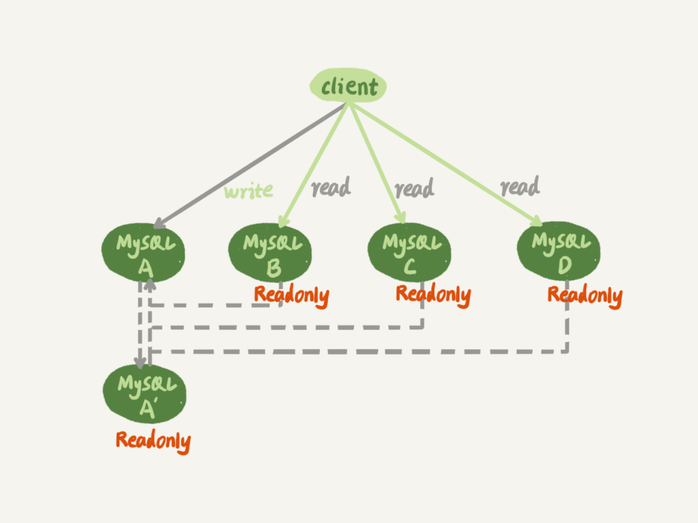

图中，虚线箭头表示的是主备关系，也就是A和A’互为主备， 从库B、C、D指向的是主库A。一主多从的设置，一般用于读写分离，主库负责所有的写入和一部分读，其他的读请求则由从库分担。

今天我们要讨论的就是，在一主多从架构下，主库故障后的主备切换问题。

如图2所示，就是主库发生故障，主备切换后的结果。

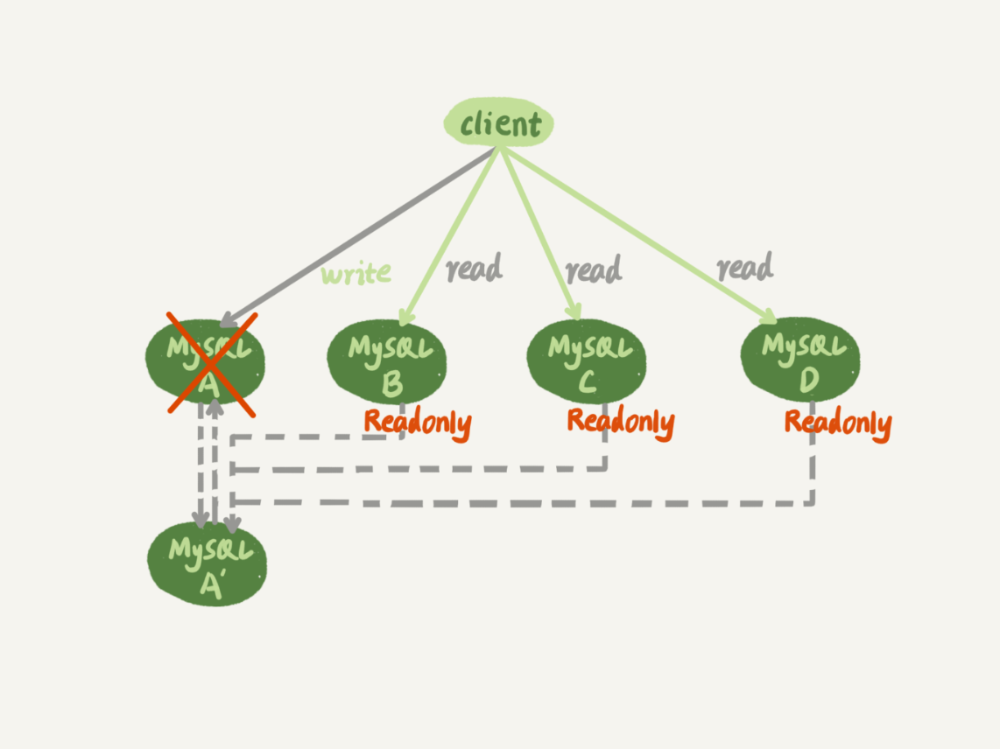

相比于一主一备的切换流程，一主多从结构在切换完成后，A’会成为新的主库，从库B、C、D也要改接到A’。正是由于多了从库B、C、D重新指向的这个过程，所以主备切换的复杂性也相应增加了。

接下来，我们再一起看看一个切换系统会怎么完成一主多从的主备切换过程。

## 基于位点的主备切换

这里，我们需要先来回顾一个知识点。

当我们把节点B设置成节点A’的从库的时候，需要执行一条change master命令：

```sql
CHANGE MASTER TO 
MASTER_HOST=$host_name 
MASTER_PORT=$port 
MASTER_USER=$user_name 
MASTER_PASSWORD=$password 
MASTER_LOG_FILE=$master_log_name 
MASTER_LOG_POS=$master_log_pos  
```

这条命令有这么6个参数：

- MASTER_HOST、MASTER_PORT、MASTER_USER和MASTER_PASSWORD四个参数，分别代表了主库A’的IP、端口、用户名和密码。
- 最后两个参数MASTER_LOG_FILE和MASTER_LOG_POS表示，要从主库的master_log_name文件的master_log_pos这个位置的日志继续同步。而这个位置就是我们所说的同步位点，也就是主库对应的文件名和日志偏移量。

那么，这里就有一个问题了，节点B要设置成A’的从库，就要执行change master命令，就不可避免地要设置位点的这两个参数，但是这两个参数到底应该怎么设置呢？

原来节点B是A的从库，本地记录的也是A的位点。但是相同的日志，A的位点和A’的位点是不同的。因此，从库B要切换的时候，就需要先经过“找同步位点”这个逻辑。

这个位点很难精确取到，只能取一个大概位置。为什么这么说呢？

我来和你分析一下看看这个位点一般是怎么获取到的，你就清楚其中不精确的原因了。

考虑到切换过程中不能丢数据，所以我们找位点的时候，总是要找一个“稍微往前”的，然后再通过判断跳过那些在从库B上已经执行过的事务。

一种取同步位点的方法是这样的：

1. 等待新主库A’把中转日志（relay log）全部同步完成；
2. 在A’上执行show master status命令，得到当前A’上最新的File 和 Position；
3. 取原主库A故障的时刻T；
4. 用mysqlbinlog工具解析A’的File，得到T时刻的位点。

```sql
mysqlbinlog File --stop-datetime=T --start-datetime=T
```

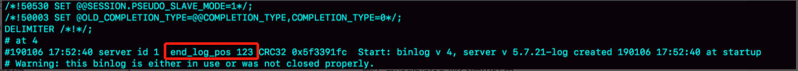

图中，end_log_pos后面的值“123”，表示的就是A’这个实例，在T时刻写入新的binlog的位置。然后，我们就可以把123这个值作为$master_log_pos ，用在节点B的change master命令里。

当然这个值并不精确。为什么呢？

你可以设想有这么一种情况，假设在T这个时刻，主库A已经执行完成了一个insert 语句插入了一行数据R，并且已经将binlog传给了A’和B，然后在传完的瞬间主库A的主机就掉电了。

那么，这时候系统的状态是这样的：

1. 在从库B上，由于同步了binlog， R这一行已经存在；
2. 在新主库A’上， R这一行也已经存在，日志是写在123这个位置之后的；
3. 我们在从库B上执行change master命令，指向A’的File文件的123位置，就会把插入R这一行数据的binlog又同步到从库B去执行。

这时候，从库B的同步线程就会报告 Duplicate entry ‘id_of_R’ for key ‘PRIMARY’ 错误，提示出现了主键冲突，然后停止同步。

所以，**通常情况下，我们在切换任务的时候，要先主动跳过这些错误，有两种常用的方法。**

**一种做法是**，主动跳过一个事务。跳过命令的写法是：

```sql
set global sql_slave_skip_counter=1;
start slave;
```

因为切换过程中，可能会不止重复执行一个事务，所以我们需要在从库B刚开始接到新主库A’时，持续观察，每次碰到这些错误就停下来，执行一次跳过命令，直到不再出现停下来的情况，以此来跳过可能涉及的所有事务。

**另外一种方式是，**通过设置slave_skip_errors参数，直接设置跳过指定的错误。

在执行主备切换时，有这么两类错误，是经常会遇到的：

- 1062错误是插入数据时唯一键冲突；
- 1032错误是删除数据时找不到行。

因此，我们可以把slave_skip_errors 设置为 “1032,1062”，这样中间碰到这两个错误时就直接跳过。

这里需要注意的是，这种直接跳过指定错误的方法，针对的是主备切换时，由于找不到精确的同步位点，所以只能采用这种方法来创建从库和新主库的主备关系。

这个背景是，我们很清楚在主备切换过程中，直接跳过1032和1062这两类错误是无损的，所以才可以这么设置slave_skip_errors参数。等到主备间的同步关系建立完成，并稳定执行一段时间之后，我们还需要把这个参数设置为空，以免之后真的出现了主从数据不一致，也跳过了。

## GTID

通过sql_slave_skip_counter跳过事务和通过slave_skip_errors忽略错误的方法，虽然都最终可以建立从库B和新主库A’的主备关系，但这两种操作都很复杂，而且容易出错。所以，MySQL 5.6版本引入了GTID，彻底解决了这个困难。

那么，GTID到底是什么意思，又是如何解决找同步位点这个问题呢？现在，我就和你简单介绍一下。

GTID的全称是Global Transaction Identifier，也就是全局事务ID，是一个事务在提交的时候生成的，是这个事务的唯一标识。它由两部分组成，格式是：

```sql
GTID=server_uuid:gno
```

其中：

- server_uuid是一个实例第一次启动时自动生成的，是一个全局唯一的值；
- gno是一个整数，初始值是1，每次提交事务的时候分配给这个事务，并加1。

这里我需要和你说明一下，在MySQL的官方文档里，GTID格式是这么定义的：

```sql
GTID=source_id:transaction_id
```

这里的source_id就是server_uuid；而后面的这个transaction_id，我觉得容易造成误导，所以我改成了gno。为什么说使用transaction_id容易造成误解呢？

因为，在MySQL里面我们说transaction_id就是指事务id，事务id是在事务执行过程中分配的，如果这个事务回滚了，事务id也会递增，而gno是在事务提交的时候才会分配。

从效果上看，GTID往往是连续的，因此我们用gno来表示更容易理解。

GTID模式的启动也很简单，我们只需要在启动一个MySQL实例的时候，加上参数gtid_mode=on和enforce_gtid_consistency=on就可以了。

在GTID模式下，每个事务都会跟一个GTID一一对应。这个GTID有两种生成方式，而使用哪种方式取决于session变量gtid_next的值。

1. 如果gtid_next=automatic，代表使用默认值。这时，MySQL就会把server_uuid:gno分配给这个事务。
   a. 记录binlog的时候，先记录一行 SET @@SESSION.GTID_NEXT=‘server_uuid:gno’;
   b. 把这个GTID加入本实例的GTID集合。
2. 如果gtid_next是一个指定的GTID的值，比如通过set gtid_next='current_gtid’指定为current_gtid，那么就有两种可能：
   a. 如果current_gtid已经存在于实例的GTID集合中，接下来执行的这个事务会直接被系统忽略；
   b. 如果current_gtid没有存在于实例的GTID集合中，就将这个current_gtid分配给接下来要执行的事务，也就是说系统不需要给这个事务生成新的GTID，因此gno也不用加1。

注意，一个current_gtid只能给一个事务使用。这个事务提交后，如果要执行下一个事务，就要执行set 命令，把gtid_next设置成另外一个gtid或者automatic。

这样，每个MySQL实例都维护了一个GTID集合，用来对应“这个实例执行过的所有事务”。

这样看上去不太容易理解，接下来我就用一个简单的例子，来和你说明GTID的基本用法。

我们在实例X中创建一个表t。

```sql
CREATE TABLE `t` (
  `id` int(11) NOT NULL,
  `c` int(11) DEFAULT NULL,
  PRIMARY KEY (`id`)
) ENGINE=InnoDB;

insert into t values(1,1);
```

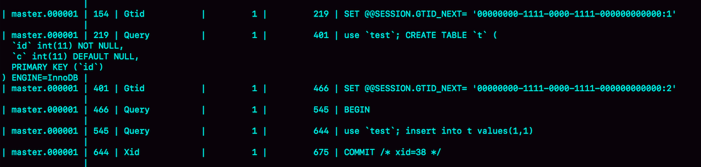

可以看到，事务的BEGIN之前有一条SET @@SESSION.GTID_NEXT命令。这时，如果实例X有从库，那么将CREATE TABLE和insert语句的binlog同步过去执行的话，执行事务之前就会先执行这两个SET命令， 这样被加入从库的GTID集合的，就是图中的这两个GTID。

假设，现在这个实例X是另外一个实例Y的从库，并且此时在实例Y上执行了下面这条插入语句：

```sql
insert into t values(1,1);
```

并且，这条语句在实例Y上的GTID是 “aaaaaaaa-cccc-dddd-eeee-ffffffffffff:10”。

那么，实例X作为Y的从库，就要同步这个事务过来执行，显然会出现主键冲突，导致实例X的同步线程停止。这时，我们应该怎么处理呢？

处理方法就是，你可以执行下面的这个语句序列：

```sql
set gtid_next='aaaaaaaa-cccc-dddd-eeee-ffffffffffff:10';
begin;
commit;
set gtid_next=automatic;
start slave;
```

其中，前三条语句的作用，是通过提交一个空事务，把这个GTID加到实例X的GTID集合中。如图5所示，就是执行完这个空事务之后的show master status的结果。

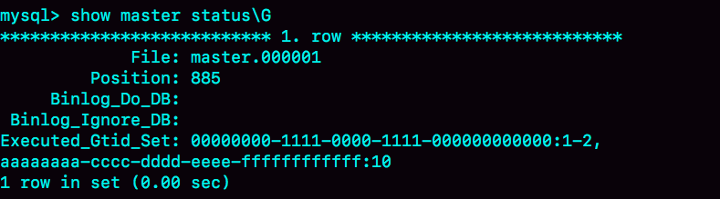

可以看到实例X的Executed_Gtid_set里面，已经加入了这个GTID。

这样，我再执行start slave命令让同步线程执行起来的时候，虽然实例X上还是会继续执行实例Y传过来的事务，但是由于“aaaaaaaa-cccc-dddd-eeee-ffffffffffff:10”已经存在于实例X的GTID集合中了，所以实例X就会直接跳过这个事务，也就不会再出现主键冲突的错误。

在上面的这个语句序列中，start slave命令之前还有一句set gtid_next=automatic。这句话的作用是“恢复GTID的默认分配行为”，也就是说如果之后有新的事务再执行，就还是按照原来的分配方式，继续分配gno=3。

## 基于GTID的主备切换

现在，我们已经理解GTID的概念，再一起来看看基于GTID的主备复制的用法。

在GTID模式下，备库B要设置为新主库A’的从库的语法如下：

```sql
CHANGE MASTER TO 
MASTER_HOST=$host_name 
MASTER_PORT=$port 
MASTER_USER=$user_name 
MASTER_PASSWORD=$password 
master_auto_position=1 
```

其中，master_auto_position=1就表示这个主备关系使用的是GTID协议。可以看到，前面让我们头疼不已的MASTER_LOG_FILE和MASTER_LOG_POS参数，已经不需要指定了。

我们把现在这个时刻，实例A’的GTID集合记为set_a，实例B的GTID集合记为set_b。接下来，我们就看看现在的主备切换逻辑。

我们在实例B上执行start slave命令，取binlog的逻辑是这样的：

1. 实例B指定主库A’，基于主备协议建立连接。
2. 实例B把set_b发给主库A’。
3. 实例A’算出set_a与set_b的差集，也就是所有存在于set_a，但是不存在于set_b的GTID的集合，判断A’本地是否包含了这个差集需要的所有binlog事务。
   a. 如果不包含，表示A’已经把实例B需要的binlog给删掉了，直接返回错误；
   b. 如果确认全部包含，A’从自己的binlog文件里面，找出第一个不在set_b的事务，发给B；
4. 之后就从这个事务开始，往后读文件，按顺序取binlog发给B去执行。

其实，这个逻辑里面包含了一个设计思想：在基于GTID的主备关系里，系统认为只要建立主备关系，就必须保证主库发给备库的日志是完整的。因此，如果实例B需要的日志已经不存在，A’就拒绝把日志发给B。

这跟基于位点的主备协议不同。基于位点的协议，是由备库决定的，备库指定哪个位点，主库就发哪个位点，不做日志的完整性判断。

基于上面的介绍，我们再来看看引入GTID后，一主多从的切换场景下，主备切换是如何实现的。

由于不需要找位点了，所以从库B、C、D只需要分别执行change master命令指向实例A’即可。

其实，严谨地说，主备切换不是不需要找位点了，而是找位点这个工作，在实例A’内部就已经自动完成了。但由于这个工作是自动的，所以对HA系统的开发人员来说，非常友好。

之后这个系统就由新主库A’写入，主库A’的自己生成的binlog中的GTID集合格式是：server_uuid_of_A’:1-M。

如果之前从库B的GTID集合格式是 server_uuid_of_A:1-N， 那么切换之后GTID集合的格式就变成了server_uuid_of_A:1-N, server_uuid_of_A’:1-M。

当然，主库A’之前也是A的备库，因此主库A’和从库B的GTID集合是一样的。这就达到了我们预期。

## GTID和在线DDL

接下来，我再举个例子帮你理解GTID。

之前在第22篇文章[《MySQL有哪些“饮鸩止渴”提高性能的方法？》](https://time.geekbang.org/column/article/75746)中，我和你提到业务高峰期的慢查询性能问题时，分析到如果是由于索引缺失引起的性能问题，我们可以通过在线加索引来解决。但是，考虑到要避免新增索引对主库性能造成的影响，我们可以先在备库加索引，然后再切换。

当时我说，在双M结构下，备库执行的DDL语句也会传给主库，为了避免传回后对主库造成影响，要通过set sql_log_bin=off关掉binlog。

评论区有位同学提出了一个问题：这样操作的话，数据库里面是加了索引，但是binlog并没有记录下这一个更新，是不是会导致数据和日志不一致？

这个问题提得非常好。当时，我在留言的回复中就引用了GTID来说明。今天，我再和你展开说明一下。

假设，这两个互为主备关系的库还是实例X和实例Y，且当前主库是X，并且都打开了GTID模式。这时的主备切换流程可以变成下面这样：

- 在实例X上执行stop slave。
- 在实例Y上执行DDL语句。注意，这里并不需要关闭binlog。
- 执行完成后，查出这个DDL语句对应的GTID，并记为 server_uuid_of_Y:gno。
- 到实例X上执行以下语句序列：

```sql
set GTID_NEXT="server_uuid_of_Y:gno";
begin;
commit;
set gtid_next=automatic;
start slave;
```

这样做的目的在于，既可以让实例Y的更新有binlog记录，同时也可以确保不会在实例X上执行这条更新。

- 接下来，执行完主备切换，然后照着上述流程再执行一遍即可。

## 小结

在今天这篇文章中，我先和你介绍了一主多从的主备切换流程。在这个过程中，从库找新主库的位点是一个痛点。由此，我们引出了MySQL 5.6版本引入的GTID模式，介绍了GTID的基本概念和用法。

可以看到，在GTID模式下，一主多从切换就非常方便了。

因此，如果你使用的MySQL版本支持GTID的话，我都建议你尽量使用GTID模式来做一主多从的切换。

在下一篇文章中，我们还能看到GTID模式在读写分离场景的应用。

最后，又到了我们的思考题时间。

你在GTID模式下设置主从关系的时候，从库执行start slave命令后，主库发现需要的binlog已经被删除掉了，导致主备创建不成功。这种情况下，你觉得可以怎么处理呢？

上期给你留的问题是，在GTID模式下，如果一个新的从库接上主库，但是需要的binlog已经没了，要怎么做？

---

@某、人同学给了很详细的分析，我把他的回答略做修改贴过来。

1. 如果业务允许主从不一致的情况，那么可以在主库上先执行show global variables like ‘gtid_purged’，得到主库已经删除的GTID集合，假设是gtid_purged1；然后先在从库上执行reset master，再执行set global gtid_purged =‘gtid_purged1’；最后执行start slave，就会从主库现存的binlog开始同步。binlog缺失的那一部分，数据在从库上就可能会有丢失，造成主从不一致。
2. 如果需要主从数据一致的话，最好还是通过重新搭建从库来做。
3. 如果有其他的从库保留有全量的binlog的话，可以把新的从库先接到这个保留了全量binlog的从库，追上日志以后，如果有需要，再接回主库。
4. 如果binlog有备份的情况，可以先在从库上应用缺失的binlog，然后再执行start slave。


# 读写分离有哪些坑

还有一种架构是，在MySQL和客户端之间有一个中间代理层proxy，客户端只连接proxy， 由proxy根据请求类型和上下文决定请求的分发路由。

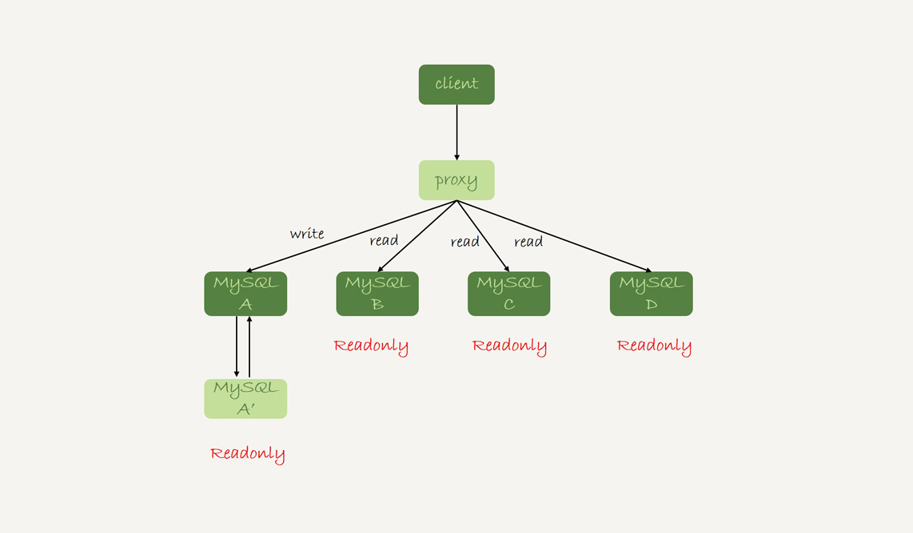

接下来，我们就看一下客户端直连和带proxy的读写分离架构，各有哪些特点。

1. 客户端直连方案，因为少了一层proxy转发，所以查询性能稍微好一点儿，并且整体架构简单，排查问题更方便。但是这种方案，由于要了解后端部署细节，所以在出现主备切换、库迁移等操作的时候，客户端都会感知到，并且需要调整数据库连接信息。
   你可能会觉得这样客户端也太麻烦了，信息大量冗余，架构很丑。其实也未必，一般采用这样的架构，一定会伴随一个负责管理后端的组件，比如Zookeeper，尽量让业务端只专注于业务逻辑开发。
2. 带proxy的架构，对客户端比较友好。客户端不需要关注后端细节，连接维护、后端信息维护等工作，都是由proxy完成的。但这样的话，对后端维护团队的要求会更高。而且，proxy也需要有高可用架构。因此，带proxy架构的整体就相对比较复杂。

理解了这两种方案的优劣，具体选择哪个方案就取决于数据库团队提供的能力了。但目前看，趋势是往带proxy的架构方向发展的。

但是，不论使用哪种架构，你都会碰到我们今天要讨论的问题：由于主从可能存在延迟，客户端执行完一个更新事务后马上发起查询，如果查询选择的是从库的话，就有可能读到刚刚的事务更新之前的状态。

**这种“在从库上会读到系统的一个过期状态”的现象，在这篇文章里，我们暂且称之为“过期读”。**

前面我们说过了几种可能导致主备延迟的原因，以及对应的优化策略，但是主从延迟还是不能100%避免的。

不论哪种结构，客户端都希望查询从库的数据结果，跟查主库的数据结果是一样的。

接下来，我们就来讨论怎么处理过期读问题。

这里，我先把文章中涉及到的处理过期读的方案汇总在这里，以帮助你更好地理解和掌握全文的知识脉络。这些方案包括：

- 强制走主库方案；
- sleep方案；
- 判断主备无延迟方案；
- 配合semi-sync方案；
- 等主库位点方案；
- 等GTID方案。

## 强制走主库方案

强制走主库方案其实就是，将查询请求做分类。通常情况下，我们可以将查询请求分为这么两类：

1. 对于必须要拿到最新结果的请求，强制将其发到主库上。比如，在一个交易平台上，卖家发布商品以后，马上要返回主页面，看商品是否发布成功。那么，这个请求需要拿到最新的结果，就必须走主库。
2. 对于可以读到旧数据的请求，才将其发到从库上。在这个交易平台上，买家来逛商铺页面，就算晚几秒看到最新发布的商品，也是可以接受的。那么，这类请求就可以走从库。

你可能会说，这个方案是不是有点畏难和取巧的意思，但其实这个方案是用得最多的。

当然，这个方案最大的问题在于，有时候你会碰到“所有查询都不能是过期读”的需求，比如一些金融类的业务。这样的话，你就要放弃读写分离，所有读写压力都在主库，等同于放弃了扩展性。

因此接下来，我们来讨论的话题是：可以支持读写分离的场景下，有哪些解决过期读的方案，并分析各个方案的优缺点。

## Sleep 方案

主库更新后，读从库之前先sleep一下。具体的方案就是，类似于执行一条select sleep(1)命令。

这个方案的假设是，大多数情况下主备延迟在1秒之内，做一个sleep可以有很大概率拿到最新的数据。

这个方案给你的第一感觉，很可能是不靠谱儿，应该不会有人用吧？并且，你还可能会说，直接在发起查询时先执行一条sleep语句，用户体验很不友好啊。

但，这个思路确实可以在一定程度上解决问题。为了看起来更靠谱儿，我们可以换一种方式。

以卖家发布商品为例，商品发布后，用Ajax（Asynchronous JavaScript + XML，异步JavaScript和XML）直接把客户端输入的内容作为“新的商品”显示在页面上，而不是真正地去数据库做查询。

这样，卖家就可以通过这个显示，来确认产品已经发布成功了。等到卖家再刷新页面，去查看商品的时候，其实已经过了一段时间，也就达到了sleep的目的，进而也就解决了过期读的问题。

也就是说，这个sleep方案确实解决了类似场景下的过期读问题。但，从严格意义上来说，这个方案存在的问题就是不精确。这个不精确包含了两层意思：

1. 如果这个查询请求本来0.5秒就可以在从库上拿到正确结果，也会等1秒；
2. 如果延迟超过1秒，还是会出现过期读。

看到这里，你是不是有一种“你是不是在逗我”的感觉，这个改进方案虽然可以解决类似Ajax场景下的过期读问题，但还是怎么看都不靠谱儿。别着急，接下来我就和你介绍一些更准确的方案。

## 判断主备无延迟方案

要确保备库无延迟，通常有三种做法。

通过前面的[第25篇](https://time.geekbang.org/column/article/76795)文章，我们知道show slave status结果里的seconds_behind_master参数的值，可以用来衡量主备延迟时间的长短。

所以**第一种确保主备无延迟的方法是，**每次从库执行查询请求前，先判断seconds_behind_master是否已经等于0。如果还不等于0 ，那就必须等到这个参数变为0才能执行查询请求。

seconds_behind_master的单位是秒，如果你觉得精度不够的话，还可以采用对比位点和GTID的方法来确保主备无延迟，也就是我们接下来要说的第二和第三种方法。

如图下图所示，是一个show slave status结果的部分截图。

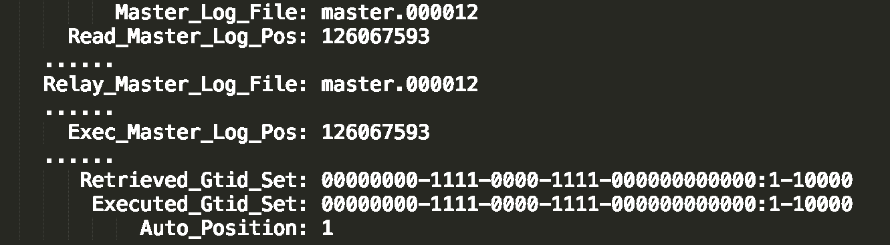

现在，我们就通过这个结果，来看看具体如何通过对比位点和GTID来确保主备无延迟。

**第二种方法，**对比位点确保主备无延迟：

- Master_Log_File和Read_Master_Log_Pos，表示的是读到的主库的最新位点；
- Relay_Master_Log_File和Exec_Master_Log_Pos，表示的是备库执行的最新位点。

如果Master_Log_File和Relay_Master_Log_File、Read_Master_Log_Pos和Exec_Master_Log_Pos这两组值完全相同，就表示接收到的日志已经同步完成。

**第三种方法，**对比GTID集合确保主备无延迟：

- Auto_Position=1 ，表示这对主备关系使用了GTID协议。
- Retrieved_Gtid_Set，是备库收到的所有日志的GTID集合；
- Executed_Gtid_Set，是备库所有已经执行完成的GTID集合。

如果这两个集合相同，也表示备库接收到的日志都已经同步完成。

可见，对比位点和对比GTID这两种方法，都要比判断seconds_behind_master是否为0更准确。

在执行查询请求之前，先判断从库是否同步完成的方法，相比于sleep方案，准确度确实提升了不少，但还是没有达到“精确”的程度。为什么这么说呢？

我们现在一起来回顾下，一个事务的binlog在主备库之间的状态：

1. 主库执行完成，写入binlog，并反馈给客户端；
2. binlog被从主库发送给备库，备库收到；
3. 在备库执行binlog完成。

我们上面判断主备无延迟的逻辑，是“备库收到的日志都执行完成了”。但是，从binlog在主备之间状态的分析中，不难看出还有一部分日志，处于客户端已经收到提交确认，而备库还没收到日志的状态。

如下图所示就是这样的一个状态。

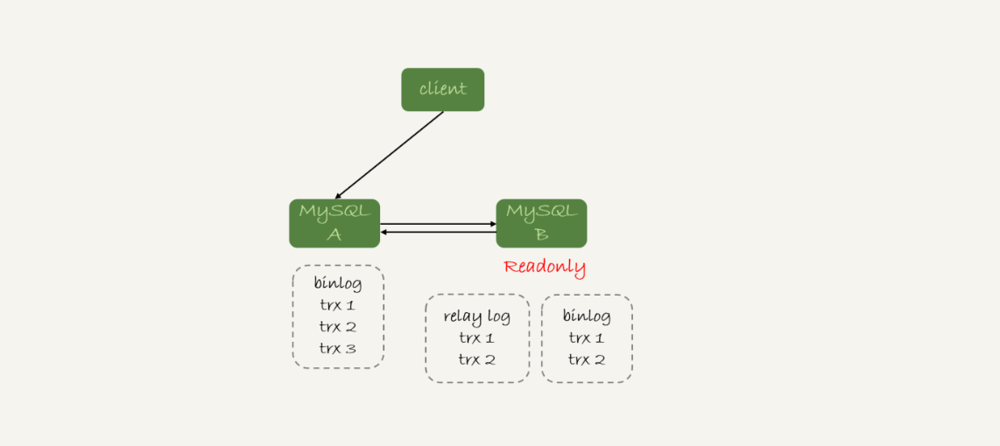

这时，主库上执行完成了三个事务trx1、trx2和trx3，其中：

1. trx1和trx2已经传到从库，并且已经执行完成了；
2. trx3在主库执行完成，并且已经回复给客户端，但是还没有传到从库中。

如果这时候你在从库B上执行查询请求，按照我们上面的逻辑，从库认为已经没有同步延迟，但还是查不到trx3的。严格地说，就是出现了过期读。

那么，这个问题有没有办法解决呢？

## 配合semi-sync

要解决这个问题，就要引入半同步复制，也就是semi-sync replication。

semi-sync做了这样的设计：

1. 事务提交的时候，主库把binlog发给从库；
2. 从库收到binlog以后，发回给主库一个ack，表示收到了；
3. 主库收到这个ack以后，才能给客户端返回“事务完成”的确认。

也就是说，如果启用了semi-sync，就表示所有给客户端发送过确认的事务，都确保了备库已经收到了这个日志。

在[第25篇文章](https://time.geekbang.org/column/article/76795)的评论区，有同学问到：如果主库掉电的时候，有些binlog还来不及发给从库，会不会导致系统数据丢失？

答案是，如果使用的是普通的异步复制模式，就可能会丢失，但semi-sync就可以解决这个问题。

这样，semi-sync配合前面关于位点的判断，就能够确定在从库上执行的查询请求，可以避免过期读。

但是，semi-sync+位点判断的方案，只对一主一备的场景是成立的。在一主多从场景中，主库只要等到一个从库的ack，就开始给客户端返回确认。这时，在从库上执行查询请求，就有两种情况：

1. 如果查询是落在这个响应了ack的从库上，是能够确保读到最新数据；
2. 但如果是查询落到其他从库上，它们可能还没有收到最新的日志，就会产生过期读的问题。

其实，判断同步位点的方案还有另外一个潜在的问题，即：如果在业务更新的高峰期，主库的位点或者GTID集合更新很快，那么上面的两个位点等值判断就会一直不成立，很可能出现从库上迟迟无法响应查询请求的情况。

实际上，回到我们最初的业务逻辑里，当发起一个查询请求以后，我们要得到准确的结果，其实并不需要等到“主备完全同步”。

为什么这么说呢？我们来看一下这个时序图。

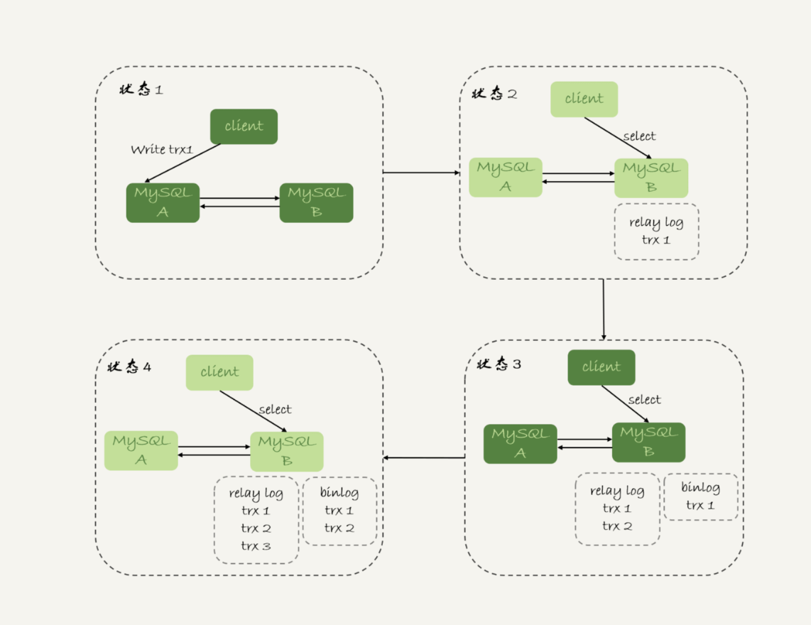

上图所示，就是等待位点方案的一个bad case。图中备库B下的虚线框，分别表示relaylog和binlog中的事务。可以看到，图5中从状态1 到状态4，一直处于延迟一个事务的状态。

备库B一直到状态4都和主库A存在延迟，如果用上面必须等到无延迟才能查询的方案，select语句直到状态4都不能被执行。

但是，其实客户端是在发完trx1更新后发起的select语句，我们只需要确保trx1已经执行完成就可以执行select语句了。也就是说，如果在状态3执行查询请求，得到的就是预期结果了。

到这里，我们小结一下，semi-sync配合判断主备无延迟的方案，存在两个问题：

1. 一主多从的时候，在某些从库执行查询请求会存在过期读的现象；
2. 在持续延迟的情况下，可能出现过度等待的问题。

接下来，我要和你介绍的等主库位点方案，就可以解决这两个问题。

## 等主库位点方案

要理解等主库位点方案，我需要先和你介绍一条命令：

```sql
select master_pos_wait(file, pos[, timeout]);
```

这条命令的逻辑如下：

1. 它是在从库执行的；
2. 参数file和pos指的是主库上的文件名和位置；
3. timeout可选，设置为正整数N表示这个函数最多等待N秒。

这个命令正常返回的结果是一个正整数M，表示从命令开始执行，到应用完file和pos表示的binlog位置，执行了多少事务。

当然，除了正常返回一个正整数M外，这条命令还会返回一些其他结果，包括：

1. 如果执行期间，备库同步线程发生异常，则返回NULL；
2. 如果等待超过N秒，就返回-1；
3. 如果刚开始执行的时候，就发现已经执行过这个位置了，则返回0。

对于图5中先执行trx1，再执行一个查询请求的逻辑，要保证能够查到正确的数据，我们可以使用这个逻辑：

1. trx1事务更新完成后，马上执行show master status得到当前主库执行到的File和Position；
2. 选定一个从库执行查询语句；
3. 在从库上执行select master_pos_wait(File, Position, 1)；
4. 如果返回值是>=0的正整数，则在这个从库执行查询语句；
5. 否则，到主库执行查询语句。

我把上面这个流程画出来。

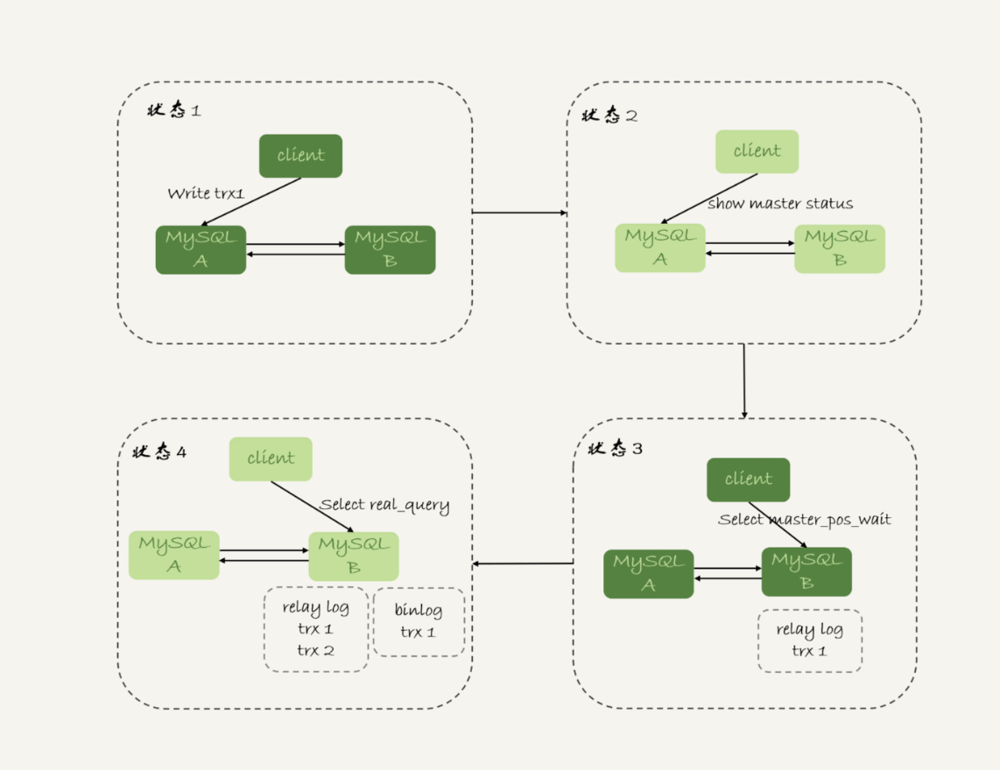

这里我们假设，这条select查询最多在从库上等待1秒。那么，如果1秒内master_pos_wait返回一个大于等于0的整数，就确保了从库上执行的这个查询结果一定包含了trx1的数据。

步骤5到主库执行查询语句，是这类方案常用的退化机制。因为从库的延迟时间不可控，不能无限等待，所以如果等待超时，就应该放弃，然后到主库去查。

你可能会说，如果所有的从库都延迟超过1秒了，那查询压力不就都跑到主库上了吗？确实是这样。

但是，按照我们设定不允许过期读的要求，就只有两种选择，一种是超时放弃，一种是转到主库查询。具体怎么选择，就需要业务开发同学做好限流策略了。

# GTID方案

如果你的数据库开启了GTID模式，对应的也有等待GTID的方案。

MySQL中同样提供了一个类似的命令：

```
 select wait_for_executed_gtid_set(gtid_set, 1);
```

这条命令的逻辑是：

1. 等待，直到这个库执行的事务中包含传入的gtid_set，返回0；
2. 超时返回1。

在前面等位点的方案中，我们执行完事务后，还要主动去主库执行show master status。而MySQL 5.7.6版本开始，允许在执行完更新类事务后，把这个事务的GTID返回给客户端，这样等GTID的方案就可以减少一次查询。

这时，等GTID的执行流程就变成了：

1. trx1事务更新完成后，从返回包直接获取这个事务的GTID，记为gtid1；
2. 选定一个从库执行查询语句；
3. 在从库上执行 select wait_for_executed_gtid_set(gtid1, 1)；
4. 如果返回值是0，则在这个从库执行查询语句；
5. 否则，到主库执行查询语句。

跟等主库位点的方案一样，等待超时后是否直接到主库查询，需要业务开发同学来做限流考虑。

我把这个流程图画出来。

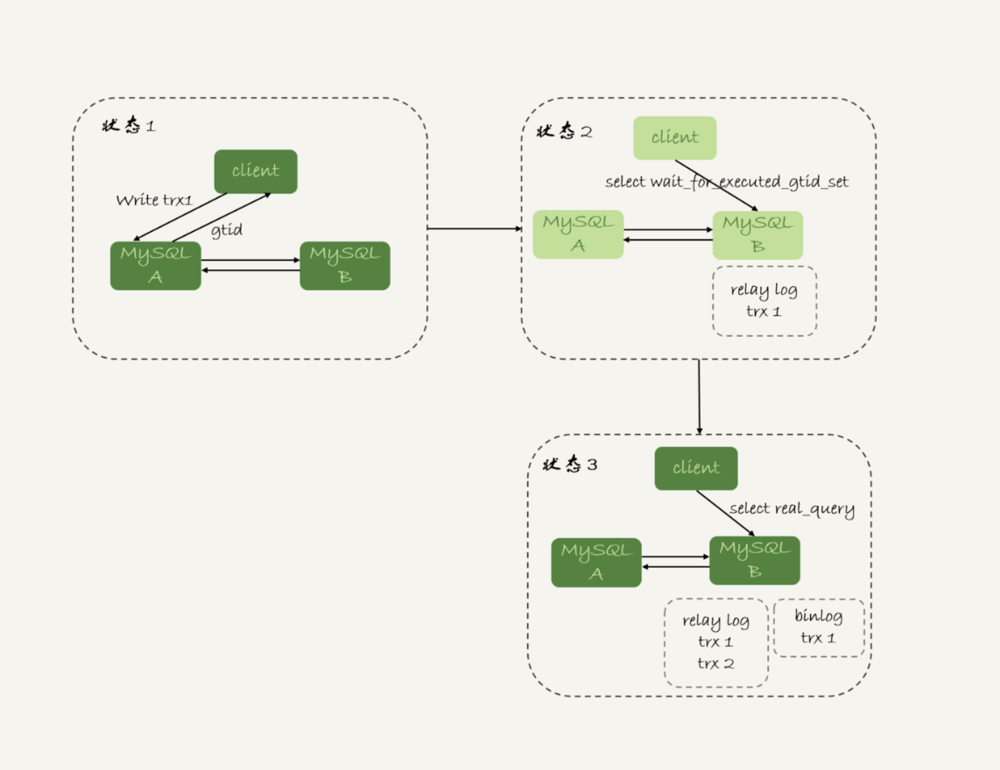

图7 wait_for_executed_gtid_set方案

在上面的第一步中，trx1事务更新完成后，从返回包直接获取这个事务的GTID。问题是，怎么能够让MySQL在执行事务后，返回包中带上GTID呢？

你只需要将参数session_track_gtids设置为OWN_GTID，然后通过API接口mysql_session_track_get_first从返回包解析出GTID的值即可。

在专栏的[第一篇文章](https://time.geekbang.org/column/article/68319)中，我介绍mysql_reset_connection的时候，评论区有同学留言问这类接口应该怎么使用。

这里我再回答一下。其实，MySQL并没有提供这类接口的SQL用法，是提供给程序的API(https://dev.mysql.com/doc/refman/5.7/en/c-api-functions.html)。

比如，为了让客户端在事务提交后，返回的GITD能够在客户端显示出来，我对MySQL客户端代码做了点修改，如下所示：

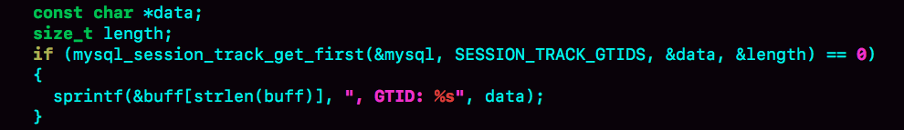

图8 显示更新事务的GTID--代码

这样，就可以看到语句执行完成，显示出GITD的值。

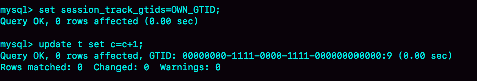

图9 显示更新事务的GTID--效果

当然了，这只是一个例子。你要使用这个方案的时候，还是应该在你的客户端代码中调用mysql_session_track_get_first这个函数。

