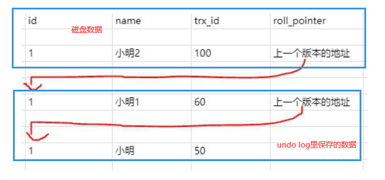
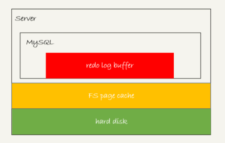
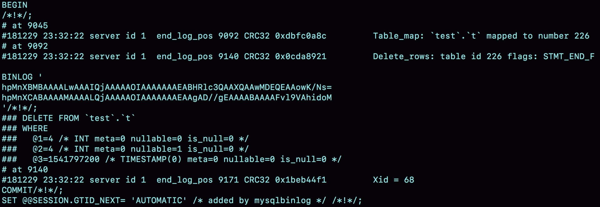
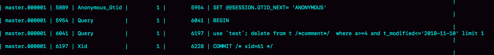
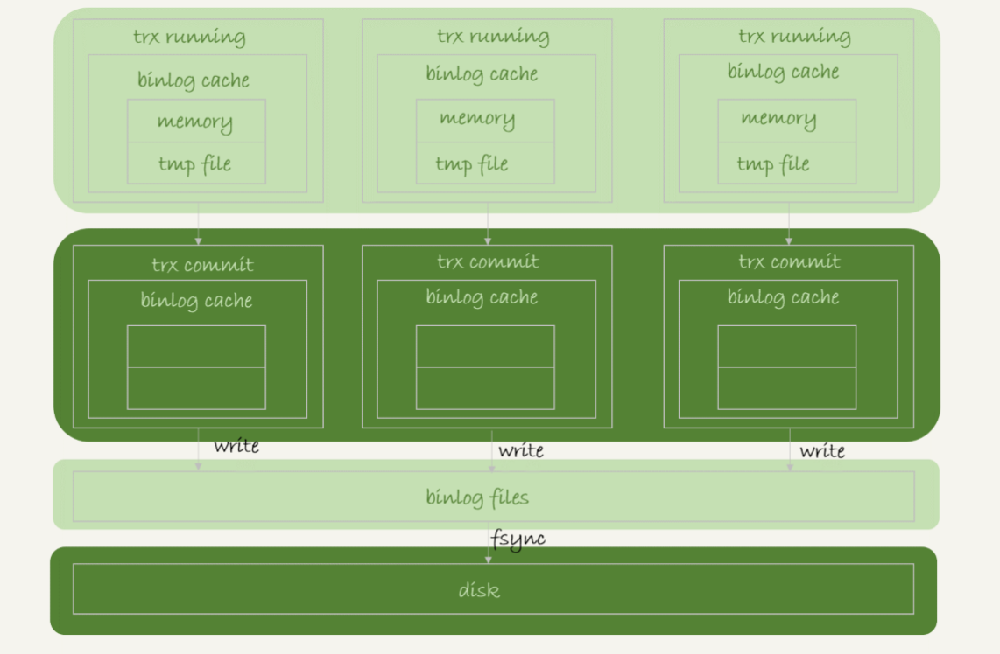

# MYSQL三种日志

## WAL（Write-Ahead Logging）预写日志系统

指的是 MySQL 的写操作并不是立刻更新到磁盘上，而是先记录在日志上，然后在合适的时间再更新到磁盘上。这样的好处是错开高峰期。日志主要分为 undo log、redo log、binlog。作用分别是 " 完成MVCC从而实现 MySQL 的隔离级别 "、" 降低随机写的性能消耗（转成顺序写），同时防止写操作因为宕机而丢失 "、" 写操作的备份，保证主从一致 "。

## undo log

undo log 主要用于实现 MVCC，从而实现 MySQL 的 ”读已提交“、”可重复读“ 隔离级别。在每个行记录后面有两个隐藏列，"trx_id"、"roll_pointer"，分别表示上一次修改的事务id，以及 "上一次修改之前保存在 undo log中的记录位置 "。在对一行记录进行修改或删除操作前，会先将该记录拷贝一份到 undo log 中，然后再进行修改，并将修改事务 id，拷贝的记录在 undo log 中的位置写入 "trx_id"、"roll_pointer"。

而 MVCC 最核心的就是 版本链 和通过版本链生成的 Read View。

1、版本链：通过 "roll_pointer" 字段指向的上一次修改的值，使每行记录变化前后形成了一条版本链。

2、Read View：Read View 表示可见视图，用于限制当前事务查询数据的，通过与版本链的配合可以实现对数据的 “快照读” 。Read View 内部主要有四个部分组成，第一个是创建当前 Read View 的事务 id creator_trx_id，第二个是创建 Read View 时还未提交的事务 id 集合trx_ids，第三个是未提交事务 id 集合中的最大值up_limit_id，第四个是未提交事务 id 集合中的最小值low_limit_id。

当执行查询操作时会先找磁盘上的数据，然后根据 Read View 里的各个值进行判断，

1）如果该数据的 trx_id 等于 creator_trx_id，那么就说明这条数据是创建 Read View的事务修改的，那么就直接返回；

2）如果 trx_id 大于等于 up_limit_id，说明是新事务修改的，那么会根据 roll_pointer 找到上一个版本的数据重新比较；

3）如果 trx_id 小于 low_limit_id，那么说明是之前的事务修改的数据，那么就直接返回；

4）如果 trx_id 是在 low_limit_id 与 up_limit_id 中间，那么需要去 trx_ids 中对各个元素逐个判断，如果存在相同值的元素，就根据 roll_pointer 找到上一个版本的数据，然后再重复判断；如果不存在就说明该数据是创建当前 Read View 时就已经修改好的了，可以返回。

 

**而读已提交和可重复读之所以不同就是它们 Read View 生成机制不同，读已提交是每次 select 都会重新生成一次，而可重复读是一次事务只会创建一次且在第一次查询时创建 Read View。事务启动命令begin/start transaction不会创建Read View，但是通过 start transaction with consistent snapshot 开启事务就会在开始时就创建一次 Read View。**

举个网上的例子，启动事务的方式是通过 start transaction with consistent 。首先创建事务1，假设此时事务1 id 是60，事务1先修改 name 为小明1，那么就会在修改前将之前的记录写入 undo log，同时在修改时将生成的undo log 行数据地址写入 roll_pointer，然后暂不提交事务1。开一个事务2，事务 id 为 65，进行查询操作，此时生成的 Read View 的trx_ids是[60]，creator_trx_id 为 65，对应的数据状态就是下图，首先先得到磁盘数据的 trx_id ，为60，然后判断，不等于 creator_trx_id，然后检查，最大值和最小值都是 60，也就是属于上面 2）的情况，所以通过 roll_pointer 从 undo log 中找到 “小明” 那条数据，再次判断，发现 50 是小于 60的，满足上面 3）的情况，所以返回数据。

然后提交事务2，再开一个事务3，将name改成小明2，假设此时的事务3 id 是100，那么在修改前又会将 trx_id 为 60 拷贝进 undo log，同时修改时将 trx_id 改为100，然后事务3暂不提交，此时事务1再进行select。如果隔离级别是读已提交，那么就会重新生成 Read View，trx_ids是[100]，creator_trx_id 为65，判断过程和上面相似，最终返回的是小明1那条数据；而如果是可重复读，那么还是一开始的 Read View，trx_ids 还是[60]，creator_trx_id 还是 65，那么还是从小明2 的 trx_id 进行判断，发现不等于 65，且大于60，为情况 2），跳到 小明1 ，对 trx_id判断，等于，还是情况 2），跳转到 “小明” 那条数据，判断 trx_id < low_mimit_id，为情况 3），所以返回 "小明"。下面是这个例子最终的示意图

## Redo log

redo log 是搭配缓冲池、change buffer 使用的，缓冲池的作用是缓存磁盘上的数据页，减少磁盘的IO；change buffer 的作用是将写操作先存在内存中，等到下次需要读取这些操作涉及到的数据页时，就把数据页加载到缓冲池中，然后在缓冲池中更新；redo log 的作用就是持久化记录的写操作，防止在写操作更新到磁盘前发生断电丢失这些写操作，**直到该操作对应的脏页真正落盘（先读取数据页到缓冲池然后应用写操作到缓冲池，最后再将脏页落盘替换磁盘上的数据页），该操作才会从 redo log 中移除（覆盖）**。记录的是写操作对数据页的修改逻辑以及 change buffer的变化。

#### 三种状态

在将写操作写入 redo log 的过程中并不是直接就进行磁盘IO来完成的，而是分为三个步骤。

1. 写入 redo log buffer 中，这部分是属于MySQL 的内存中，是**全局公用**的。
2. 在事务编写完成后，就可以执行 write 操作，写到文件系统的 page cache 中，属于操作系统的内存，如果 MySQL 崩溃不会影响，但如果机器断电则会丢失数据。
3. 执行 fsync（持久化）操作，将 page cache 中的数据正式写入磁盘上的 redo log 中，也就是图中的 hard disk。

#### **redo log 的持久化**

**1、**持久化策略通过参数 innodb_flush_log_at_trx_commit 控制。

设置为 0 的时候，表示每次事务提交时都只是把 redo log 留在 redo log buffer 中 ; MySQL 崩溃就会丢失。
设置为 1 的时候，表示每次事务提交时都将 redo log 直接持久化到磁盘（**将 redo log buffer 中的操作全部进行持久化，可能会包含其他事务还未提交的记录**）；断电也不会丢失。
设置为 2 的时候，表示每次事务提交时都只是把 redo log 写到 page cache。MySQL 崩溃不会丢失，断电会丢失。

**2、**InnoDB 后台还有一个线程会每隔一秒钟将 redo log buffer 中记录的操作执行 write 写到 page cache，然后再 fsync 到磁盘上。 

 

未提交的事务操作也可能会持久化，未提交事务操作的持久化触发场景如下：

1、redo log buffer 被占用的空间达到 innodb_log_buffer_size（redo log buffer 大小参数）的一半时，后台会主动写盘，无论是否是已完成的事务操作都会执行。

2、innodb_flush_log_at_trx_commit 设为 1 时，在每次事务提交时，都会将 redo log buffer 中的所有操作（包括未提交事务的操作）都进行持久化。

3、后台有线程每秒清空 redo log buffer 进行落盘。

## bin log

binlog 也是保存写操作的，但是它主要是用于进行集群中保证主从一致以及执行异常操作后恢复数据的。

#### 三种格式

1、Row（5.7默认）。记录操作语句对具体行的操作以及操作前的整行信息。缺点是占空间大。优点是**能保证数据安全，不会发生遗漏**。

内容可以通过 " mysqlbinlog + 文件名 " 来查看，**一个事务的结尾会有 " Xid" 标记（作为三步提交时判断事务是否执行完成的判断标记）**，内容格式如下：

1）server id 1，表示这个事务是在 server_id=1 的这个库上执行的。
2）每个 event 都有 CRC32 的值，这是因为我把参数 binlog_checksum 设置成了 CRC32。
3）Table_map event 跟在图 5 中看到的相同，显示了接下来要打开的表，map 到数字 226。现在我们这条 SQL 语句只操作了一张表，如果要操作多张表呢？每个表都有一个对应的 Table_map event、都会 map 到一个单独的数字，用于区分对不同表的操作。
4）我们在 mysqlbinlog 的命令中，使用了 -vv 参数是为了把内容都解析出来，所以从结果里面可以看到各个字段的值（比如，@1=4、 @2=4 这些值）。
5）binlog_row_image 的默认配置是 FULL，因此 Delete_event 里面，包含了删掉的行的所有字段的值。如果把 binlog_row_image 设置为 MINIMAL，则只会记录必要的信息，在这个例子里，就是只会记录 id=4 这个信息。
6）最后的 Xid event，用于表示事务被正确地提交了。

2、Statement。记录修改的 sql。缺点是在 mysql 集群时可能会导致操作不一致从而使得数据不一致（比如在操作中加入了Now()函数，主从数据库操作的时间不同结果也不同）。优点是占空间小，执行快。

可以使用 "show binlog events in '文件名'" 来查看 statement 格式的日志内容（通用），**一个事务的结尾会有 " COMMIT " 标志**。 内容格式如下：

3、Mixed。会针对于操作的 sql 选择使用Row 还是 Statement。相比于 row 更省空间，但还是可能发生主从不一致的情况。

#### 三种状态

和 redo log 类似，binlog 写到磁盘上的过程也分为三种状态：binlog cache（**每个线程各有一份**）、page chache、disk。

write：从binglog cache写到 page cache。

fsync：将数据持久化到磁盘。

#### binlog 的持久化

binlog 的持久化策略通过参数 sync_binlog 控制：

sync_binlog=0 的时候，表示每次提交事务都只 write，不 fsync；
sync_binlog=1 的时候，表示每次提交事务都会执行 fsync；
sync_binlog=N(N>1) 的时候，表示每次提交事务都 write，但累积 N 个事务后才 fsync。

## 三个日志的比较（undo、redo、bin）

1、undo log是用于事务的回滚、保证事务隔离级别读已提交、可重复读实现的。redo log是用于对暂不更新到磁盘上的操作进行记录，使得其可以延迟落盘，保证程序的效率。bin log是对数据操作进行备份恢复（并不能依靠 bin log 直接完成数据恢复）。

2、undo log 与 redo log 是存储引擎层的日志，只能在 InnoDB 下使用；而bin log 是 Server 层的日志，可以在任何引擎下使用。

3、redo log 大小有限，超过后会循环写；另外两个大小不会。

4、undo log 记录的是行记录变化前的数据；redo log 记录的是 sql 的数据页修改逻辑以及 change buffer 的变更；bin log记录操作语句对具体行的操作以及操作前的整行信息（5.7默认）或者sql语句。

5、单独的 binlog 没有 crash-safe 能力，也就是在异常断电后，之前已经提交但未更新的事务操作到磁盘的操作会丢失，也就是主从复制的一致性无法保障，而 redo log 有 crash-safe 能力，通过与 redo log 的配合实现 "三步提交"，就可以让主从库的数据也能保证一致性。

6、redo log 是物理日志，它记录的是数据页修改逻辑以及 change buffer 的变更，只能在当前存储引擎下使用，而 binlog 是逻辑日志，它记录的是操作语句涉及的每一行修改前后的值，在任何存储引擎下都可以使用。
