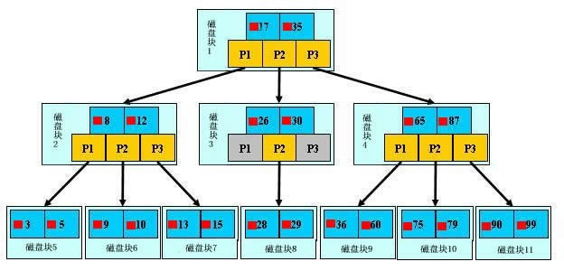

# Mysql查询优化

## Mysql索引的数据结构

我们需要这种数据结构能够做些什么，其实很简单，那就是：每次查找数据时把磁盘IO次数控制在一个很小的数量级，最好是常数数量级。那么我们就想到如果一个高度可控的多路搜索树是否能满足需求呢？就这样，b+树应运而生。




如上图，是一颗b+树，关于b+树的定义可以参见B+树，这里只说一些重点，浅蓝色的块我们称之为一个磁盘块，可以看到每个磁盘块包含几个数据项（深蓝色所示）和指针（黄色所示），如磁盘块1包含数据项17和35，包含指针P1、P2、P3，P1表示小于17的磁盘块，P2表示在17和35之间的磁盘块，P3表示大于35的磁盘块。真实的数据存在于叶子节点即3、5、9、10、13、15、28、29、36、60、75、79、90、99。非叶子节点只不存储真实的数据，只存储指引搜索方向的数据项，如17、35并不真实存在于数据表中。

**b+树查找过程**

如图所示，如果要查找数据项29，那么首先会把磁盘块1由磁盘加载到内存，此时发生一次IO，在内存中用二分查找确定29在17和35之间，锁定磁盘块1的P2指针，内存时间因为非常短（相比磁盘的IO）可以忽略不计，通过磁盘块1的P2指针的磁盘地址把磁盘块3由磁盘加载到内存，发生第二次IO，29在26和30之间，锁定磁盘块3的P2指针，通过指针加载磁盘块8到内存，发生第三次IO，同时内存中做二分查找找到29，结束查询，总计三次IO。真实的情况是，3层的b+树可以表示上百万的数据，如果上百万的数据查找只需要三次IO，性能提高将是巨大的，如果没有索引，每个数据项都要发生一次IO，那么总共需要百万次的IO，显然成本非常非常高。

**b+树性质**

1.通过上面的分析，我们知道IO次数取决于b+数的高度h，假设当前数据表的数据为N，每个磁盘块的数据项的数量是m，则有h=㏒(m+1)N，当数据量N一定的情况下，m越大，h越小；而m = 磁盘块的大小 / 数据项的大小，磁盘块的大小也就是一个数据页的大小，是固定的，如果数据项占的空间越小，数据项的数量越多，树的高度越低。这就是为什么每个数据项，即索引字段要尽量的小，比如int占4字节，要比bigint8字节少一半。这也是为什么b+树要求把真实的数据放到叶子节点而不是内层节点，一旦放到内层节点，磁盘块的数据项会大幅度下降，导致树增高。当数据项等于1时将会退化成线性表。

2.当b+树的数据项是复合的数据结构，比如(name,age,sex)的时候，b+数是按照从左到右的顺序来建立搜索树的，比如当(张三,20,F)这样的数据来检索的时候，b+树会优先比较name来确定下一步的所搜方向，如果name相同再依次比较age和sex，最后得到检索的数据；但当(20,F)这样的没有name的数据来的时候，b+树就不知道下一步该查哪个节点，因为建立搜索树的时候name就是第一个比较因子，必须要先根据name来搜索才能知道下一步去哪里查询。比如当(张三,F)这样的数据来检索时，b+树可以用name来指定搜索方向，但下一个字段age的缺失，所以只能把名字等于张三的数据都找到，然后再匹配性别是F的数据了， 这个是非常重要的性质，即索引的最左匹配特性。

### explain命令

> 关于explain命令相信大家并不陌生，具体用法和字段含义可以参考官网explain-output，这里需要强调rows是核心指标，绝大部分rows小的语句执行一定很快（有例外，下面会讲到）。所以优化语句基本上都是在优化rows。


```sql
explain select name from `lsl_test` where id = 1
```

explain出来后一共会出来12列，分别是id、select_type、table、partitions、type、possible_keys、key、key_len、ref、rows、filtered、Extra。


#### 参数详解

#### 2.1 id

表示select标识符，同时表示执行顺序，也就是说id是一个查询的序列号，查询序号即为sql语句执行的顺序

1. 当id值相同时，按从上到下的顺序执行
2. 当id全部不同时，按id从大到小执行
3. 当id部分不同时，先执行id大的，id相同的，按从上到下的顺序执行


#### 2.2 select_type

表示查询类型

1. simple：表示简单的select，没有union和子查询
2. primary：最外面的查询 或者 主查询，在有子查询的语句中，最外面的select查询就是primary
3. subquery：子查询
4. union：union语句的第二个或者说是后面那一个select
5. union result：union之后的结果
6. dependent unoin：unoin 中的第二个或随后的 select 查询，依赖于外部查询的结果集
7. dependent subquery：子查询中的第一个 select 查询，依赖于外部 查询的结果集
8. derived：衍生表（5.7版本中不存在这一个）


#### 2.3 table

表示输出行所引用的表

通常是表名，或者表的别名，或者一个为查询产生临时表的标示符（如派生表、子查询、集合）


#### 2.4 partitions

表示使用的是哪个分区，需要结合表分区才能看到

使用的哪些分区（对于非分区表值为null），在5.5版本中需要加上explain partitions select……


#### 2.5 type

表示按某种类型来查询，例如按照索引类型查找，按照范围查找。从最好到最差的连接类型为：const、eq_reg、ref、range、indexhe和all

1. const：表中最多有一个匹配行，const用于比较primary key 或者unique索引。因为只匹配一行数据，所以很快
2. eq_ref：唯一性索引扫描，对于每个来自于前面的表的记录，从该表中读取唯一一行
3. ref：非唯一性索引扫描，对于每个来自于前面的表的记录，所有匹配的行从这张表取出。出现该连接类型的条件是： 查找条件列使用了索引而且不为主键和unique。其实，意思就是虽然使用了索引，但该索引列的值并不唯一，有重复。这样即使使用索引快速查找到了第一条数据，仍然不能停止，要进行目标值附近的小范围扫描。但它的好处是它并不需要扫全表，因为索引是有序的，即便有重复值，也是在一个非常小的范围内扫描。
4. ref_or_null：类似于ref，但是可以搜索包含null值的行，例如：select * from student where address='xxx' or address is null，需要在address建立索引。
5. index_merge：查询语句用到了一张表的多个索引时，mysql会将多个索引合并到一起
6. range：按指定范围（如in、<、>、between and等，但是前提是此字段要建立索引）来检索，很常见。如：select * from student where id < 5，id上要有索引。
7. index：全“表”扫描，但是是在索引树中扫描，通常比ALL快，因为索引文件通常比数据文件小，index扫描是通过二叉树的方式扫描，而all是扫描物理表。（也就是说虽然all和index都是读全表，但index是从索引中读取的，而all是从硬盘中读的）。例如：select name from student，但name字段上需要建立索引，也就是查询的字段属于索引中的字段。
8. all：全表扫描，扫描完整的物理表，此时就需要优化了。


#### 2.6 possible_key

表示 MySQL 能在该表中可能使用的索引，显示的是索引的名称，多个索引用逗号隔开，如果没有，则为null。


#### 2.7 key

表示MySQL决定实际用到的索引，显示的是索引的名称，多个索引用逗号隔开，如果没有，则为null


#### 2.8 key_len

表示本次查询中，所选择的索引长度有多少字节

当用到组合索引的时候判断索引是否完全用上。


#### 2.9 ref

显示索引的哪一列被使用了，如果可能的话，是一个常数


#### 2.10 rows

显示mysql认为执行查询时必须要返回的行数，可结合type和key分析，没有用上索引的情况下，会全表扫描。rows的值越小越好，说明检索的数据少


#### 2.11 filtered

给出了一个百分比的值，这个百分比值和rows列的值一起使用，可以估计出那些将要和执行计划中的前一个表（前一个表就是指id列的值比当前表的id小的表）进行连接的行的数目。

这一列在5.5版本中，需要加上 explain extended select……


#### 2.12 extra

此字段显示一些额外的信息，但是此字段的部分值具有优化的参考意义。

1. using where：表示查询使用了where 语句来处理结果
2. using index：表示使用了覆盖索引。这个值重点强调了只需要使用索引就可以满足查询表的要求，不需要直接访问表数据。
3. using join buffer：这个值强调了在获取连接条件时没有使用索引，并且需要连接缓冲区来存储中间结果。如果出现了这个值，那应该注意，根据查询的具体情况可能需要添加索引来改进性能
4. using filesort：这是 order by 语句的结果。这可能是一个CPU密集型的过程。using filesort表示出现了文件内排序，表示很不好的现象，必须要优化，特别是大表，可以通过选择合适的索引来改进性能，用索引来为查询结果排序。
5. using temporary：mysql需要创建一张临时表来保存中间结果。 也就是说，需要先把数据放到临时表中，然后从临时表中获取需要的数据。出现这种临时表，也是必须需要优化的地方，特别是数据量大的情况。两个常见的原因是在来自不同表的列上使用了distinct，或者使用了不同的 order by 和 group by 列。


