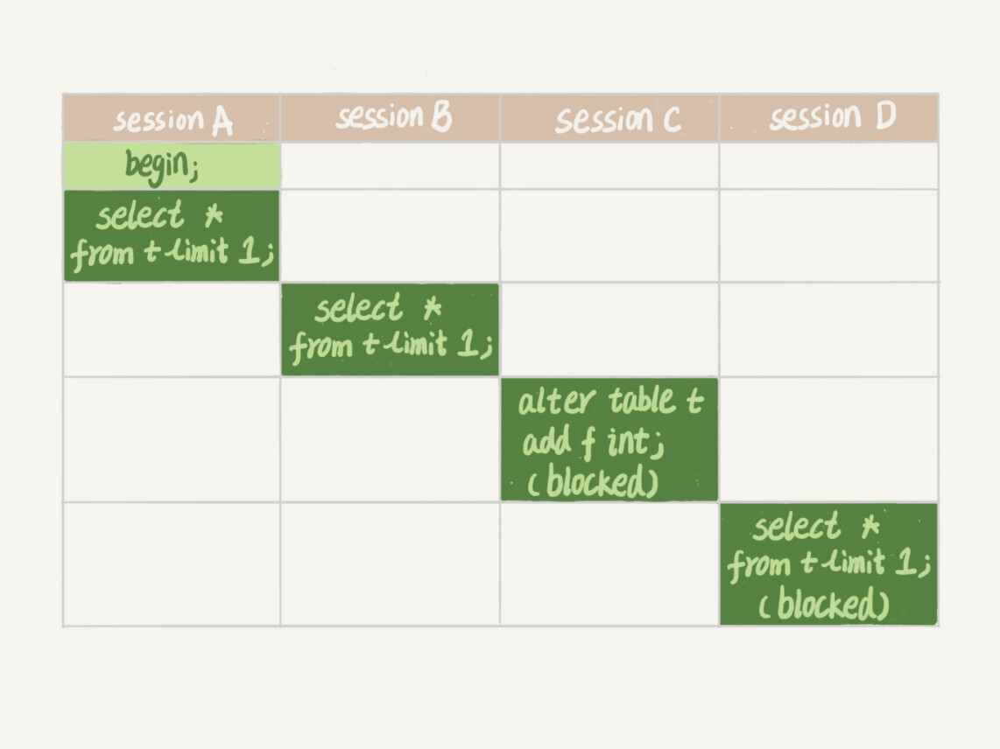

# MYSQL锁

**根据加锁的范围，MySQL里面的锁大致可以分成全局锁、表级锁和行锁三类**。今天这篇文章，我会和你分享全局锁和表级锁。而关于行锁的内容，我会留着在下一篇文章中再和你详细介绍。

这里需要说明的是，锁的设计比较复杂，这两篇文章不会涉及锁的具体实现细节，主要介绍的是碰到锁时的现象和其背后的原理。

## 全局锁

顾名思义，全局锁就是对整个数据库实例加锁。MySQL提供了一个加全局读锁的方法，命令是 Flush tables with read lock (FTWRL)。当你需要让整个库处于只读状态的时候，可以使用这个命令，之后其他线程的以下语句会被阻塞：数据更新语句（数据的增删改）、数据定义语句（包括建表、修改表结构等）和更新类事务的提交语句。

**全局锁的典型使用场景是，做全库逻辑备份。**也就是把整库每个表都select出来存成文本。

以前有一种做法，是通过FTWRL确保不会有其他线程对数据库做更新，然后对整个库做备份。注意，在备份过程中整个库完全处于只读状态。

但是让整库都只读，听上去就很危险：

- 如果你在主库上备份，那么在备份期间都不能执行更新，业务基本上就得停摆；
- 如果你在从库上备份，那么备份期间从库不能执行主库同步过来的binlog，会导致主从延迟。

看来加全局锁不太好。但是细想一下，备份为什么要加锁呢？我们来看一下不加锁会有什么问题。

假设你现在要维护“极客时间”的购买系统，关注的是用户账户余额表和用户课程表。

现在发起一个逻辑备份。假设备份期间，有一个用户，他购买了一门课程，业务逻辑里就要扣掉他的余额，然后往已购课程里面加上一门课。

如果时间顺序上是先备份账户余额表(u_account)，然后用户购买，然后备份用户课程表(u_course)，会怎么样呢？你可以看一下这个图：


可以看到，这个备份结果里，用户A的数据状态是“账户余额没扣，但是用户课程表里面已经多了一门课”。如果后面用这个备份来恢复数据的话，用户A就发现，自己赚了。

作为用户可别觉得这样可真好啊，你可以试想一下：如果备份表的顺序反过来，先备份用户课程表再备份账户余额表，又可能会出现什么结果？

也就是说，不加锁的话，备份系统备份的得到的库不是一个逻辑时间点，这个视图是逻辑不一致的。

说到视图你肯定想起来了，我们在前面讲事务隔离的时候，其实是有一个方法能够拿到一致性视图的，对吧？

是的，就是在可重复读隔离级别下开启一个事务。

官方自带的逻辑备份工具是mysqldump。当mysqldump使用参数–single-transaction的时候，导数据之前就会启动一个事务，来确保拿到一致性视图。而由于MVCC的支持，这个过程中数据是可以正常更新的。

你一定在疑惑，有了这个功能，为什么还需要FTWRL呢？**一致性读是好，但前提是引擎要支持这个隔离级别。**比如，对于MyISAM这种不支持事务的引擎，如果备份过程中有更新，总是只能取到最新的数据，那么就破坏了备份的一致性。这时，我们就需要使用FTWRL命令了。

所以，**single-transaction方法只适用于所有的表使用事务引擎的库。**如果有的表使用了不支持事务的引擎，那么备份就只能通过FTWRL方法。这往往是DBA要求业务开发人员使用InnoDB替代MyISAM的原因之一。

你也许会问，**既然要全库只读，为什么不使用set global readonly=true的方式呢**？确实readonly方式也可以让全库进入只读状态，但我还是会建议你用FTWRL方式，主要有两个原因：

- 一是，在有些系统中，readonly的值会被用来做其他逻辑，比如用来判断一个库是主库还是备库。因此，修改global变量的方式影响面更大，我不建议你使用。
- 二是，在异常处理机制上有差异。如果执行FTWRL命令之后由于客户端发生异常断开，那么MySQL会自动释放这个全局锁，整个库回到可以正常更新的状态。而将整个库设置为readonly之后，如果客户端发生异常，则数据库就会一直保持readonly状态，这样会导致整个库长时间处于不可写状态，风险较高。

业务的更新不只是增删改数据（DML)，还有可能是加字段等修改表结构的操作（DDL）。不论是哪种方法，一个库被全局锁上以后，你要对里面任何一个表做加字段操作，都是会被锁住的。

但是，即使没有被全局锁住，加字段也不是就能一帆风顺的，因为你还会碰到接下来我们要介绍的表级锁。

## 表级锁

MySQL里面表级别的锁有两种：一种是**表锁**，一种是**元数据锁（meta data lock，MDL)**。

**表锁的语法是 lock tables … read/write。**与FTWRL类似，可以用unlock tables主动释放锁，也可以在客户端断开的时候自动释放。需要注意，lock tables语法除了会限制别的线程的读写外，也限定了本线程接下来的操作对象。

举个例子, 如果在某个线程A中执行lock tables t1 read, t2 write; 这个语句，则其他线程写t1、读写t2的语句都会被阻塞。同时，线程A在执行unlock tables之前，也只能执行读t1、读写t2的操作。连写t1都不允许，自然也不能访问其他表。

在还没有出现更细粒度的锁的时候，表锁是最常用的处理并发的方式。而对于InnoDB这种支持行锁的引擎，一般不使用lock tables命令来控制并发，毕竟锁住整个表的影响面还是太大。

**另一类表级的锁是MDL（metadata lock)。**MDL不需要显式使用，在访问一个表的时候会被自动加上。MDL的作用是，保证读写的正确性。你可以想象一下，如果一个查询正在遍历一个表中的数据，而执行期间另一个线程对这个表结构做变更，删了一列，那么查询线程拿到的结果跟表结构对不上，肯定是不行的。

因此，在MySQL 5.5版本中引入了MDL，当对一个表做增删改查操作的时候，加MDL读锁；当要对表做结构变更操作的时候，加MDL写锁。

- 读锁之间不互斥，因此你可以有多个线程同时对一张表增删改查。
- 读写锁之间、写锁之间是互斥的，用来保证变更表结构操作的安全性。因此，如果有两个线程要同时给一个表加字段，其中一个要等另一个执行完才能开始执行。

虽然MDL锁是系统默认会加的，但却是你不能忽略的一个机制。比如下面这个例子，我经常看到有人掉到这个坑里：给一个小表加个字段，导致整个库挂了。

你肯定知道，给一个表加字段，或者修改字段，或者加索引，需要扫描全表的数据。在对大表操作的时候，你肯定会特别小心，以免对线上服务造成影响。而实际上，即使是小表，操作不慎也会出问题。我们来看一下下面的操作序列，假设表t是一个小表。

备注：这里的实验环境是MySQL 5.6。



我们可以看到session A先启动，这时候会对表t加一个MDL读锁。由于session B需要的也是MDL读锁，因此可以正常执行。

之后session C会被blocked，是因为session A的MDL读锁还没有释放，而session C需要MDL写锁，因此只能被阻塞。

如果只有session C自己被阻塞还没什么关系，但是之后所有要在表t上新申请MDL读锁的请求也会被session C阻塞。前面我们说了，所有对表的增删改查操作都需要先申请MDL读锁，就都被锁住，等于这个表现在完全不可读写了。

如果某个表上的查询语句频繁，而且客户端有重试机制，也就是说超时后会再起一个新session再请求的话，这个库的线程很快就会爆满。

你现在应该知道了，事务中的MDL锁，在语句执行开始时申请，但是语句结束后并不会马上释放，而会等到整个事务提交后再释放。

基于上面的分析，我们来讨论一个问题，**如何安全地给小表加字段？**

首先我们要解决长事务，事务不提交，就会一直占着MDL锁。在MySQL的information_schema 库的 innodb_trx 表中，你可以查到当前执行中的事务。如果你要做DDL变更的表刚好有长事务在执行，要考虑先暂停DDL，或者kill掉这个长事务。

但考虑一下这个场景。如果你要变更的表是一个热点表，虽然数据量不大，但是上面的请求很频繁，而你不得不加个字段，你该怎么做呢？

这时候kill可能未必管用，因为新的请求马上就来了。比较理想的机制是，在alter table语句里面设定等待时间，如果在这个指定的等待时间里面能够拿到MDL写锁最好，拿不到也不要阻塞后面的业务语句，先放弃。之后开发人员或者DBA再通过重试命令重复这个过程。

MariaDB已经合并了AliSQL的这个功能，所以这两个开源分支目前都支持DDL NOWAIT/WAIT n这个语法。

```sql
ALTER TABLE tbl_name NOWAIT add column ...
ALTER TABLE tbl_name WAIT N add column ... 
```

## 小结

今天，我跟你介绍了MySQL的全局锁和表级锁。

全局锁主要用在逻辑备份过程中。对于全部是InnoDB引擎的库，我建议你选择使用–single-transaction参数，对应用会更友好。

表锁一般是在数据库引擎不支持行锁的时候才会被用到的。如果你发现你的应用程序里有lock tables这样的语句，你需要追查一下，比较可能的情况是：

- 要么是你的系统现在还在用MyISAM这类不支持事务的引擎，那要安排升级换引擎；
- 要么是你的引擎升级了，但是代码还没升级。我见过这样的情况，最后业务开发就是把lock tables 和 unlock tables 改成 begin 和 commit，问题就解决了。

MDL会直到事务提交才释放，在做表结构变更的时候，你一定要小心不要导致锁住线上查询和更新。

最后，我给你留一个问题吧。备份一般都会在备库上执行，你在用–single-transaction方法做逻辑备份的过程中，如果主库上的一个小表做了一个DDL(修改表结构的操作)，比如给一个表上加了一列。这时候，从备库上会看到什么现象呢？

---

假设这个DDL是针对表t1的， 这里我把备份过程中几个关键的语句列出来：

```sql
Q1:SET SESSION TRANSACTION ISOLATION LEVEL REPEATABLE READ;
Q2:START TRANSACTION  WITH CONSISTENT SNAPSHOT；
/* other tables */
Q3:SAVEPOINT sp;
/* 时刻 1 */
Q4:show create table `t1`;
/* 时刻 2 */
Q5:SELECT * FROM `t1`;
/* 时刻 3 */
Q6:ROLLBACK TO SAVEPOINT sp;
/* 时刻 4 */
/* other tables */
```

在备份开始的时候，为了确保RR（可重复读）隔离级别，再设置一次RR隔离级别(Q1);

启动事务，这里用 WITH CONSISTENT SNAPSHOT确保这个语句执行完就可以得到一个一致性视图（Q2)；

设置一个保存点，这个很重要（Q3）；

show create 是为了拿到表结构(Q4)，然后正式导数据 （Q5），回滚到SAVEPOINT sp，在这里的作用是释放 t1的MDL锁 （Q6）。当然这部分属于“超纲”，上文正文里面都没提到。

DDL从主库传过来的时间按照效果不同，我打了四个时刻。题目设定为小表，我们假定到达后，如果开始执行，则很快能够执行完成。

参考答案如下：

1. 如果在Q4语句执行之前到达，现象：没有影响，备份拿到的是DDL后的表结构。
2. 如果在“时刻 2”到达，则表结构被改过，Q5执行的时候，报 Table definition has changed, please retry transaction，现象：mysqldump终止；
3. 如果在“时刻2”和“时刻3”之间到达，mysqldump占着t1的MDL读锁，binlog被阻塞，现象：主从延迟，直到Q6执行完成。
4. 从“时刻4”开始，mysqldump释放了MDL读锁，现象：没有影响，备份拿到的是DDL前的表结构。

---

## 行锁

顾名思义，行锁就是针对数据表中行记录的锁。这很好理解，比如事务A更新了一行，而这时候事务B也要更新同一行，则必须等事务A的操作完成后才能进行更新。

当然，数据库中还有一些没那么一目了然的概念和设计，这些概念如果理解和使用不当，容易导致程序出现非预期行为，比如两阶段锁。

### 从两阶段锁说起

我先给你举个例子。在下面的操作序列中，事务B的update语句执行时会是什么现象呢？假设字段id是表t的主键。


这个问题的结论取决于事务A在执行完两条update语句后，持有哪些锁，以及在什么时候释放。你可以验证一下：实际上事务B的update语句会被阻塞，直到事务A执行commit之后，事务B才能继续执行。

知道了这个答案，你一定知道了事务A持有的两个记录的行锁，都是在commit的时候才释放的。

也就是说，**在InnoDB事务中，行锁是在需要的时候才加上的，但并不是不需要了就立刻释放，而是要等到事务结束时才释放。这个就是两阶段锁协议。**

知道了这个设定，对我们使用事务有什么帮助呢？那就是，如果你的事务中需要锁多个行，要把最可能造成锁冲突、最可能影响并发度的锁尽量往后放。我给你举个例子。

假设你负责实现一个电影票在线交易业务，顾客A要在影院B购买电影票。我们简化一点，这个业务需要涉及到以下操作：

1. 从顾客A账户余额中扣除电影票价；
2. 给影院B的账户余额增加这张电影票价；
3. 记录一条交易日志。

也就是说，要完成这个交易，我们需要update两条记录，并insert一条记录。当然，为了保证交易的原子性，我们要把这三个操作放在一个事务中。那么，你会怎样安排这三个语句在事务中的顺序呢？

试想如果同时有另外一个顾客C要在影院B买票，那么这两个事务冲突的部分就是语句2了。因为它们要更新同一个影院账户的余额，需要修改同一行数据。

根据两阶段锁协议，不论你怎样安排语句顺序，所有的操作需要的行锁都是在事务提交的时候才释放的。所以，如果你把语句2安排在最后，比如按照3、1、2这样的顺序，那么影院账户余额这一行的锁时间就最少。这就最大程度地减少了事务之间的锁等待，提升了并发度。

好了，现在由于你的正确设计，影院余额这一行的行锁在一个事务中不会停留很长时间。但是，这并没有完全解决你的困扰。

如果这个影院做活动，可以低价预售一年内所有的电影票，而且这个活动只做一天。于是在活动时间开始的时候，你的MySQL就挂了。你登上服务器一看，CPU消耗接近100%，但整个数据库每秒就执行不到100个事务。这是什么原因呢？

这里，我就要说到死锁和死锁检测了。

### 死锁和死锁检测

当并发系统中不同线程出现循环资源依赖，涉及的线程都在等待别的线程释放资源时，就会导致这几个线程都进入无限等待的状态，称为死锁。这里我用数据库中的行锁举个例子。


这时候，事务A在等待事务B释放id=2的行锁，而事务B在等待事务A释放id=1的行锁。 事务A和事务B在互相等待对方的资源释放，就是进入了死锁状态。当出现死锁以后，有两种策略：

- 一种策略是，直接进入等待，直到超时。这个超时时间可以通过参数innodb_lock_wait_timeout来设置。
- 另一种策略是，发起死锁检测，发现死锁后，主动回滚死锁链条中的某一个事务，让其他事务得以继续执行。将参数innodb_deadlock_detect设置为on，表示开启这个逻辑。

在InnoDB中，innodb_lock_wait_timeout的默认值是50s，意味着如果采用第一个策略，当出现死锁以后，第一个被锁住的线程要过50s才会超时退出，然后其他线程才有可能继续执行。对于在线服务来说，这个等待时间往往是无法接受的。

但是，我们又不可能直接把这个时间设置成一个很小的值，比如1s。这样当出现死锁的时候，确实很快就可以解开，但如果不是死锁，而是简单的锁等待呢？所以，超时时间设置太短的话，会出现很多误伤。

所以，正常情况下我们还是要采用第二种策略，即：主动死锁检测，而且innodb_deadlock_detect的默认值本身就是on。主动死锁检测在发生死锁的时候，是能够快速发现并进行处理的，但是它也是有额外负担的。

你可以想象一下这个过程：每当一个事务被锁的时候，就要看看它所依赖的线程有没有被别人锁住，如此循环，最后判断是否出现了循环等待，也就是死锁。

那如果是我们上面说到的所有事务都要更新同一行的场景呢？

每个新来的被堵住的线程，都要判断会不会由于自己的加入导致了死锁，这是一个时间复杂度是O(n)的操作。假设有1000个并发线程要同时更新同一行，那么死锁检测操作就是100万这个量级的。虽然最终检测的结果是没有死锁，但是这期间要消耗大量的CPU资源。因此，你就会看到CPU利用率很高，但是每秒却执行不了几个事务。

根据上面的分析，我们来讨论一下，怎么解决由这种热点行更新导致的性能问题呢？问题的症结在于，死锁检测要耗费大量的CPU资源。

**一种头痛医头的方法，就是如果你能确保这个业务一定不会出现死锁，可以临时把死锁检测关掉。**但是这种操作本身带有一定的风险，因为业务设计的时候一般不会把死锁当做一个严重错误，毕竟出现死锁了，就回滚，然后通过业务重试一般就没问题了，这是业务无损的。而关掉死锁检测意味着可能会出现大量的超时，这是业务有损的。

**另一个思路是控制并发度。**根据上面的分析，你会发现如果并发能够控制住，比如同一行同时最多只有10个线程在更新，那么死锁检测的成本很低，就不会出现这个问题。一个直接的想法就是，在客户端做并发控制。但是，你会很快发现这个方法不太可行，因为客户端很多。我见过一个应用，有600个客户端，这样即使每个客户端控制到只有5个并发线程，汇总到数据库服务端以后，峰值并发数也可能要达到3000。

因此，这个并发控制要做在数据库服务端。如果你有中间件，可以考虑在中间件实现；如果你的团队有能修改MySQL源码的人，也可以做在MySQL里面。基本思路就是，对于相同行的更新，在进入引擎之前排队。这样在InnoDB内部就不会有大量的死锁检测工作了。

可能你会问，**如果团队里暂时没有数据库方面的专家，不能实现这样的方案，能不能从设计上优化这个问题呢？**

你可以考虑通过将一行改成逻辑上的多行来减少锁冲突。还是以影院账户为例，可以考虑放在多条记录上，比如10个记录，影院的账户总额等于这10个记录的值的总和。这样每次要给影院账户加金额的时候，随机选其中一条记录来加。这样每次冲突概率变成原来的1/10，可以减少锁等待个数，也就减少了死锁检测的CPU消耗。

这个方案看上去是无损的，但其实这类方案需要根据业务逻辑做详细设计。如果账户余额可能会减少，比如退票逻辑，那么这时候就需要考虑当一部分行记录变成0的时候，代码要有特殊处理。

## 小结

今天，我和你介绍了MySQL的行锁，涉及了两阶段锁协议、死锁和死锁检测这两大部分内容。

其中，我以两阶段协议为起点，和你一起讨论了在开发的时候如何安排正确的事务语句。这里的原则/我给你的建议是：如果你的事务中需要锁多个行，要把最可能造成锁冲突、最可能影响并发度的锁的申请时机尽量往后放。

但是，调整语句顺序并不能完全避免死锁。所以我们引入了死锁和死锁检测的概念，以及提供了三个方案，来减少死锁对数据库的影响。减少死锁的主要方向，就是控制访问相同资源的并发事务量。

最后，我给你留下一个问题吧。如果你要删除一个表里面的前10000行数据，有以下三种方法可以做到：

- 第一种，直接执行delete from T limit 10000;
- 第二种，在一个连接中循环执行20次 delete from T limit 500;
- 第三种，在20个连接中同时执行delete from T limit 500。

你会选择哪一种方法呢？为什么呢？

---

我在上一篇文章最后，留给你的问题是：怎么删除表的前10000行。比较多的留言都选择了第二种方式，即：在一个连接中循环执行20次 delete from T limit 500。

确实是这样的，第二种方式是相对较好的。

第一种方式（即：直接执行delete from T limit 10000）里面，单个语句占用时间长，锁的时间也比较长；而且大事务还会导致主从延迟。

第三种方式（即：在20个连接中同时执行delete from T limit 500），会人为造成锁冲突。

评论区留言点赞板：

> @Tony Du的评论，详细而且准确。
> @Knight²º¹⁸ 提到了如果可以加上特定条件，将这10000行天然分开，可以考虑第三种。是的，实际上在操作的时候我也建议你尽量拿到ID再删除。
> @荒漠甘泉 提了一个不错的问题，大家需要区分行锁、MDL锁和表锁的区别。对InnoDB表更新一行，可能过了MDL关，却被挡在行锁阶段。


---

## 间隙锁

为了便于说明问题，这一篇文章，我们就先使用一个小一点儿的表。建表和初始化语句如下（为了便于本期的例子说明，我把上篇文章中用到的表结构做了点儿修改）：

```sql
CREATE TABLE `t` (
  `id` int(11) NOT NULL,
  `c` int(11) DEFAULT NULL,
  `d` int(11) DEFAULT NULL,
  PRIMARY KEY (`id`),
  KEY `c` (`c`)
) ENGINE=InnoDB;

insert into t values(0,0,0),(5,5,5),
(10,10,10),(15,15,15),(20,20,20),(25,25,25);
```

这个表除了主键id外，还有一个索引c，初始化语句在表中插入了6行数据。

上期我留给你的问题是，下面的语句序列，是怎么加锁的，加的锁又是什么时候释放的呢？

```sql
begin;
select * from t where d=5 for update;
commit;
```

比较好理解的是，这个语句会命中d=5的这一行，对应的主键id=5，因此在select 语句执行完成后，id=5这一行会加一个写锁，而且由于两阶段锁协议，这个写锁会在执行commit语句的时候释放。

由于字段d上没有索引，因此这条查询语句会做全表扫描。那么，其他被扫描到的，但是不满足条件的5行记录上，会不会被加锁呢？

我们知道，InnoDB的默认事务隔离级别是可重复读，所以本文接下来没有特殊说明的部分，都是设定在可重复读隔离级别下。

### 幻读


​																				假设只在id=5这一行加行锁

可以看到，session A里执行了三次查询，分别是Q1、Q2和Q3。它们的SQL语句相同，都是select * from t where d=5 for update。这个语句的意思你应该很清楚了，查所有d=5的行，而且使用的是当前读，并且加上写锁。现在，我们来看一下这三条SQL语句，分别会返回什么结果。

1. Q1只返回id=5这一行；
2. 在T2时刻，session B把id=0这一行的d值改成了5，因此T3时刻Q2查出来的是id=0和id=5这两行；
3. 在T4时刻，session C又插入一行（1,1,5），因此T5时刻Q3查出来的是id=0、id=1和id=5的这三行。

其中，Q3读到id=1这一行的现象，被称为“幻读”。也就是说，幻读指的是一个事务在前后两次查询同一个范围的时候，后一次查询看到了前一次查询没有看到的行。

这里，我需要对“幻读”做一个说明：

1. 在可重复读隔离级别下，普通的查询是快照读，是不会看到别的事务插入的数据的。因此，幻读在“当前读”下才会出现。
2. 上面session B的修改结果，被session A之后的select语句用“当前读”看到，不能称为幻读。幻读仅专指“新插入的行”。

正常分析的话因为这三个查询都是加了for update，都是当前读。而当前读的规则，就是要能读到所有已经提交的记录的最新值。并且，session B和sessionC的两条语句，执行后就会提交，所以Q2和Q3就是应该看到这两个事务的操作效果，而且也看到了，这跟事务的可见性规则并不矛盾。

但是，这是不是真的没问题呢？

不，这里还真就有问题。

### 幻读有什么问题

**首先是语义上的。**session A在T1时刻就声明了，“我要把所有d=5的行锁住，不准别的事务进行读写操作”。而实际上，这个语义被破坏了。

如果现在这样看感觉还不明显的话，我再往session B和session C里面分别加一条SQL语句，你再看看会出现什么现象。


session B的第二条语句update t set c=5 where id=0，语义是“我把id=0、d=5这一行的c值，改成了5”。

由于在T1时刻，session A 还只是给id=5这一行加了行锁， 并没有给id=0这行加上锁。因此，session B在T2时刻，是可以执行这两条update语句的。这样，就破坏了 session A 里Q1语句要锁住所有d=5的行的加锁声明。

session C也是一样的道理，对id=1这一行的修改，也是破坏了Q1的加锁声明。

**其次，是数据一致性的问题。**

我们知道，锁的设计是为了保证数据的一致性。而这个一致性，不止是数据库内部数据状态在此刻的一致性，还包含了数据和日志在逻辑上的一致性。

为了说明这个问题，我给session A在T1时刻再加一个更新语句，即：update t set d=100 where d=5。


update的加锁语义和select …for update 是一致的，所以这时候加上这条update语句也很合理。session A声明说“要给d=5的语句加上锁”，就是为了要更新数据，新加的这条update语句就是把它认为加上了锁的这一行的d值修改成了100。

现在，我们来分析一下图3执行完成后，数据库里会是什么结果。

1. 经过T1时刻，id=5这一行变成 (5,5,100)，当然这个结果最终是在T6时刻正式提交的;
2. 经过T2时刻，id=0这一行变成(0,5,5);
3. 经过T4时刻，表里面多了一行(1,5,5);
4. 其他行跟这个执行序列无关，保持不变。

这样看，这些数据也没啥问题，但是我们再来看看这时候binlog里面的内容。

1. T2时刻，session B事务提交，写入了两条语句；
2. T4时刻，session C事务提交，写入了两条语句；
3. T6时刻，session A事务提交，写入了update t set d=100 where d=5 这条语句。

我统一放到一起的话，就是这样的：

```sql
update t set d=5 where id=0; /*(0,0,5)*/
update t set c=5 where id=0; /*(0,5,5)*/

insert into t values(1,1,5); /*(1,1,5)*/
update t set c=5 where id=1; /*(1,5,5)*/

update t set d=100 where d=5;/*所有d=5的行，d改成100*/
```

好，你应该看出问题了。这个语句序列，不论是拿到备库去执行，还是以后用binlog来克隆一个库，这三行的结果，都变成了 (0,5,100)、(1,5,100)和(5,5,100)。

也就是说，id=0和id=1这两行，发生了数据不一致。这个问题很严重，是不行的。

### 间隙锁

现在你知道了，产生幻读的原因是，行锁只能锁住行，但是新插入记录这个动作，要更新的是记录之间的“间隙”。因此，为了解决幻读问题，InnoDB只好引入新的锁，也就是间隙锁(Gap Lock)。

顾名思义，间隙锁，锁的就是两个值之间的空隙。比如文章开头的表t，初始化插入了6个记录，这就产生了7个间隙。


这样，当你执行 select * from t where d=5 for update的时候，就不止是给数据库中已有的6个记录加上了行锁，还同时加了7个间隙锁。这样就确保了无法再插入新的记录。

也就是说这时候，在一行行扫描的过程中，不仅将给行加上了行锁，还给行两边的空隙，也加上了间隙锁。

现在你知道了，数据行是可以加上锁的实体，数据行之间的间隙，也是可以加上锁的实体。但是间隙锁跟我们之前碰到过的锁都不太一样。


---

也就是说，跟行锁有冲突关系的是“另外一个行锁”。

但是间隙锁不一样，**跟间隙锁存在冲突关系的，是“往这个间隙中插入一个记录”这个操作。**间隙锁之间都不存在冲突关系。

这句话不太好理解，我给你举个例子：


这里session B并不会被堵住。因为表t里并没有c=7这个记录，因此session A加的是间隙锁(5,10)。而session B也是在这个间隙加的间隙锁。它们有共同的目标，即：保护这个间隙，不允许插入值。但，它们之间是不冲突的。

间隙锁和行锁合称next-key lock，每个next-key lock是前开后闭区间。也就是说，我们的表t初始化以后，如果用select * from t for update要把整个表所有记录锁起来，就形成了7个next-key lock，分别是 (-∞,0]、(0,5]、(5,10]、(10,15]、(15,20]、(20, 25]、(25, +supremum]。

> 备注：这篇文章中，如果没有特别说明，我们把间隙锁记为开区间，把next-key lock记为前开后闭区间。

你可能会问说，这个supremum从哪儿来的呢？

这是因为+∞是开区间。实现上，InnoDB给每个索引加了一个不存在的最大值supremum，这样才符合我们前面说的“都是前开后闭区间”。

### 带来的问题

**间隙锁和next-key lock的引入，帮我们解决了幻读的问题，但同时也带来了一些“困扰”。**

在前面的文章中，就有同学提到了这个问题。我把他的问题转述一下，对应到我们这个例子的表来说，业务逻辑这样的：任意锁住一行，如果这一行不存在的话就插入，如果存在这一行就更新它的数据，代码如下：

```sql
begin;
select * from t where id=N for update;

/*如果行不存在*/
insert into t values(N,N,N);
/*如果行存在*/
update t set d=N set id=N;

commit;
```

可能你会说，这个不是insert … on duplicate key update 就能解决吗？但其实在有多个唯一键的时候，这个方法是不能满足这位提问同学的需求的。至于为什么，我会在后面的文章中再展开说明。

现在，我们就只讨论这个逻辑。

这个同学碰到的现象是，这个逻辑一旦有并发，就会碰到死锁。你一定也觉得奇怪，这个逻辑每次操作前用for update锁起来，已经是最严格的模式了，怎么还会有死锁呢？

这里，我用两个session来模拟并发，并假设N=9。


你看到了，其实都不需要用到后面的update语句，就已经形成死锁了。我们按语句执行顺序来分析一下：

1. session A 执行select … for update语句，由于id=9这一行并不存在，因此会加上间隙锁(5,10);
2. session B 执行select … for update语句，同样会加上间隙锁(5,10)，间隙锁之间不会冲突，因此这个语句可以执行成功；
3. session B 试图插入一行(9,9,9)，被session A的间隙锁挡住了，只好进入等待；
4. session A试图插入一行(9,9,9)，被session B的间隙锁挡住了。

至此，两个session进入互相等待状态，形成死锁。当然，InnoDB的死锁检测马上就发现了这对死锁关系，让session A的insert语句报错返回了。

你现在知道了，**间隙锁的引入，可能会导致同样的语句锁住更大的范围，这其实是影响了并发度的**。其实，这还只是一个简单的例子，在下一篇文章中我们还会碰到更多、更复杂的例子。

:::

我在文章一开始就说过，如果没有特别说明，今天和你分析的问题都是在可重复读隔离级别下的，间隙锁是在可重复读隔离级别下才会生效的。所以，你如果把隔离级别设置为读提交的话，就没有间隙锁了。但同时，你要解决可能出现的数据和日志不一致问题，需要把binlog格式设置为row。这，也是现在不少公司使用的配置组合。

前面文章的评论区有同学留言说，他们公司就使用的是读提交隔离级别加binlog_format=row的组合。他曾问他们公司的DBA说，你为什么要这么配置。DBA直接答复说，因为大家都这么用呀。

:::
