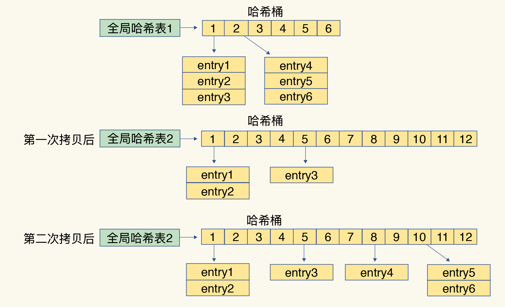

# Redis

## 什么是Redis

Redis是一款内存高速缓存数据库。Redis全称为：**Remote Dictionary Server**（远程数据服务），使用C语言编写，Redis是一个key-value存储系统（键值存储系统），支持丰富的数据类型，如：String、list、set、zset、hash。

Redis是一种支持key-value等多种数据结构的存储系统。可用于缓存，事件发布或订阅，高速队列等场景。支持网络，提供字符串，哈希，列表，队列，集合结构直接存取，基于内存，可持久化。

redis是“单线程，高性能”。

Memcached和Redis采用哈希表作为key-value索引，而RocksDB则采用跳表作为内存中key-value的索引。

一般而言，内存键值数据库（例如Redis）采用哈希表作为索引，很大一部分原因在于，其键值数据基本都是保存在内存中的，而内存的高性能随机访问特性可以很好地与哈希表O(1)的操作复杂度相匹配。

对于Redis而言，很有意思的一点是，它的value支持多种类型，当我们通过索引找到一个key所对应的value后，仍然需要从value的复杂结构（例如集合和列表）中进一步找到我们实际需要的数据，这个操作的效率本身就依赖于它们的实现结构。Redis采用一些常见的高效索引结构作为某些value类型的底层数据结构，这一技术路线为Redis实现高性能访问提供了良好的支撑。

Redis的持久化模块能支持两种方式：日志（AOF）和快照（RDB）

## redis的数据结构

可以看到，String类型的底层实现只有一种数据结构，也就是简单动态字符串。而List、Hash、Set和Sorted Set这四种数据类型，都有两种底层实现结构。通常情况下，我们会把这四种类型称为集合类型，它们的特点是**一个键对应了一个集合的数据**。

看到这里，其实有些问题已经值得我们去考虑了：

- 这些数据结构都是值的底层实现，键和值本身之间用什么结构组织？
- 为什么集合类型有那么多的底层结构，它们都是怎么组织数据的，都很快吗？
- 什么是简单动态字符串，和常用的字符串是一回事吗？

接下来，我就和你聊聊前两个问题。这样，你不仅可以知道Redis“快”的基本原理，还可以借此理解Redis中有哪些潜在的“慢操作”，最大化Redis的性能优势。而关于简单动态字符串，我会在后面的课程中再和你讨论。

我们先来看看键和值之间是用什么结构组织的。

## 键和值用什么结构组织？

为了实现从键到值的快速访问，Redis使用了一个哈希表来保存所有键值对。

一个哈希表，其实就是一个数组，数组的每个元素称为一个哈希桶。所以，我们常说，一个哈希表是由多个哈希桶组成的，每个哈希桶中保存了键值对数据。

看到这里，你可能会问了：“如果值是集合类型的话，作为数组元素的哈希桶怎么来保存呢？”其实，哈希桶中的元素保存的并不是值本身，而是指向具体值的指针。这也就是说，不管值是String，还是集合类型，哈希桶中的元素都是指向它们的指针。

在下图中，可以看到，哈希桶中的entry元素中保存了`*key`和`*value`指针，分别指向了实际的键和值，这样一来，即使值是一个集合，也可以通过`*value`指针被查找到。

因为这个哈希表保存了所有的键值对，所以，我也把它称为**全局哈希表**。哈希表的最大好处很明显，就是让我们可以用O(1)的时间复杂度来快速查找到键值对——我们只需要计算键的哈希值，就可以知道它所对应的哈希桶位置，然后就可以访问相应的entry元素。

你看，这个查找过程主要依赖于哈希计算，和数据量的多少并没有直接关系。也就是说，不管哈希表里有10万个键还是100万个键，我们只需要一次计算就能找到相应的键。

但是，如果你只是了解了哈希表的O(1)复杂度和快速查找特性，那么，当你往Redis中写入大量数据后，就可能发现操作有时候会突然变慢了。这其实是因为你忽略了一个潜在的风险点，那就是**哈希表的冲突问题和rehash可能带来的操作阻塞。**

### 为什么哈希表操作变慢了？

当你往哈希表中写入更多数据时，哈希冲突是不可避免的问题。这里的哈希冲突，也就是指，两个key的哈希值和哈希桶计算对应关系时，正好落在了同一个哈希桶中。

毕竟，哈希桶的个数通常要少于key的数量，这也就是说，难免会有一些key的哈希值对应到了同一个哈希桶中。

Redis解决哈希冲突的方式，就是链式哈希。链式哈希也很容易理解，就是指**同一个哈希桶中的多个元素用一个链表来保存，它们之间依次用指针连接**。

如下图所示：entry1、entry2和entry3都需要保存在哈希桶3中，导致了哈希冲突。此时，entry1元素会通过一个`*next`指针指向entry2，同样，entry2也会通过`*next`指针指向entry3。这样一来，即使哈希桶3中的元素有100个，我们也可以通过entry元素中的指针，把它们连起来。这就形成了一个链表，也叫作哈希冲突链。

但是，这里依然存在一个问题，哈希冲突链上的元素只能通过指针逐一查找再操作。如果哈希表里写入的数据越来越多，哈希冲突可能也会越来越多，这就会导致某些哈希冲突链过长，进而导致这个链上的元素查找耗时长，效率降低。对于追求“快”的Redis来说，这是不太能接受的。

所以，Redis会对哈希表做rehash操作。rehash也就是增加现有的哈希桶数量，让逐渐增多的entry元素能在更多的桶之间分散保存，减少单个桶中的元素数量，从而减少单个桶中的冲突。那具体怎么做呢？

其实，为了使rehash操作更高效，Redis默认使用了两个全局哈希表：哈希表1和哈希表2。一开始，当你刚插入数据时，默认使用哈希表1，此时的哈希表2并没有被分配空间。随着数据逐步增多，Redis开始执行rehash，这个过程分为三步：

1. 给哈希表2分配更大的空间，例如是当前哈希表1大小的两倍；
2. 把哈希表1中的数据重新映射并拷贝到哈希表2中；
3. 释放哈希表1的空间。

到此，我们就可以从哈希表1切换到哈希表2，用增大的哈希表2保存更多数据，而原来的哈希表1留作下一次rehash扩容备用。

这个过程看似简单，但是第二步涉及大量的数据拷贝，如果一次性把哈希表1中的数据都迁移完，会造成Redis线程阻塞，无法服务其他请求。此时，Redis就无法快速访问数据了。

为了避免这个问题，Redis采用了**渐进式rehash**。

简单来说就是在第二步拷贝数据时，Redis仍然正常处理客户端请求，每处理一个请求时，从哈希表1中的第一个索引位置开始，顺带着将这个索引位置上的所有entries拷贝到哈希表2中；等处理下一个请求时，再顺带拷贝哈希表1中的下一个索引位置的entries。如下图所示：

这样就巧妙地把一次性大量拷贝的开销，分摊到了多次处理请求的过程中，避免了耗时操作，保证了数据的快速访问。

好了，到这里，你应该就能理解，Redis的键和值是怎么通过哈希表组织的了。对于String类型来说，找到哈希桶就能直接增删改查了，所以，哈希表的O(1)操作复杂度也就是它的复杂度了。
