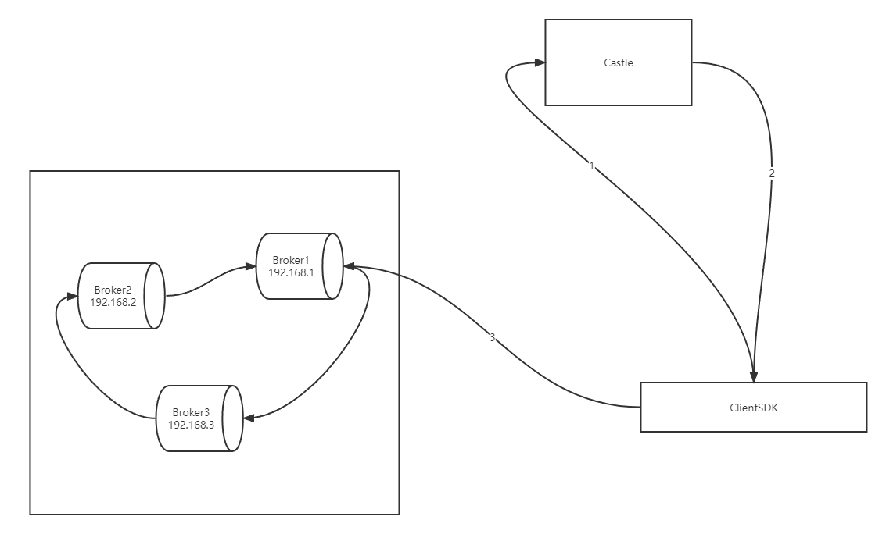

# Kafka

1. **Mafka、Broker、Castle、ClientSDK**: 

    

   **Mafka组件交流图（简化版）**，如上图所示，Mafka主要有三个组件：

   Broker: 存储实际消息的地方，一台服务器，多个服务器(broker)组成一个集群。

   Castle: 中控调度，调度客户端从哪个机器上拉取消息，或把消息生产到哪台机器上去。

   ClientSDK: 业务使用的api，来生产或消费消息。

   **图中的流程**

   1: 第一步心跳请求，客户端启动以后，主动链接castle，请求需要往哪个集群上生产和消费

   2: 第二步心跳响应，castle返回客户端，“你往192.168.1.1” 这个broker上生产消息或拉取消息。

   3: 第三步，客户端链接Broker，生产消息到broker上，或从broker上拉取消息消费。

   4: 以后第一步和第二步会一直重复，这就是所谓的“Mafka心跳”，客户端会始终和Cas

   tle保持一个“请求/响应”循环，目的是为了接收服务端的调度和控制指令。

2. **MQ**:  Message Queue（消息队列）的简写

3. **Topic:** 主题，队列

4. **生产方** : 消息的生产方，生产端，有时候我们也称之为消息的“上游（upstream）”， “上游” 水流的意思，水从上游(upstream)留到下游(downstream)，就类似"消息”从生产端“流到” 消费端

5. **消费者** : 消息的消费方，消费端，消息下游（downstream）。

6. **Mafka集群：** 几个服务器组成的一个Mafka集群，每个服务器称作一个broker，消息的实际存放地，一般是一个机房一个或几个。

7. **Partition、主题分区、消息分片、分片**：

   消息分片，设想你发给Mafka 一万条消息，Mafka保存的时候，把它切成了4块，每块2500条消息，分别放到了四个不同的机器上。为啥要切开？ 方便你大并发的消费。这四块消息会分别分给你的四台消费机器，每台一块，各消费各的，互不干扰。如果你有两台消费机器，那么这两台每人分得两块。如果你有6台消费机器，这时只有4台机器能消费，剩下两台不能参与，这时你就可以找@**MQ技术支持**帮你增加下分块，比如增加到6个，这样6台消费的机器每人分得1块。重要的是，每块消息只能由一台机器消费，不能分给另外的一个机器同时消费。打个比喻，1堆人如何快速的吃掉4个苹果，可以一个人吃多个，也可以一个人只吃一个，看你有多少人，但是一个苹果只能给一个人吃（给两个人同时吃的话，显然是不行的，太不讲卫生）。

8. **消费组&消费者:**

   一个Topic，可以由多个消费方消费，每个消费各自的，互不干扰，同一条消息都可以消费到，比如发送一条消息message_a，有两个消费方，consumer_a和consumer_b，那么这两个消费方都可以消费到message_a这条消息。假设这个topic有4个partition，但是目前只有一台机器在消费，消费速度有点慢，那么你可以增加多个机器到consumer_a 这个消费方里，这时我们称consumer_a为消费组，添加进去的机器叫做消费者。

9. **消息副本、replica、消息复制:**

    继续上边的例子，一万条消息分成4块，分别放到了4台机器上，这样虽然很整齐，但假如某台机器挂了，上边的消息也就随之丢失了，同时队列也变得不可用了，显然是不合理的，所以我在别的机器上保存一个副本，就解决了这个问题，但是保存几个副本呢？ 一般是2个或3个副本。2个副本的话，容忍Mafka集群同一时间内有一台机器宕机。3个副本的话，容忍Mafka集群同一时间内有两台机器同时宕机。从历史来看（2018-2019），一个集群同时有两台机器宕机的概率一年时间内小于千分之二。

10. **Topic的Ack属性：**

    接着上个例子，假设我是3个副本（一个主本，两个副本），那发送消息时，怎么认为这条消息发送成功呢？这里就用到Ack值，如果Ack是-1表示3个副本都必须接收到这个消息了，这次发送才算成功，这个显然是消息持久性最保险的一种，就算有两台Mafka机器同时宕机，消息也不会丢失，但是代价是发送延时也会升高，生产端把消息发送给Mafka后，Mafka集群内部有消息同步线程，主本在接受到消息后，必须等同步线程将主本消息同步给副本后，才返回给发送端发送成功。这就是持久性与延时的一个取舍问题。如果ack值设置为1表示主本收到就算成功，同步线程会异步把消息同步给副本，这样极端情况下就会有消息丢失的风险，比如主本刚接收到消息返回给发送端成功了，但是同步线程还未把这条消息复制给副本，恰巧在这时，消息主本所在的这台机器宕机了，那副本机器上是没有这个消息的，这时因为主本所在机器已经宕机了，为了继续能让客户端收发消息，保持高可用，原来是副本的机器会转换为主本，继续接收消息，这样这条消息就丢失了。 一般来说，同步线程会保证消息主本和副本复制时延在1秒内，所以Ack设置为1的极端情况下最大可能会丢失1秒内的消息。业务同学可以在自己的topic管理页面里->"topic配置"里修改Ack值。

11. **死信:**

    在消费消息的时候，我们很容易碰到这种场景，比如消费过程中遇到一条消息，由于某种问题，始终无法消费成功，这样就会一直卡在这条消息处，无法继续消费后边的消息。针对这个问题，Mafka 有一种死信功能，是基于topic的，可以在topic管理页面里打开死信。开启死信后，处理一条消息如果失败，可以将此条消息扔进死信队列里（使用SDK中的retry方法），指定一个时间，比如1分钟，那就表示：这条消息现在处理失败了，先不处理它，先继续消费后边的消息，等过1分钟后，再把这条消息给我消费。死信很好的解决了消费卡顿的问题。

