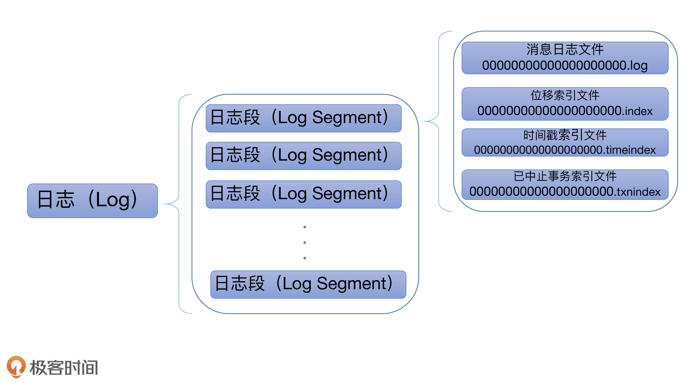
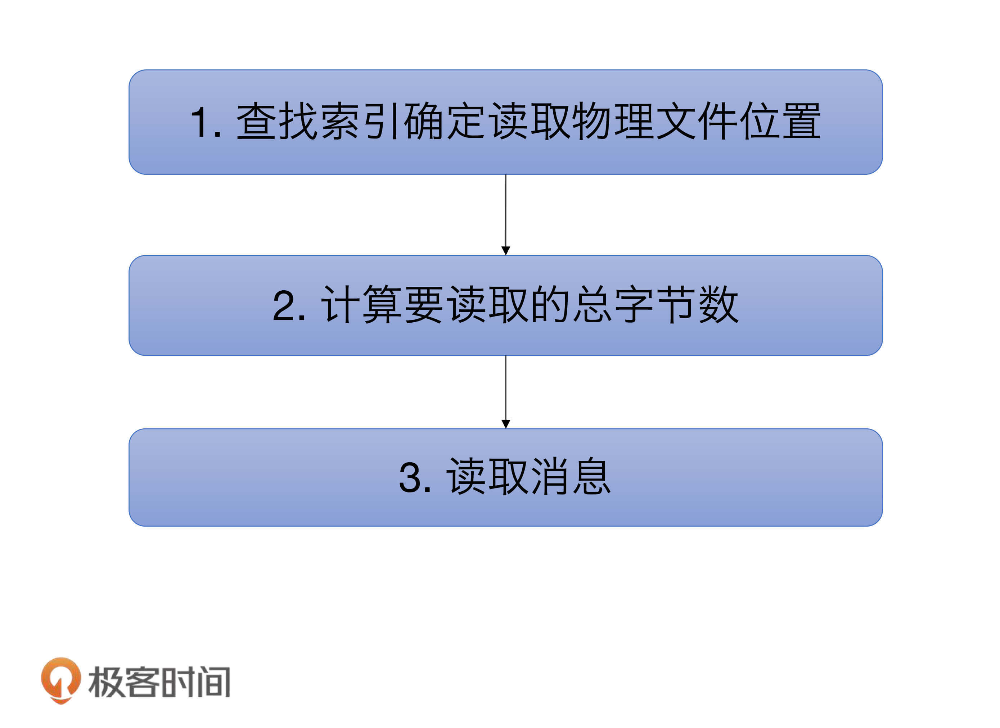

# Kafka的日志结构

## Kafka日志结构概览



Kafka日志对象由多个日志段对象组成，而每个日志段对象会在磁盘上创建一组文件，包括消息日志文件（.log）、位移索引文件（.index）、时间戳索引文件（.timeindex）以及已中止（Aborted）事务的索引文件（.txnindex）。当然，如果你没有使用Kafka事务，已中止事务的索引文件是不会被创建出来的。图中的一串数字0是该日志段的起始位移值（Base Offset），也就是该日志段中所存的第一条消息的位移值。

一般情况下，一个Kafka主题有很多分区，每个分区就对应一个Log对象，在物理磁盘上则对应于一个子目录。比如你创建了一个双分区的主题test-topic，那么，Kafka在磁盘上会创建两个子目录：test-topic-0和test-topic-1。而在服务器端，这就是两个Log对象。每个子目录下存在多组日志段，也就是多组.log、.index、.timeindex文件组合，只不过文件名不同，因为每个日志段的起始位移不同。

## LogSegment

```scala
class LogSegment private[log] (val log: FileRecords,
                               val lazyOffsetIndex: LazyIndex[OffsetIndex],
                               val lazyTimeIndex: LazyIndex[TimeIndex],
                               val txnIndex: TransactionIndex,
                               val baseOffset: Long,
                               val indexIntervalBytes: Int,
                               val rollJitterMs: Long,
	val time: Time) extends Logging { … }
```

就像我前面说的，一个日志段包含**消息日志文件**、**位移索引文件**、**时间戳索引文件**、**已中止事务索引文件**等。这里的 FileRecords 就是实际保存 Kafka 消息的对象。专栏后面我将专门讨论 Kafka 是如何保存具体消息的，也就是 FileRecords 及其家族的实现方式。同时，我还会给你介绍一下社区在持久化消息这块是怎么演进的，你一定不要错过那部分的内容。

下面的 lazyOffsetIndex、lazyTimeIndex 和 txnIndex 分别对应于刚才所说的 3 个索引文件。不过，在实现方式上，前两种使用了延迟初始化的原理，降低了初始化时间成本。后面我们在谈到索引的时候再详细说。

每个日志段对象保存自己的起始位移 **baseOffset**——这是非常重要的属性！事实上，你在磁盘上看到的文件名就是baseOffset的值。每个LogSegment对象实例一旦被创建，它的起始位移就是固定的了，不能再被更改。

indexIntervalBytes 值其实就是 Broker 端参数 log.index.interval.bytes 值，它控制了**日志段对象新增索引项的频率**。默认情况下，日志段至少新写入 4KB 的消息数据才会新增一条索引项。而 rollJitterMs 是日志段对象新增倒计时的“扰动值”。因为目前 Broker 端日志段新增倒计时是全局设置，这就是说，在未来的某个时刻可能同时创建多个日志段对象，这将极大地增加物理磁盘 I/O 压力。有了 rollJitterMs 值的干扰，每个新增日志段在创建时会彼此岔开一小段时间，这样可以缓解物理磁盘的 I/O 负载瓶颈。

至于最后的 time 参数，它就是用于统计计时的一个实现类。

对于一个日志段而言，最重要的方法就是写入消息和读取消息了，它们分别对应着源码中的 append 方法和 read 方法。另外，recover方法同样很关键，它是Broker重启后恢复日志段的操作逻辑。

### append方法

我们先来看append 方法，了解下写入消息的具体操作。

```scala
def append(largestOffset: Long,
             largestTimestamp: Long,
             shallowOffsetOfMaxTimestamp: Long,
             records: MemoryRecords): Unit = {
    if (records.sizeInBytes > 0) {
      trace(s"Inserting ${records.sizeInBytes} bytes at end offset $largestOffset at position ${log.sizeInBytes} " +
            s"with largest timestamp $largestTimestamp at shallow offset $shallowOffsetOfMaxTimestamp")
      val physicalPosition = log.sizeInBytes()
      if (physicalPosition == 0)
        rollingBasedTimestamp = Some(largestTimestamp)

      ensureOffsetInRange(largestOffset)

      // append the messages
      val appendedBytes = log.append(records)
      trace(s"Appended $appendedBytes to ${log.file} at end offset $largestOffset")
      // Update the in memory max timestamp and corresponding offset.
      if (largestTimestamp > maxTimestampSoFar) {
        maxTimestampSoFar = largestTimestamp
        offsetOfMaxTimestampSoFar = shallowOffsetOfMaxTimestamp
      }
      // append an entry to the index (if needed)
      if (bytesSinceLastIndexEntry > indexIntervalBytes) {
        offsetIndex.append(largestOffset, physicalPosition)
        timeIndex.maybeAppend(maxTimestampSoFar, offsetOfMaxTimestampSoFar)
        bytesSinceLastIndexEntry = 0
      }
      bytesSinceLastIndexEntry += records.sizeInBytes
    }
  }
```

append 方法接收 4 个参数，分别表示待写入消息批次中消息的**最大位移值**、**最大时间戳**、**最大时间戳对应消息的位移**以及**真正要写入的消息集合**。下面这张图展示了 append 方法的完整执行流程：


**第一步：**

在源码中，首先调用 log.sizeInBytes 方法判断该日志段是否为空，如果是空的话， Kafka 需要记录要写入消息集合的最大时间戳，并将其作为后面新增日志段倒计时的依据。

**第二步：**

代码调用 ensureOffsetInRange 方法确保输入参数最大位移值是合法的。那怎么判断是不是合法呢？标准就是看它与日志段起始位移的差值是否在整数范围内，即 largestOffset - baseOffset的值是不是介于 [0，Int.MAXVALUE] 之间。在极个别的情况下，这个差值可能会越界，这时，append 方法就会抛出异常，阻止后续的消息写入。一旦你碰到这个问题，你需要做的是升级你的 Kafka 版本，因为这是由已知的 Bug 导致的。

**第三步：**

待这些做完之后，append 方法调用 FileRecords 的 append 方法执行真正的写入。前面说过了，专栏后面我们会详细介绍 FileRecords 类。这里你只需要知道它的工作是将内存中的消息对象写入到操作系统的页缓存就可以了。

**第四步：**

再下一步，就是更新日志段的最大时间戳以及最大时间戳所属消息的位移值属性。每个日志段都要保存当前最大时间戳信息和所属消息的位移信息。

还记得 Broker 端提供定期删除日志的功能吗？比如我只想保留最近 7 天的日志，没错，当前最大时间戳这个值就是判断的依据；而最大时间戳对应的消息的位移值则用于时间戳索引项。虽然后面我会详细介绍，这里我还是稍微提一下：**时间戳索引项保存时间戳与消息位移的对应关系**。在这步操作中，Kafka会更新并保存这组对应关系。

**第五步：**

append 方法的最后一步就是更新索引项和写入的字节数了。我在前面说过，日志段每写入 4KB 数据就要写入一个索引项。当已写入字节数超过了 4KB 之后，append 方法会调用索引对象的 append 方法新增索引项，同时清空已写入字节数，以备下次重新累积计算。

### read方法

```scala
def read(startOffset: Long,
           maxSize: Int,
           maxPosition: Long = size,
           minOneMessage: Boolean = false): FetchDataInfo = {
    if (maxSize < 0)
      throw new IllegalArgumentException(s"Invalid max size $maxSize for log read from segment $log")

    val startOffsetAndSize = translateOffset(startOffset)

    // if the start position is already off the end of the log, return null
    if (startOffsetAndSize == null)
      return null

    val startPosition = startOffsetAndSize.position
    val offsetMetadata = LogOffsetMetadata(startOffset, this.baseOffset, startPosition)

    val adjustedMaxSize =
      if (minOneMessage) math.max(maxSize, startOffsetAndSize.size)
      else maxSize

    // return a log segment but with zero size in the case below
    if (adjustedMaxSize == 0)
      return FetchDataInfo(offsetMetadata, MemoryRecords.EMPTY)

    // calculate the length of the message set to read based on whether or not they gave us a maxOffset
    val fetchSize: Int = min((maxPosition - startPosition).toInt, adjustedMaxSize)

    FetchDataInfo(offsetMetadata, log.slice(startPosition, fetchSize),
      firstEntryIncomplete = adjustedMaxSize < startOffsetAndSize.size)
  }
```

read 方法接收 4 个输入参数。

- startOffset：要读取的第一条消息的位移；
- maxSize：能读取的最大字节数；
- maxPosition ：能读到的最大文件位置；
- minOneMessage：是否允许在消息体过大时至少返回第一条消息。

前3个参数的含义很好理解，我重点说下第 4 个。当这个参数为 true 时，即使出现消息体字节数超过了 maxSize 的情形，read 方法依然能返回至少一条消息。引入这个参数主要是为了确保不出现消费饿死的情况。



逻辑很简单，我们一步步来看下。

第一步是调用 translateOffset 方法定位要读取的起始文件位置 （startPosition）。输入参数 startOffset 仅仅是位移值，Kafka 需要根据索引信息找到对应的物理文件位置才能开始读取消息。

待确定了读取起始位置，日志段代码需要根据这部分信息以及 maxSize 和 maxPosition 参数共同计算要读取的总字节数。举个例子，假设 maxSize=100，maxPosition=300，startPosition=250，那么 read 方法只能读取 50 字节，因为 maxPosition - startPosition = 50。我们把它和maxSize参数相比较，其中的最小值就是最终能够读取的总字节数。

最后一步是调用 FileRecords 的 slice 方法，从指定位置读取指定大小的消息集合。
