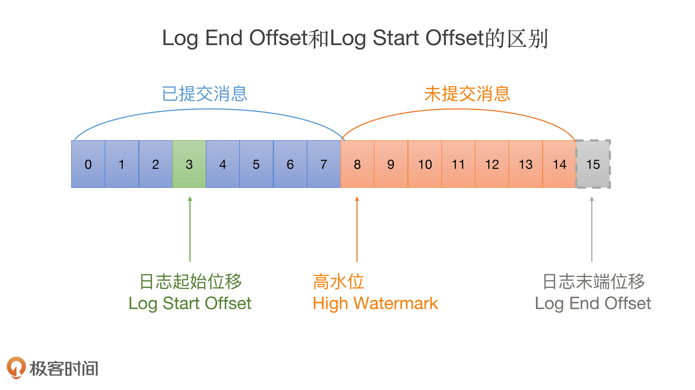

# Kafka日志

既然Log源码要管理日志段对象，那么它就必须先把所有日志段对象加载到内存里面。这个过程是怎么实现的呢？

## Log源码结构

Log源码位于Kafka core工程的log源码包下，文件名是Log.scala。总体上，该文件定义了10个类和对象，如下图所示：

C表示Class，O表示Object


**1.LogAppendInfo**

- LogAppendInfo（C）：保存了一组待写入消息的各种元数据信息。比如，这组消息中第一条消息的位移值是多少、最后一条消息的位移值是多少；再比如，这组消息中最大的消息时间戳又是多少。总之，这里面的数据非常丰富（下节课我再具体说说）。
- LogAppendInfo（O）: 可以理解为其对应伴生类的工厂方法类，里面定义了一些工厂方法，用于创建特定的LogAppendInfo实例。

**2.Log**

- Log（C）: Log源码中最核心的代码。这里我先卖个关子，一会儿细聊。
- Log（O）：同理，Log伴生类的工厂方法，定义了很多常量以及一些辅助方法。

**3.RollParams**

- RollParams（C）：定义用于控制日志段是否切分（Roll）的数据结构。
- RollParams（O）：同理，RollParams伴生类的工厂方法。

除了这3组伴生对象之外，还有4类源码。

- LogMetricNames：定义了Log对象的监控指标。
- LogOffsetSnapshot：封装分区所有位移元数据的容器类。
- LogReadInfo：封装读取日志返回的数据及其元数据。
- CompletedTxn：记录已完成事务的元数据，主要用于构建事务索引。

## **Log类**

```scala
class Log(@volatile var dir: File,
          @volatile var config: LogConfig,
          @volatile var logStartOffset: Long,
          @volatile var recoveryPoint: Long,
          scheduler: Scheduler,
          brokerTopicStats: BrokerTopicStats,
          val time: Time,
          val maxProducerIdExpirationMs: Int,
          val producerIdExpirationCheckIntervalMs: Int,
          val topicPartition: TopicPartition,
          val producerStateManager: ProducerStateManager,
          logDirFailureChannel: LogDirFailureChannel) extends Logging with KafkaMetricsGroup {
……
}
```

看着好像有很多属性，但其实，你只需要记住两个属性的作用就够了：**dir和logStartOffset**。dir就是这个日志所在的文件夹路径，也就是**主题分区的路径**。而logStartOffset，表示**日志的当前最早位移**。dir和logStartOffset都是volatile var类型，表示它们的值是变动的，而且可能被多个线程更新。

你可能听过日志的当前末端位移，也就是Log End Offset（LEO），它是表示日志下一条待插入消息的位移值，而这个Log Start Offset是跟它相反的，它表示日志当前对外可见的最早一条消息的位移值。我用一张图来标识它们的区别：


