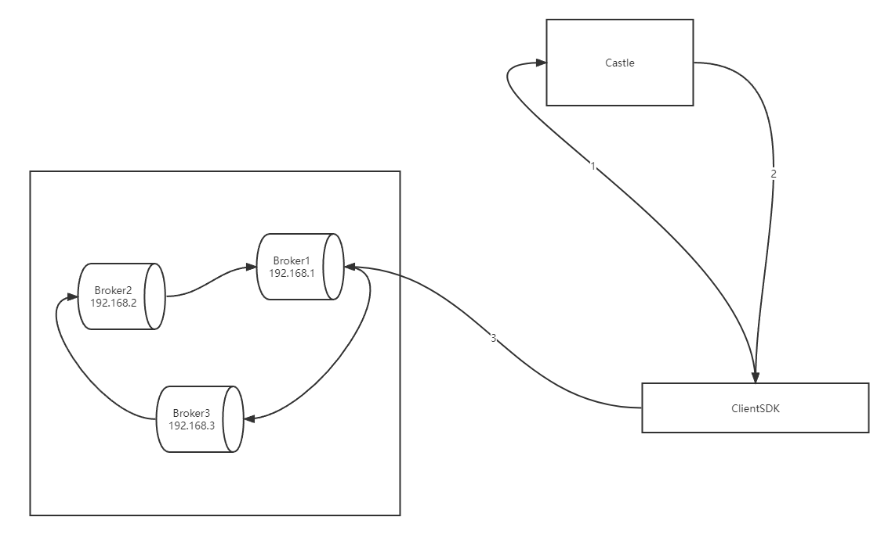

# Kafka多线程消费

## Kafka Java Consumer设计原理

从Kafka 0.10.1.0版本开始，KafkaConsumer就变为了双线程的设计，即**用户主线程和心跳线程**。

**所谓用户主线程，就是你启动Consumer应用程序main方法的那个线程，而新引入的心跳线程（Heartbeat Thread）只负责定期给对应的Broker机器发送心跳请求，以标识消费者应用的存活性（liveness）**。引入这个心跳线程还有一个目的，那就是期望它能将心跳频率与主线程调用KafkaConsumer.poll方法的频率分开，从而解耦真实的消息处理逻辑与消费者组成员存活性管理。

不过，虽然有心跳线程，但实际的消息获取逻辑依然是在用户主线程中完成的。因此，在消费消息的这个层面上，我们依然可以安全地认为KafkaConsumer是单线程的设计。

