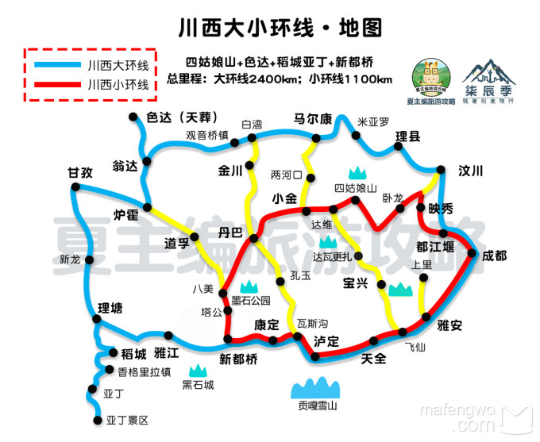
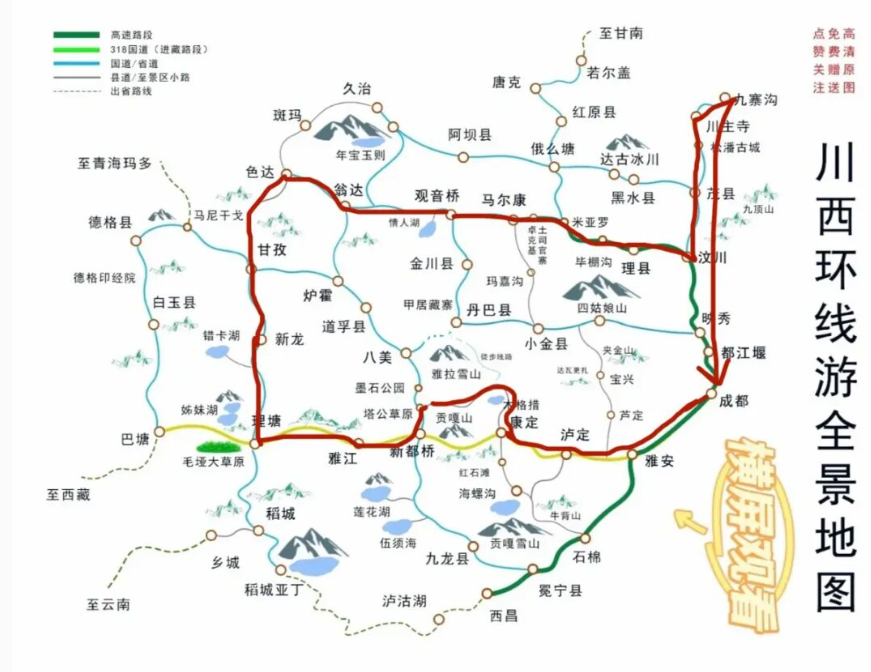
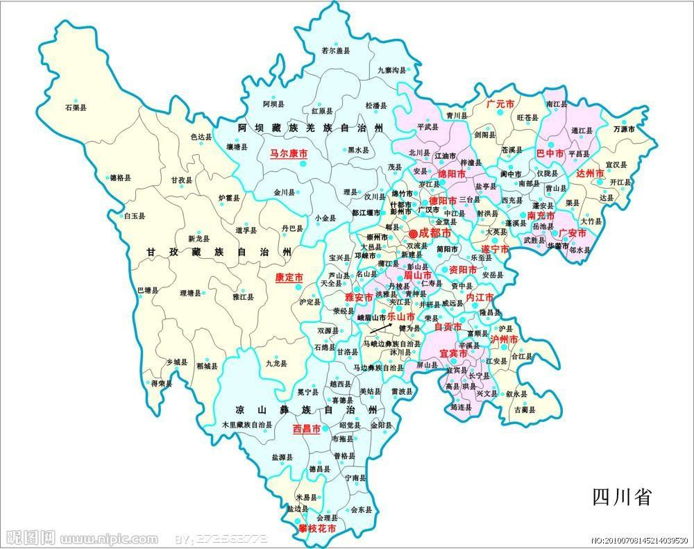

# 四川旅游安排

## 环线地图

## 景点

### 21日

到宜宾后取车住宜宾    买东西（氧气 水 士力架 巧克力）

### 22日

宜宾-》康定=》新都桥    路中间经过泸定城 （泸定桥？）   可以在墨石公园玩  住新都桥

### 23日

新都桥=》理塘=》兔儿山=》海子山 到稻城亚丁  塔公草原  住稻城

### 24日

稻城玩一天   住稻城

### 25日

稻城=》甘牧  

兔儿山，位于天空之城理塘，海拔4696米，有一个像小白兔一样的山峰，因此而得名。需要注意保暖，挡风。山上有个观景台，可以停车照相。

从稻城亚丁出发2.5小时可到达姊妹湖

### 26日

甘孜=》色达 =》马尔康

### 27日

马尔康 =》 都江堰  【如果去四姑娘山】    马尔康 =》宜宾  【不去四姑娘山】

### 28日

赶回宜宾还车上高铁
