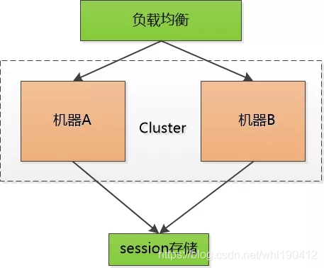
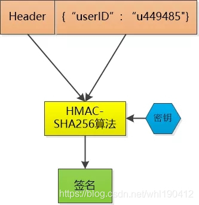
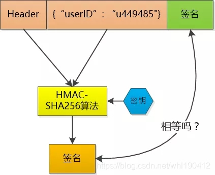

# cookie、session与token的真正区别

## 发展史

1. 很久很久以前，Web 基本上就是文档的浏览而已， 既然是浏览，作为服务器， 不需要记录谁在某一段时间里都浏览了什么文档，每次请求都是一个新的HTTP协议， 就是请求加响应， 尤其是我不用记住是谁刚刚发了HTTP请求， 每个请求对我来说都是全新的。这段时间很嗨皮。
2. 但是随着交互式Web应用的兴起，像在线购物网站，需要登录的网站等等，马上就面临一个问题，那就是要管理会话，必须记住哪些人登录系统， 哪些人往自己的购物车中放商品， 也就是说我必须把每个人区分开，这就是一个不小的挑战，因为HTTP请求是无状态的，所以想出的办法就是给大家发一个会话标识(session id), 说白了就是一个随机的字串，每个人收到的都不一样， 每次大家向我发起HTTP请求的时候，把这个字符串给一并捎过来， 这样我就能区分开谁是谁了

3. 这样大家很嗨皮了，可是服务器就不嗨皮了，每个人只需要保存自己的session id，而服务器要保存所有人的session id ！如果访问服务器多了， 就得由成千上万，甚至几十万个。

这对服务器说是一个巨大的开销 ， 严重的限制了服务器扩展能力， 比如说我用两个机器组成了一个集群， 小F通过机器A登录了系统， 那session id会保存在机器A上， 假设小F的下一次请求被转发到机器B怎么办？机器B可没有小F的 session id啊。

有时候会采用一点小伎俩： session sticky ， 就是让小F的请求一直粘连在机器A上， 但是这也不管用， 要是机器A挂掉了， 还得转到机器B去。

那只好做session 的复制了， 把session id 在两个机器之间搬来搬去， 快累死了。

后来有个叫Memcached的支了招：把session id 集中存储到一个地方， 所有的机器都来访问这个地方的数据， 这样一来，就不用复制了， 但是增加了单点失败的可能性， 要是那个负责session 的机器挂了， 所有人都得重新登录一遍， 估计得被人骂死。

也尝试把这个单点的机器也搞出集群，增加可靠性， 但不管如何， 这小小的session 对我来说是一个沉重的负担

**token**

于是有人就一直在思考， 我为什么要保存这可恶的session呢， 只让每个客户端去保存该多好？

可是如果不保存这些session id , 怎么验证客户端发给我的session id 的确是我生成的呢？ 如果不去验证，我们都不知道他们是不是合法登录的用户， 那些不怀好意的家伙们就可以伪造session id , 为所欲为了。

嗯，对了，关键点就是验证 ！

比如说， 小F已经登录了系统， 我给他发一个令牌(token)， 里边包含了小F的 user id， 下一次小F 再次通过Http 请求访问我的时候， 把这个token 通过Http header 带过来不就可以了。

不过这和session id没有本质区别啊， 任何人都可以可以伪造， 所以我得想点儿办法， 让别人伪造不了。

那就对数据做一个签名吧， 比如说我用HMAC-SHA256 算法，加上一个只有我才知道的密钥， 对数据做一个签名， 把这个签名和数据一起作为token ， 由于密钥别人不知道， 就无法伪造token了。

这个token 我不保存， 当小F把这个token 给我发过来的时候，我再用同样的HMAC-SHA256 算法和同样的密钥，对数据再计算一次签名， 和token 中的签名做个比较， 如果相同， 我就知道小F已经登录过了，并且可以直接取到小F的user id , 如果不相同， 数据部分肯定被人篡改过， 我就告诉发送者：对不起，没有认证。

Token 中的数据是明文保存的（虽然我会用Base64做下编码， 但那不是加密）， 还是可以被别人看到的， 所以我不能在其中保存像密码这样的敏感信息。

当然， 如果一个人的token 被别人偷走了， 那我也没办法， 我也会认为小偷就是合法用户， 这其实和一个人的session id 被别人偷走是一样的。

这样一来， 我就不保存session id 了， 我只是生成token , 然后验证token ， 我用我的CPU计算时间获取了我的session 存储空间 ！

解除了session id这个负担， 可以说是无事一身轻， 我的机器集群现在可以轻松地做水平扩展， 用户访问量增大， 直接加机器就行。这种无状态的感觉实在是太好了！

## **Cookie**

cookie 是一个非常具体的东西，指的就是浏览器里面能永久存储的一种数据，仅仅是浏览器实现的一种数据存储功能。

cookie由服务器生成，发送给浏览器，浏览器把cookie以kv形式保存到某个目录下的文本文件内，下一次请求同一网站时会把该cookie发送给服务器。由于cookie是存在客户端上的，所以浏览器加入了一些限制确保cookie不会被恶意使用，同时不会占据太多磁盘空间，所以每个域的cookie数量是有限的。

## **Session**

session 从字面上讲，就是会话。这个就类似于你和一个人交谈，你怎么知道当前和你交谈的是张三而不是李四呢？对方肯定有某种特征（长相等）表明他就是张三。

session 也是类似的道理，服务器要知道当前发请求给自己的是谁。为了做这种区分，服务器就要给每个客户端分配不同的“身份标识”，然后客户端每次向服务器发请求的时候，都带上这个“身份标识”，服务器就知道这个请求来自于谁了。至于客户端怎么保存这个“身份标识”，可以有很多种方式，对于浏览器客户端，大家都默认采用 cookie 的方式。

服务器使用session把用户的信息临时保存在了服务器上，用户离开网站后session会被销毁。这种用户信息存储方式相对cookie来说更安全，可是session有一个缺陷：如果web服务器做了负载均衡，那么下一个操作请求到了另一台服务器的时候session会丢失。

## **Token**

在Web领域基于Token的身份验证随处可见。在大多数使用Web API的互联网公司中，tokens 是多用户下处理认证的最佳方式。

以下几点特性会让你在程序中使用基于Token的身份验证

1. 无状态、可扩展

2. 支持移动设备

3. 跨程序调用

4. 安全

那些使用基于Token的身份验证的大佬们

大部分你见到过的API和Web应用都使用tokens。例如Facebook, Twitter, Google+, GitHub等。
